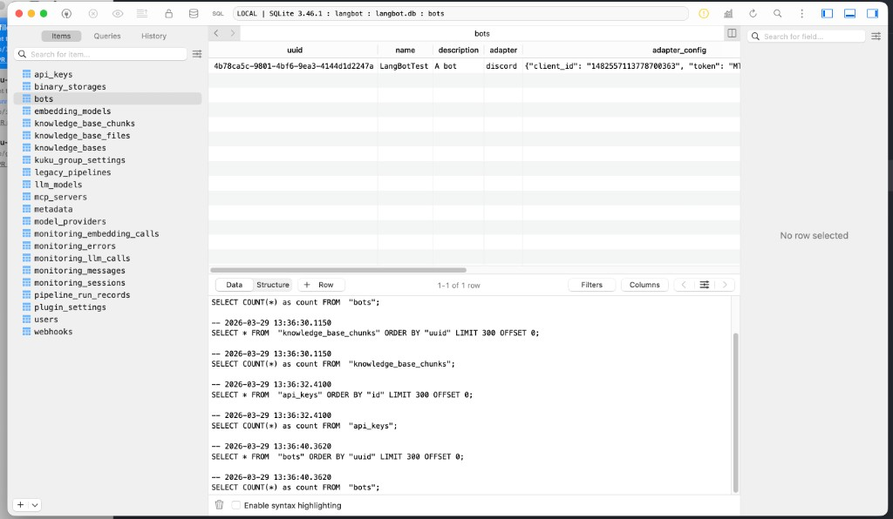

# KUKU Bootstrap Runbook

This runbook is for bootstrapping a local LangBot environment when you need to demo the KUKU setup APIs currently implemented in this repository.

## Goal

Get the current repo code running locally on `http://127.0.0.1:5300`, with:

- the KUKU API routes from this repository
- a working local database
- a known bot UUID
- a temporary API key for demo requests

## When You Need This Runbook

Use this when:

- Docker LangBot is already running on port `5300`
- the browser UI works, but the locally checked-out KUKU API routes are missing
- you need to demo local repo code instead of an older container image

## Two audiences

| Path | Who | What you run |
|------|-----|----------------|
| **Returning** | You already have `data/langbot.db` with bots (e.g. you bootstrap often) | `./scripts/kuku-bootstrap.sh` — does **not** stop Docker or overwrite the DB |
| **First-time from Docker** | You run LangBot in Docker today and want the **same** DB + users/bots under `uv run main.py` | `./scripts/kuku-bootstrap.sh --first-time-from-docker` — stops Docker containers, backs up local `data/langbot.db`, copies `docker/data/langbot.db` → `data/langbot.db` |

The script always (re)writes **`.kuku-demo.env`** at the repo root with `KUKU_API_KEY`, `KUKU_BOT_UUID`, etc., so demo `curl` commands stay consistent. That file is gitignored.

---

## Fast path (recommended)

From the **repository root**:

```bash
# Returning user (default)
./scripts/kuku-bootstrap.sh

# OR first-time migration from Docker (stops containers + copies DB)
./scripts/kuku-bootstrap.sh --first-time-from-docker
```

Optional: create `web/.env` if missing (Next.js → backend on `5300`):

```bash
./scripts/kuku-bootstrap.sh --setup-web-env
```

Load variables into your shell (required for the `curl` examples below):

```bash
source .kuku-demo.env
```

Start the backend in another terminal:

```bash
uv run main.py
```

Optional web UI:

```bash
cd web && pnpm install && pnpm dev
# http://127.0.0.1:3000 — needs web/.env (see section 4 notes below)
```

Script help: `./scripts/kuku-bootstrap.sh --help`

### API key behavior

- If a row `api_keys.name = 'demo-kuku'` already exists, the script **reuses** its `key` (good for returning users).
- If not, it inserts `demo-kuku-key`.
- To recreate the key row (e.g. after manual DB edits): `./scripts/kuku-bootstrap.sh --force-new-api-key`
- If you still have an older value in the DB (e.g. `demo-kuku-key-YYYYMMDD`), the script keeps using it until you run `--force-new-api-key`, which resets the secret to `demo-kuku-key`.

---

## One-Time Commands Per Machine

If needed:

```bash
pip install uv
uv sync --dev
```

---

## Manual bootstrap (if you prefer not to use the script)

### 1. Stop Docker LangBot if it is using the same ports

Check:

```bash
docker ps --format 'table {{.Names}}\t{{.Ports}}'
```

If you see `langbot` or `langbot_plugin_runtime`, stop them:

```bash
docker stop langbot langbot_plugin_runtime
```

Why:

- the Docker image may not include your local repo changes
- it occupies ports `5300` and `5401`

**Returning users:** skip this if nothing is bound to those ports.

### 2. Reuse the Docker database state locally (first-time / Docker users only)

Back up the local DB and copy the Docker DB over it:

```bash
cp data/langbot.db data/langbot.db.bak.$(date +%Y%m%d%H%M%S)
cp docker/data/langbot.db data/langbot.db
```

**Returning users** who already have the right `data/langbot.db`: skip this step.

### 3. Start LangBot from the local repo checkout

Run:

```bash
uv run main.py
```

Expected startup signals:

- database migration `25` completes or is already applied
- LangBot listens on `http://0.0.0.0:5300`
- plugin runtime listens on port `5401`

### 4. Optionally start the frontend

If you need the web UI:

**One-time:** create `web/.env` so the browser calls the Python API on `5300`, not the Next.js origin on `3000`:

```bash
cd web
cp .env.example .env
```

`web/.env.example` sets `NEXT_PUBLIC_API_BASE_URL=http://localhost:5300`. Without this (or if the variable is wrong), the login screen shows **Unable to connect to the LangBot backend** because API requests default to same-origin (`/`). After editing `.env`, restart `pnpm dev` so Next.js picks up `NEXT_PUBLIC_*` values.

Then:

```bash
pnpm install
pnpm dev
```

Open:

```text
http://127.0.0.1:3000
```

Why:

- the local backend may warn that built WebUI files are missing
- the Next.js dev server is the easiest way to get a UI while keeping the local backend on `5300`

Do **not** commit `web/.env`; it is gitignored. Only `web/.env.example` belongs in the repo.

## Demo Bootstrap Data

### 5. Get the bot UUID

Run:

```bash
sqlite3 data/langbot.db "select uuid,name,adapter from bots;"
```

Example:

```text
4b78ca5c-9801-4bf6-9ea3-4144d1d2247a|LangBotTest|discord
```

**GUI alternative:** Open `data/langbot.db` in [TablePlus](https://tableplus.com/) or any SQLite client (database path = repo root’s `data/langbot.db`), select the `bots` table, and read `uuid` from the grid—same data as the query above. Example:



Redact `adapter_config` in screenshots if needed; it can contain tokens. The root **README.md** (*Local development → Inspecting the SQLite database*) documents the same CLI and TablePlus workflow.

Use the UUID for your demo bot (or rely on `./scripts/kuku-bootstrap.sh`, which sets `KUKU_BOT_UUID`).

### 6. Create a temporary API key for demo calls

**Preferred:** run `./scripts/kuku-bootstrap.sh` and `source .kuku-demo.env` — the script inserts or reuses the `demo-kuku` key and keeps `KUKU_API_KEY` in sync.

**Manual:** use the same key string everywhere:

```bash
sqlite3 data/langbot.db "INSERT INTO api_keys (name,key,description) VALUES ('demo-kuku','demo-kuku-key','Temporary local API key for KUKU demo');"
```

Then `export KUKU_API_KEY=demo-kuku-key` (or `source .kuku-demo.env` after running the script).

You can also create keys in the web UI (**API Integration → API Keys**); see `docs/API_KEY_AUTH.md`.

## Demo Commands

After `source .kuku-demo.env` (or defining the same variables yourself), all examples use one key and one bot UUID.

### List personas

```bash
curl -s "${KUKU_API_BASE_URL}/api/v1/kuku/personas" \
  -H "X-API-Key: ${KUKU_API_KEY}"
```

### Save KUKU group settings

```bash
curl -s -X PUT "${KUKU_API_BASE_URL}/api/v1/kuku/groups/${KUKU_BOT_UUID}/discord/${KUKU_GROUP_ID}" \
  -H "X-API-Key: ${KUKU_API_KEY}" \
  -H "Content-Type: application/json" \
  -d '{"persona_id":"kuku-sunny","silence_minutes":30,"cooldown_minutes":10,"quiet_hours":{"start":"00:00","end":"08:00","timezone":"UTC"},"enabled":true}'
```

### Read KUKU group settings back

```bash
curl -s "${KUKU_API_BASE_URL}/api/v1/kuku/groups/${KUKU_BOT_UUID}/discord/${KUKU_GROUP_ID}" \
  -H "X-API-Key: ${KUKU_API_KEY}"
```

### Show a guardrail failure

```bash
curl -s -X PUT "${KUKU_API_BASE_URL}/api/v1/kuku/groups/${KUKU_BOT_UUID}/slack/${KUKU_GROUP_ID}" \
  -H "X-API-Key: ${KUKU_API_KEY}" \
  -H "Content-Type: application/json" \
  -d '{"persona_id":"kuku-sunny","enabled":true}'
```

Expected result:

- `personas` returns `kuku-sunny`
- `PUT` returns the saved settings
- `GET` returns the same settings
- the `slack` request returns `KUKU MVP only supports discord`

To use a different Discord group id for a one-off demo, source the file first, then override:

```bash
source .kuku-demo.env
export KUKU_GROUP_ID=my-other-group
```

## Recommended Demo Narrative

Use this sequence:

1. Show that LangBot is running from the local repo checkout.
2. Show that the Discord bot already exists.
3. Show the KUKU persona catalog.
4. Save KUKU settings for one Discord group.
5. Read them back to prove persistence.
6. Trigger one invalid request to show validation.
7. Close by explaining that runtime behavior is not implemented yet; the current KUKU slice is the persistence and setup foundation.

## Shutdown And Restore

When done:

### Stop the local backend

Use `Ctrl+C` in the terminal running `uv run main.py`.

### Restart the Docker version if you want the old setup back

```bash
docker start langbot langbot_plugin_runtime
```

## Notes

- If the Discord bot token was ever shown on screen or in screenshots, rotate it after the demo.
- The KUKU APIs are backend-only today. They do not make KUKU talk in Discord yet.
- If `5300` or `5401` are already in use, check Docker first before debugging the Python process.
