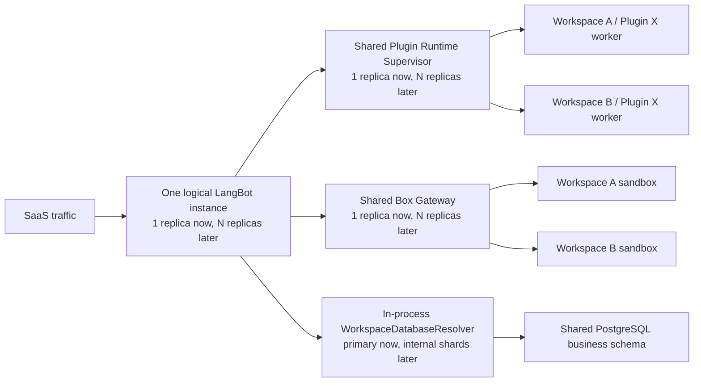

# Cloud v2 多租户架构待决策项

状态：`OPEN`
创建日期：2026-07-19

本文只记录架构质疑、候选方案和决策条件，不代表最终结论。在正式决策前，
[implementation-decisions.md](./implementation-decisions.md) 中已经落地的方案仍是当前实现基线；
正式结论需要再同步回主架构、决策日志、实施清单和协议设计。

## 0. 已确认的 SaaS 拓扑前提

1. SaaS 只有一个逻辑 LangBot 实例，全部 Workspace 都是该实例内的租户。
2. 产品和领域模型中不引入 Cell 内多个 CloudInstance、Workspace Placement 或 Workspace 到 CloudInstance 的路由。
3. 当前不实现分布式，但必须允许同一个逻辑实例未来运行多个 Core replica、Runtime supervisor replica、
   Box gateway/worker 和 PostgreSQL shard；这些只是内部实现，不成为新的租户或产品实体。
4. 所有副本共享稳定的 `instance_uuid`；`replica_id`、`worker_id` 和进程地址是短期运行身份，不能写进业务资源的永久主键。
5. `workspace_uuid` 始终是数据、任务和运行时的分片键。当前所有 Workspace 可以路由到同一个副本和数据库，
   将来可以在不改变外部 API 的情况下路由到不同副本或 shard。
6. generation/epoch 继续保留，但语义是执行所有权、故障转移和任务撤销，不再代表 Workspace 在多个 CloudInstance 之间 Placement。
7. 新增 Account 或 Workspace 只新增数据行；不能因为未来可能分布式而提前创建租户专属部署、数据库或队列。

“单个 LangBot 实例”表示单个逻辑服务和安全域，不等于永远只能有一个 OS 进程或一个 Kubernetes replica。
当前代码字段 `placement_generation` 在完成架构迁移前继续兼容，但目标语义和候选命名是 `execution_generation`。

## 1. 本轮重构的最高目标

本轮 Cloud v2 重构的核心目标是：

> 共享可信控制面和基础设施池，隔离不可信执行单元；减少需要独立部署、扩缩容和运维的组件，使新增 Account 或 Workspace 的静态成本接近零。

这里的“减少组件”主要指减少独立 Deployment、Service、数据库、消息系统和租户专属常驻进程，
不是通过合并安全边界来减少代码模块或必要的隔离进程。

统一评估原则：

1. 注册一个新 Account、创建一个空 Workspace，不应创建 Deployment、Pod、数据库、schema 或常驻 Runtime。
2. 闲置 Workspace 不应占用 Plugin 或 Box worker；成本应随实际使用增长。
3. 可信 gateway、supervisor、scheduler、artifact cache 和 worker pool 可以多租户共享。
4. 一个不可信插件进程或 Box sandbox 不能同时服务多个 Workspace。
5. 默认使用共享池；dedicated 只作为高隔离、大客户或合规套餐，不另造一套协议。
6. 优先复用 PostgreSQL transaction、outbox、advisory lock 和现有对象存储；没有明确容量证据前不新增 Kafka、专用 Runtime 数据库或专用租户调度数据库。
7. “多租户”必须同时覆盖身份、路由、存储、缓存、日志、配额、撤销和故障恢复，不能只给请求增加 `workspace_uuid`。

## 2. 统一的候选方案框架

确认“单个逻辑 LangBot 实例”后，候选方案不再比较多个产品级实例拓扑，而是比较同一逻辑实例的演进阶段：

| 档位                       | 内部部署形态                                                                                                                             | 新 Workspace 静态成本             | 启用条件                   |
| -------------------------- | ---------------------------------------------------------------------------------------------------------------------------------------- | --------------------------------- | -------------------------- |
| M0. 单副本 MVP             | 一个 Core replica；一个共享 Plugin Supervisor；一个共享 Box Gateway；一个 PostgreSQL business shard；worker 与 sandbox 按需创建          | 只新增 Workspace 目录记录和业务行 | 当前默认候选               |
| M1. 同逻辑实例内部横向扩展 | Core、Plugin Supervisor、Box Gateway/worker 按容量增加 replica；PostgreSQL 可增加共享 shard；owner 由内部 lease 和 generation fence 决定 | 仍不创建 Workspace 专属部署       | 出现明确容量或可用性证据后 |
| M2. Dedicated 资源档位     | 特定 workload 或 Workspace 使用独享 worker pool、sandbox class 或 PostgreSQL shard，但沿用相同身份、协议、schema 和控制面                | 只由购买 dedicated 的客户承担     | 合规、数据驻留或超大负载   |

M1 是 M0 的透明扩容，M2 是相同架构下的资源等级；两者都不是新的 LangBot 实例、Cell 或 CloudInstance。
外部 API 只认识稳定的 `instance_uuid` 和 `workspace_uuid`，不认识 replica、worker、pool 或 shard。

Plugin Supervisor 与 Core 在 M0 可以共用一个 Deployment/Pod，但保持独立进程；Box worker 需要更高的宿主机权限，
应与 Plugin Supervisor 使用不同的进程身份和 worker pool。两者可以复用 tenant context、generation fence、quota、
owner abstraction 和审计 library，不为“统一控制面”额外增加一个 Runtime Gateway 服务。

## 3. D-001：Plugin Runtime 控制面是否多租户

### 3.1 质疑

当前决策是 “Plugin Runtime binds to exactly one Workspace”。新的质疑是：

> Plugin Runtime 的可信控制面应服务多个 Workspace，但每个插件执行进程必须只属于一个 Workspace，不能跨租户复用。

状态：`OPEN`，当前决策被质疑但尚未废止。

### 3.2 当前实现事实

- SDK `RuntimeContext` 只有一个不可重绑的 `workspace_binding`。
- Runtime 只有一个全局 control handler 和 PluginManager；插件、handler、任务与安装目录都处于 Runtime 全局集合。
- Core `PluginRuntimeConnector` 也绑定一个 `ActionContext`，并拒绝其他 Workspace。
- 插件本身已经以子进程运行，但包目录只按 author/name 组织，依赖安装会修改 Runtime 全局 Python 环境；
  包、依赖、debug 凭证和 supervisor 状态尚未按多租户 registry 设计。
- 如果直接按 Workspace 复制当前 Runtime，会复制 Deployment、固定内存、控制连接和本地存储，空 Workspace 也产生常驻成本。

### 3.3 不可妥协的不变量

1. 一个插件执行进程只能绑定一个
   `(instance_uuid, workspace_uuid, execution_generation, installation_uuid)`；当前协议字段
   `placement_generation` 只作为迁移期兼容名称。
2. 插件不能通过 payload、Host API 参数或重连选择 Workspace。
3. 插件进程的 cwd、tmp、可写目录、secret、日志、配额和网络策略不能跨 Workspace。
4. 相同 artifact 或 dependency cache 可以只读共享，但执行进程、配置和持久数据不能共享。
5. generation、installation revision 或 installation UUID 变化后，旧进程必须失去 Host API 和副作用权限。
6. Supervisor 不能直接加载第三方插件代码；插件代码只在隔离 worker 中执行。

### 3.4 候选方案与淘汰结论

| 状态           | 方案                                                   | 部署与执行模型                                                                                 | 结论                                         |
| -------------- | ------------------------------------------------------ | ---------------------------------------------------------------------------------------------- | -------------------------------------------- |
| MVP 首选候选   | R0. 单副本共享 Supervisor + installation 独立 worker   | 所有 Workspace 共用可信 Supervisor；只有启用的 installation 才创建一个不可重绑的进程或 sandbox | 新租户静态成本近零，隔离边界清晰             |
| 未来演进       | R1. 同一逻辑 Runtime 服务增加 replica                  | 按 `(workspace_uuid, installation_uuid)` 分配 owner；replica 和地址不进入业务身份              | R0 的透明扩容，不是另一套架构                |
| Dedicated 例外 | R2. 独享 Runtime worker pool                           | 特定 workload 使用独立容量池或更强 sandbox，仍走 R0/R1 的协议和 installation 身份              | 套餐资源等级，不创建租户专属控制面           |
| 淘汰           | X1. 每 Workspace 一个 Runtime                          | 每个 Workspace 复制 Deployment、Service/PVC 和控制连接                                         | 组件和空闲成本随 Workspace 线性增长          |
| 淘汰           | X2. 同一个插件进程处理多个 Workspace                   | 插件代码根据请求 context 切换租户                                                              | 全局变量、依赖和本地状态无法成为可信隔离边界 |
| 淘汰为默认     | X3. 每 Workspace 一个 worker 承载该 Workspace 全部插件 | 同租户插件共享解释器、依赖环境和故障域                                                         | 可作为受信兼容层，不作为公开 SaaS 默认       |
| MVP 不引入     | X4. Runtime 专用数据库、Redis、Kafka 或独立 scheduler  | 为未来分布式提前拆分新的常驻服务                                                               | 当前没有容量依据，增加组件和运维面           |

### 3.5 当前倾向（非决策）

当前倾向是 M0/R0；R1 只作为不改变协议的扩容路径，R2 只作为资源例外：

- 把“只绑定一个 Workspace”的边界从整个 Plugin Runtime 下沉到每个插件 installation worker 和它的 Host connection。
- Runtime Supervisor 以整个逻辑 SaaS 实例为共享边界，持有多租户 registry、调度、artifact cache 和进程生命周期。
- M0 中 Runtime Supervisor 与 Core 优先共用一个 Deployment/Pod、保持独立进程，并通过一条本地 Unix socket、stdio
  或 loopback multiplexed connection 通信；不创建独立 Runtime Service。
- Core 与 Supervisor 之间的每个 action 都携带可信的
  `instance_uuid + workspace_uuid + execution_generation`，多条 Workspace-bound connection 只作为 v1 迁移兼容路径。
- 插件进程使用一次性 capability 注册，capability 至少绑定
  `instance_uuid + workspace_uuid + execution_generation + installation_uuid + runtime_revision + artifact_digest`。
- Supervisor 使用进程的不可变 binding 注入 Host API context，继续丢弃插件 payload 中的 scope 字段。
- 新 Account 或 Workspace 不创建专属 Runtime、连接、目录、卷或进程；安装并启用插件后才创建 worker。
  无后台任务的插件可 idle eviction，有常驻事件或定时任务的插件按 entitlement 保持 resident。
- artifact 与 venv 可以按 digest 只读复用；安装实例使用私有运行目录。公开 SaaS 的第三方插件最终应使用 cgroup 加内核级 sandbox，单纯同 UID 子进程只适合作为受信插件兼容层。

为了减少组件，MVP 不新增 Runtime 专用数据库或消息队列：PostgreSQL 中的 plugin installation 记录保存 desired state，
Core 连接或重连时向可重建的 Supervisor replay；Supervisor 只保存运行态和缓存。M0 只有一个 owner，
不实现分布式 lease coordinator，但 owner store、幂等 reconcile 和 generation fence 必须是可替换边界。

进入 R1 前，才启用 PostgreSQL-backed、带 expiry 和 fencing token 的 installation owner lease；同一 installation
同时只能有一个 owner。优先保持 Core 与 Runtime replica 1:1 共置，只有出现独立扩缩容证据时才拆成共享 Runtime pool。
本地 artifact cache 继续可重建，不为跨 replica 缓存另建服务。

### 3.6 需要正式决定的问题

- M0 中 Core 与 Supervisor 共置是否存在无法接受的发布、资源或故障域约束；若存在，是否接受一个 SaaS 实例共享的独立 Runtime Deployment 作为部署妥协。
- 公共 SaaS 首版是否强制容器/nsjail，还是允许受信插件使用普通进程。
- 默认是否保持“每 installation 一个进程”；是否允许同 Workspace 的受信插件合并 worker。
- 插件 manifest 如何声明 `on_demand`、`resident`、后台任务和资源规格。
- content-addressed artifact/venv cache 的版本、签名、淘汰和供应链校验规则。
- Runtime protocol v1 的多条 Workspace-bound connection 保留多久；v2 的目标协议固定为 multiplexed connection。
- R1 的启用阈值、lease expiry、fencing token 和 owner 转移顺序；这些在 M0 定义接口，但不部署多副本协调器。

### 3.7 决策验收条件

- 两个 Workspace 同时安装同名、同版本和不同版本插件，进程、配置、storage、日志和 Host API 均不可串租户。
- 一个插件 worker 崩溃、超额或被撤销，只影响对应 installation。
- 新建但不使用插件的 Workspace 不增加常驻进程。
- Supervisor 重启可由 PostgreSQL desired state 恢复，不依赖本地租户状态作为权威真相。
- 旧 generation 的插件回调、消息、副作用和存储访问全部失败关闭。

## 4. D-002：Box 控制面是否多租户

### 4.1 质疑

新的质疑是：

> Box 的 gateway、调度和 worker pool 应在整个逻辑 SaaS 实例内共享，不应按 Workspace 或用户复制；每个 sandbox、session 和 managed process 仍必须是单租户执行边界。

状态：`OPEN`。

### 4.2 当前实现事实

- Box 已经用 `instance_uuid + workspace_uuid` 派生持久 namespace，并用 generation 派生运行时 namespace。
- Box server 的 generation fence 已按 `(instance_uuid, workspace_uuid)` 建索引，说明一个进程内已有多 Workspace 数据结构基础。
- RPC 控制连接仍通过共享 secret 绑定整个 trusted instance，无法区分未来的 Core replica 身份和权限。
  当前单 replica 可工作，但不能直接作为多 replica owner 与故障转移协议。
- generation、活跃任务和 stale-session 目录主要保存在单进程内存中；多副本 gateway 无法共享 owner 和 fence 状态。
- 当前远程 connector 是 Core 到 Box 的长连接，不是可被多个 Core replica 共享的 session scheduler。
- `INIT`、`SHUTDOWN` 和 backend 配置仍是整个 Box 进程的全局操作，不能直接暴露给多租户 Core 连接。
- 当前 orphan cleanup 不能区分其他 gateway/worker replica 的有效容器；现有 Kubernetes 方案挂载 `docker.sock`，
  不能直接作为整个 SaaS 实例共享的安全边界。

### 4.3 不可妥协的不变量

1. 一个 sandbox、session 或 managed process 在生命周期内只能属于一个
   `(instance_uuid, workspace_uuid, execution_generation)`；当前协议字段
   `placement_generation` 只作为迁移期兼容名称。
2. Workspace 不能指定 host path、特权挂载、worker 节点或其他租户的 session ID。
3. persistent Workspace data 与 ephemeral generation/session data 必须使用不同 namespace 和生命周期。
4. generation 切换必须撤销旧 attach token、stdin/stdout relay、进程和不可回滚副作用。
5. 配额、公平调度、网络策略、CPU、内存、PID、磁盘和端口都按不可变 Workspace/workload context 执行；
   进入 B1 后该 context 必须由 workload lease 证明。
6. warm pool 可以共享镜像和空闲容量，但不能并发共享一个未重置的 sandbox。

### 4.4 候选方案与淘汰结论

| 状态           | 方案                                  | 部署与执行模型                                                                                                       | 结论                                      |
| -------------- | ------------------------------------- | -------------------------------------------------------------------------------------------------------------------- | ----------------------------------------- |
| MVP 首选候选   | B0. 单副本共享 Box Gateway            | 整个逻辑 SaaS 实例只有一个 gateway/runtime；它承担控制入口、本地调度和 session supervision；sandbox 按需创建且单租户 | 新 Workspace 静态成本近零                 |
| 未来演进       | B1. 共享 Gateway 与 worker 横向扩容   | 多个 gateway replica 位于同一稳定内部地址后；session owner 使用 lease；worker capacity 独立扩缩容                    | B0 的透明扩容，不改变外部协议             |
| Dedicated 例外 | B2. 独享 worker pool 或 sandbox class | 特定 workload 使用独立节点池、网络策略或 microVM 等级，仍通过同一 Gateway 协议                                       | 套餐资源等级，不创建 Workspace 专属控制面 |
| 淘汰           | X1. 每 Workspace 一个 Box service     | Workspace 创建时复制 gateway、Service、存储和固定容量                                                                | 组件与空闲成本随 Workspace 线性增长       |
| 淘汰为 SaaS    | X2. 每 Core replica 一个 Box sidecar  | Core 扩容时复制 Box 控制面并产生重复 session owner                                                                   | 只保留 OSS 本地部署兼容                   |
| 淘汰           | X3. 多 Workspace 并发共享活 sandbox   | 只依赖目录、UID 或进程 namespace 切租户                                                                              | 不足以承载不可信代码                      |

### 4.5 当前倾向（非决策）

当前倾向是 M0/B0；B1 只作为不改变协议的扩容路径，B2 只作为资源例外：

- 整个 SaaS 实例部署一个共享 Box Gateway/Runtime，不增加独立 scheduler service、worker registry、Redis 或 Box 专用数据库。
- gateway 在 M0 同时承担可信控制入口、本地调度和 session supervisor；sandbox 本身仍是独立容器、Pod 或 microVM。
- 新 Workspace 只新增数据行和稳定的逻辑 storage key prefix/metadata；prefix 在首次写入时懒创建，
  不能对应租户专属 bucket、PVC、volume 或常驻目录。第一次执行时才创建 sandbox；warm pool 不是 MVP 必需组件。
- sandbox 以 session 或 managed workload 为隔离单元，不能同时承载多个 Workspace；空闲 sandbox 可以彻底销毁或证明已重置后回到 warm pool。
- Core 使用服务身份连接 gateway，请求携带可信的
  `instance_uuid + workspace_uuid + execution_generation`；gateway 派生物理 session ID、路径和 worker，外部请求不能直接选择。
- `INIT` 改为运维级版本化配置；普通 Core 连接不能执行关闭整个 SaaS Box gateway 的 `SHUTDOWN`。
- M0 不实现分布式 session lease。定义可替换的 `SessionOwnershipStore`，首版使用单 owner 实现；
  权威 execution generation 和 managed workload desired state 仍保存在 PostgreSQL。
- gateway 重启可以使临时 session 失效并按需重建；持久 Workspace 数据不能依赖 gateway 本地磁盘。
- 配额由 gateway 强制执行；M0 使用本地并发计数和 PostgreSQL usage/outbox，不新增 Redis。
- persistent skill/workspace data 使用稳定 Workspace namespace；运行态文件、端口和进程使用 generation/session namespace。
- 共享 SaaS worker 不直接向 gateway 暴露宿主机 `docker.sock`；选择受限 K8s workload API、gVisor、Kata、microVM
  或同等级边界，由后续隔离实现决策确定。

进入 B1 前，才启用 PostgreSQL-backed session directory、带 CAS/fencing token 的 owner lease 和跨 replica 路由；
session handle 保持不透明，不包含 replica 地址。只有 PostgreSQL 无法满足已测量吞吐时才增加 Redis。
worker capacity、预拉镜像、warm pool 和 dedicated pool 可以独立扩展，但不改变 Workspace 或 session 的外部身份。

Plugin Supervisor 与 Box Gateway 可以共享 tenant context、quota、审计和 ownership library，但 M0 不额外增加一个位于 Core
与两者之间的 Runtime Gateway Deployment。Box worker 所需的宿主机权限和网络策略更高，不应与 Plugin Supervisor
运行在同一个高权限进程或安全池中。

### 4.6 需要正式决定的问题

- Box sandbox 的默认生命周期是每请求、每会话还是可恢复的长会话。
- 首版隔离实现选 nsjail、rootless container、microVM，还是按 workload 风险分层。
- 哪些 session 或 managed workload 必须在 gateway 重启后恢复；哪些允许 fail closed 后由调用方重建。
- `SessionOwnershipStore` 的接口、session handle 和 attach capability 需要预留哪些 B1 字段，且不让 M0 提前实现分布式协调。
- persistent skill/workspace 文件由对象存储同步、共享卷还是专用文件服务提供。
- warm pool 的重置证明、镜像版本、容量水位和跨租户复用条件。
- B1 的启用阈值、lease TTL、owner 转移和 worker 故障恢复语义。
- Box Gateway 是否可以在不持有宿主机高权限的前提下与其他控制模块共置；在证明前保持独立进程身份。

### 4.7 决策验收条件

- 两个 Workspace 使用相同逻辑 session ID、端口、进程名和文件名时完全隔离。
- 一个 Workspace 的高负载、超额、sandbox escape 测试或 generation 切换不影响其他 Workspace 的数据与授权。
- 空 Workspace 不占 Box worker；短任务可以复用 warm capacity，而不是创建租户专属 service。
- M0 gateway 重启后，旧 attach token 和旧 generation 必须失败关闭，临时 session 可以安全重建。
- 进入 B1 后，任一 gateway replica 重启不产生第二个 owner，也不能让旧 owner 恢复副作用权限。
- attach token 不能跨 Workspace、generation、session 或用途重放。

## 5. D-003：SaaS 业务数据库使用 PostgreSQL 的租户拓扑

### 5.1 已知方向与待决策点

已知方向：SaaS 多租户版本使用 PostgreSQL 作为业务数据库。

仍待决定的不是数据库产品，而是租户拓扑：

> Workspace 使用共享 database/shared schema、schema-per-tenant、database-per-tenant，还是共享默认加 dedicated 逃生通道。

状态：`OPEN`。

### 5.2 当前实现事实

- Core 已支持 SQLAlchemy `asyncpg` 和 PostgreSQL Alembic migration，但连接配置仍是单数据库基础实现。
- 租户业务表已经具有非空 `workspace_uuid`、Workspace 复合唯一键、部分复合外键和作用域索引。
- Repository/Service 已执行应用层 Workspace scoping，但尚未建立生产 SaaS 的 RLS、transaction-local tenant context、连接池和在线迁移规范。
- 当前 Cloud v2 文档仍保留 Cell/CloudInstance 级 database 或 schema namespace，与已确认的单逻辑实例前提冲突，
  而且会增加数据库逻辑单元、连接池和迁移次数。
- 当前 `execute_async` 风格不能表达完整的 tenant transaction、RLS context、generation fence 与 outbox 原子提交，
  需要统一的 `TenantUnitOfWork`。
- Core 启动路径仍会创建表和执行 migration；共享 SaaS schema 需要独立 migration job 和 revision compatibility gate。
- 数据库元数据绑定稳定的 SaaS `instance_uuid` 是合理的，但不能假设数据库只有一个 Core 进程 owner；
  未来 replica/shard 的运行所有权由 lease/ExecutionState 表达，不能改变业务实例身份。

### 5.3 候选方案

| 状态           | 方案                                                        | 阶段与形态                                                                                       | 新增 Workspace 成本                   | 结论                                     |
| -------------- | ----------------------------------------------------------- | ------------------------------------------------------------------------------------------------ | ------------------------------------- | ---------------------------------------- |
| MVP 首选候选   | P0. 单 shared database/shared schema                        | 一个 PostgreSQL business database/schema 承载全部 Workspace；应用层 `workspace_uuid` scope + RLS | 只新增 Workspace 目录记录和业务行     | 一套 pool、一套 migration                |
| 未来演进       | P1. 多 shared database shard                                | 增加内部 PostgreSQL shard；每个 shard 仍使用相同 shared schema 并承载多个 Workspace              | 仍只新增业务行，不创建租户级数据库    | 成本按 shard 数而不是 Workspace 数增长   |
| Dedicated 例外 | P2. Dedicated shard                                         | 合规、驻留或超大 workload 独占一个 shard；schema、migration 和应用协议与共享 shard 相同          | 仅购买 dedicated 的客户产生独立资源   | P1 的容量特例，不是第二套代码路径        |
| 淘汰           | X1. Schema per Workspace                                    | 每 Workspace 创建 schema、管理 `search_path` 并执行 migration                                    | schema、catalog 和 migration 线性增长 | 不适合 SaaS 默认拓扑                     |
| 淘汰为默认     | X2. Database per Workspace                                  | 每 Workspace 创建 database、role、pool、备份和 migration                                         | 与用户数量线性增长                    | 只由 P2 shard abstraction 表达 dedicated |
| 淘汰           | X3. Database/schema per Core replica、Cell 或 CloudInstance | 数据库拓扑绑定计算副本或已删除的产品实体                                                         | 扩容计算会复制数据库运维单元          | 概念与成本目标均错误                     |

### 5.4 当前倾向（非决策）

当前倾向是 M0/P0；出现容量、地域或故障域证据后演进到 P1，P2 只作为资源例外；X1、X2、X3 不进入 SaaS 默认架构：

- SaaS 对外始终只有一个稳定的逻辑 LangBot 实例、`instance_uuid`、Workspace URL 和 API；Core replica、
  PostgreSQL shard 和内部 worker 都不是产品实体。
- M0 只部署一个 PostgreSQL business database/schema。所有 Workspace 共享表结构，业务行必须带全局唯一
  `workspace_uuid`；创建 Workspace 不创建 database、schema、role、连接池或部署单元。
- M0 不建设独立 shard router 服务。Persistence 层只预留进程内 `WorkspaceDatabaseResolver`，其单库实现始终返回
  `primary`；这是代码边界，不是新增组件。
- M0 不持久化 shard binding。进入 P1 时才在现有全局 Workspace directory aggregate 上增加
  `business_shard_id` 和 binding revision，并统一回填 `primary`；不新增 binding/Placement 表、服务或事件流。
  该映射不能重新引入 Workspace Placement、CloudInstance 或 Cell 实体，也不能暴露给外部 API。
- 首次扩展计算时，多个 Core replica 仍连接同一个 shared database；数据库与 Core replica 没有一一对应关系。
  Runtime owner、任务故障转移和 write fence 继续由 execution generation 与 owner abstraction 表达。
- 单库达到明确容量、地域或故障域阈值后才增加 PostgreSQL shard。每个 shard 承载多个 Workspace，
  使用相同 schema 和 migration；Workspace 到 shard 使用显式可迁移目录映射，不使用固定 UUID hash。
- P1 不允许每个 Core replica 为所有 shard 建立常驻连接池。resolver 必须使用有上限的 lazy pool，
  或把 Core replica 分成 shard-affine group；具体选择在启用 P1 前根据流量决定，M0 不新增数据库代理。
- 一个业务 `TenantUnitOfWork` 只能访问一个 Workspace 和一个 shard，禁止跨 shard transaction。
  全局目录、计费和聚合使用 Control Plane 数据或异步 outbox，不把跨 shard JOIN 变成业务依赖。
- Workspace 跨 shard 迁移使用 snapshot/delta、execution generation write fence、outbox drain 和 binding revision CAS；
  切换不改变 Workspace UUID、实例身份或外部路由。
- P2 复用同一 shard abstraction，只是容量上独占或少量 Workspace 共用，不建立 dedicated 产品代码路径。
- 应用层 Repository/Service scope 继续保留；SaaS PostgreSQL 从第一版启用 RLS 作为第二道防线，而不是以后再补。
- 应用连接角色不得拥有 `BYPASSRLS`，关键表使用 `FORCE ROW LEVEL SECURITY`；migration、repair 和审计使用不同的受控角色。
- 每个业务事务使用 `SET LOCAL` 写入 tenant context，绝不依赖连接级 session variable 或 `search_path`，避免 PgBouncer/SQLAlchemy 复用连接时串租户。
- RLS 主要校验稳定的 `workspace_uuid`；execution generation write fence 放在 `TenantUnitOfWork` 的事务锁中，
  不把复杂状态查询塞进每张表的 RLS policy。
- 跨 Workspace parent-child 关系继续使用复合外键；M0 不预先对普通业务表做 Workspace hash partition。
  Monitoring/Usage 达到明确数据量后才按时间分区；database shard 与 table partition 是不同问题。
- execution generation 的写 fence 使用 PostgreSQL row/advisory lock，并与业务写入、outbox 同事务提交。
- M0 用 PostgreSQL outbox polling 代替 Kafka，并保存 Runtime desired state、execution generation 与 usage；
  临时 owner 和 session directory 仍使用单 owner implementation。进入 M1 前优先把 CAS lease 和必要目录状态放入
  PostgreSQL；只有达到容量边界后才引入 Redis 或其他协调组件。
- SaaS migration 由独立 release job 对每个 shard 执行；M0 只有一次。未来迁移次数是 O(shards)，不能退化为 O(workspaces)。

Control Plane 数据与 Core 业务数据应保持逻辑 database/schema 和角色隔离。MVP 可以在同一个物理 PostgreSQL cluster
上使用不同 database/schema/role 来减少托管组件，但不能让 Core 应用角色访问 Control Plane 表；
未来因容量或数据驻留进行物理分片时，仍属于同一个逻辑 LangBot 实例。

OSS 继续默认 SQLite，并保留 PostgreSQL 自托管选项；RLS 和共享 SaaS pool 是 Cloud PostgreSQL adapter 的附加防御，
不能把开源单 Workspace 强制改为依赖 PostgreSQL。

### 5.5 备份、恢复和数据生命周期

- PITR 是 SaaS database/cluster 级恢复手段，不能直接等同于单 Workspace 恢复。
- 必须提供 Workspace 级逻辑导出、删除、迁移和选择性恢复工具；恢复时重写或验证 Workspace/instance/generation 归属。
- 大对象仍进入对象存储，PostgreSQL 保存稳定引用、checksum 和 owner；不要把插件包、文档原文和 sandbox 文件全部塞进业务表。
- Monitoring 等高增长表需要 retention、按时间分区和归档策略；在容量证据出现前先留在 PostgreSQL，避免过早引入分析数据库。
- 是否首版同时使用 pgvector 以减少向量数据库组件，是独立待决策项，不由“业务数据库使用 PostgreSQL”自动推出。

### 5.6 需要正式决定的问题

- SaaS 是否从第一版强制 RLS；当前倾向是“是”。
- 进入 P1 时，`business_shard_id` 与 binding revision 如何加入现有全局 Workspace directory aggregate，
  Core projection 如何 fail closed，且不新建 Placement 模型。
- 单个 business database 的容量、地域和故障域阈值；何时启用 P1，以及 Workspace 在线搬迁的 SLA。
- P1 使用 bounded lazy pool 还是 shard-affine Core replica group，以及允许的全局连接预算。
- Control Plane 与 Core 是否允许共用物理 PostgreSQL cluster、但使用独立 database/schema/role。
- Runtime/Box 从 M0 进入 M1 时，哪些 owner lease 和 session directory 状态复用 PostgreSQL，何时才有证据增加 Redis。
- Workspace 级 export、delete、restore 和合规审计的产品 SLA。
- pgvector 是否作为 SaaS MVP 默认向量后端，以进一步减少组件。

### 5.7 决策验收条件

- 在故意遗漏应用层 Workspace filter 的测试查询中，RLS 仍阻止跨租户读取和写入。
- PgBouncer transaction pooling、异常回滚、连接复用和后台任务场景不会残留 tenant context。
- migration 只执行一次即可覆盖共享 schema 中所有 Workspace，不产生租户级 schema drift。
- generation fence、业务写入和 outbox 在同一事务内具备可证明的提交顺序。
- 单 Workspace 可导出、删除和迁移，不依赖恢复整个 SaaS database。
- 新建 Workspace 只新增目录与业务行，不创建 database、schema、role 或专属连接池。
- 进入 P1 后，连接池数量有显式上限，不形成无界的 `Core replicas × PostgreSQL shards` all-to-all 连接。

## 6. 三项决策之间的关系

三项质疑指向同一个架构原则：

> 多租户共享的是可信控制面、连接池、缓存和容量池；租户独占的是不可信执行进程、sandbox、secret 和数据作用域。

建议讨论顺序：

1. 先确认 M0/M1/M2 是三种运行档位而不是三套产品拓扑，并明确 M0 不因预留分布式而新增服务。
2. 再决定 Plugin Runtime 的新边界，因为它会明确 “shared supervisor / tenant worker” 的通用 owner abstraction。
3. 决定 Box，复用或修正同一套 tenant context、generation、quota 和 worker ownership 语义。
4. 最后确定 PostgreSQL tenant context、RLS、shard resolver 和 outbox 持久化方式，为前两者提供最小共享状态底座。
5. 三项都确定后，删除主架构中的 Cell/CloudInstance 产品模型，改成“单逻辑实例、当前单副本、内部可水平扩展”的拓扑。

## 7. 当前不做分布式时仍必须保留的能力

1. 所有运行时协议继续携带稳定 `instance_uuid`、`workspace_uuid` 和 execution generation；不能依赖进程地址表达身份。
2. Core、Plugin Supervisor 和 Box Gateway 的本地内存不能成为 durable desired state 或撤销状态的唯一真相；
   M0 的临时 owner 可以是单进程实现，但必须在重启时 fail closed，并隐藏在可替换的 ownership store 后。
3. 创建、重试、回调、outbox 和 worker 注册都有稳定 idempotency key；重复投递不会产生第二个 owner 或副作用。
4. Plugin installation 和 Box session 从 M0 起使用稳定 owner abstraction；启用第二个 replica 前必须切换到有期限、
   可续租、带 fencing token 的 CAS lease，且外部协议和永久标识不改变。
5. Repository/UoW 不允许无边界跨 Workspace 事务；`workspace_uuid` 从第一天就是可用于数据库分片的路由键。
6. schema migration、任务扫描、监控聚合和运维接口不能假设永远只有一个 Core 进程。
7. 外部 API 不暴露 replica、worker 或 shard 标识；未来扩容不改变 Workspace URL、UUID 或客户端协议。
8. 只有出现容量、可用性或地域需求时才增加 replica/shard；预留协议不等于现在部署额外组件。

## 8. 本轮明确不做的事情

- 不因提出质疑而立即修改现有 Plugin/Box 协议或数据库 migration。
- 不把待决策倾向写成已完成承诺。
- 不为减少组件而允许第三方插件进程或 Box sandbox 跨 Workspace 共享。
- 不在缺少容量证据时引入新的 broker、租户数据库或专用调度服务。
- 不因预留未来分片而新增独立 shard router；M0 只保留进程内 resolver interface。
- 不修改旧 Space 部署模型；Cloud v2 仍按绿地方案设计。
- 不实现多个 CloudInstance、Workspace Placement 或 Cell Router；未来分布式只作为单逻辑实例内部的副本和分片能力。
