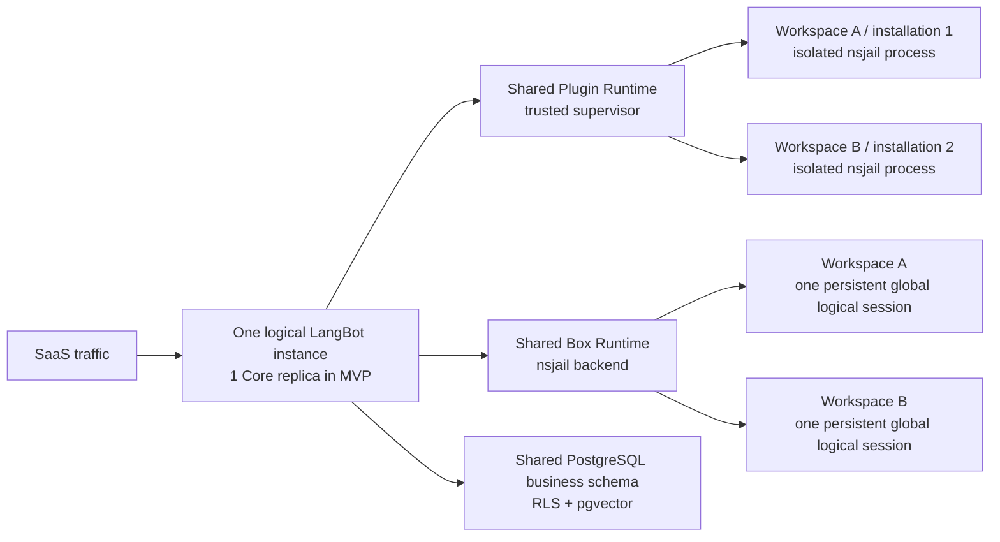

# Cloud v2 多租户架构决策与待决策项

状态：`DECIDED — Core isolation kernel implemented; SaaS activation gates remain`
创建日期：2026-07-19
最近更新：2026-07-20

本文记录 Cloud v2 多租户架构中已经确认的首期决策、明确淘汰的方案和仍需在后续阶段决定的扩展项。
本文同时记录实现状态。“实现完成”仅指开源 Core/SDK 的隔离内核和 fail-closed 门禁，
不表示闭源 Control Plane、计费或 Cloud v2 部署已经可上线。最终实现选择同步记录在
[implementation-decisions.md](./implementation-decisions.md)，剩余发布门禁记录在实施清单和验证报告。

## 0. 已确认的 SaaS 拓扑前提

1. SaaS 只有一个逻辑 LangBot 实例，全部 Workspace 都是该实例内的租户。
2. 产品和领域模型中不引入 Cell 内多个 CloudInstance、Workspace Placement 或 Workspace 到 CloudInstance 的路由。
3. 当前不实现分布式，但同一个逻辑实例未来可以运行多个 Core、Plugin Runtime 和 Box Runtime replica，
   也可以增加 PostgreSQL shard；这些只是内部实现，不成为新的租户或产品实体。
4. 所有副本共享稳定的 `instance_uuid`；`replica_id`、`worker_id` 和进程地址是短期运行身份，不能写进业务资源的永久主键。
5. `workspace_uuid` 始终是数据、任务和运行时的租户键，也是未来内部路由与分片的候选键。
6. generation/epoch 的语义是执行所有权、故障转移和任务撤销，不代表 Workspace 在多个 CloudInstance 之间 Placement。
7. 注册 Account 时自动创建 Workspace，但只新增目录记录和业务行，不创建租户专属部署、数据库、队列或 Runtime。
8. OSS 仍是单租户 LangBot 实例，但允许该 Workspace 内存在多个用户；只有 SaaS 开启多 Workspace 租户模式。

“单个 LangBot 实例”表示单个逻辑服务和安全域，不等于永远只有一个 OS 进程或一个 Kubernetes replica。
当前代码字段 `placement_generation` 在完成架构迁移前继续兼容，目标语义和候选命名是 `execution_generation`。

### 0.1 本轮确认的首期决策

| 编号  | 结论                                                                                                                                          | 首期状态                                                             |
| ----- | --------------------------------------------------------------------------------------------------------------------------------------------- | -------------------------------------------------------------------- |
| D-001 | 一个共享 Plugin Runtime 控制面；每个运行中的 plugin installation 独占一个 nsjail 子进程；只有 digest 相同且已验证的代码 artifact 可以只读共享 | `FOUNDATION IMPLEMENTED — Linux/egress, crash recovery and disk-quota gates pending` |
| D-002 | 一个共享 Box Runtime；Cloud 固定使用 nsjail；符合套餐的 Workspace 最多一个持久 `global` 逻辑 sandbox，普通执行按需启动 nsjail 进程            | `IMPLEMENTED FAIL-CLOSED — hard filesystem quota provider pending`   |
| D-003 | SaaS 业务数据使用 PostgreSQL shared schema、应用层作用域和 RLS 双重隔离；pgvector 使用同一 PostgreSQL，作为 SaaS 默认向量后端                 | `PARTIALLY IMPLEMENTED — transaction/outbox/deployment gates remain` |
| D-004 | stdio MCP 与 Box availability 解耦；Cloud v2 首期强制关闭 stdio MCP，避免为每个 Workspace 创建额外的 `mcp-shared` persistent sandbox          | `IMPLEMENTED`                                                        |

Workspace 的具体创建、释放、数据导出和单 Workspace 恢复机制不在本轮决定；本文只保证这些后续能力不会改变稳定的
`workspace_uuid`，也不会要求重建租户专属部署。

## 1. 本轮重构的最高目标

> 共享可信控制面和基础设施池，隔离不可信执行单元；减少独立部署、扩缩容和运维组件，使新增 Account 或 Workspace 的静态成本接近零。

这里的“减少组件”指减少独立 Deployment、Service、数据库、消息系统和租户专属常驻控制面，
不是通过合并安全边界来减少必要的隔离进程。

统一评估原则：

1. 注册 Account、自动创建空 Workspace 时，不启动 Plugin worker 或 Box sandbox。
2. 启用插件后，每个 installation 的常驻成本来自其独立安全边界；首次使用托管 sandbox 后，符合套餐的 Workspace 才承担一个持久逻辑 session 的成本。
3. 可信 supervisor、artifact cache、数据库连接池和 Runtime 容量可以多租户共享。
4. 一个不可信插件进程不能服务多个 installation；一个 sandbox/session 不能服务多个 Workspace。
5. 默认使用共享 Runtime；dedicated 只作为未来高隔离、大客户或合规资源等级，不建立第二套外部协议。
6. 没有明确容量证据前，不新增 Kafka、Redis、Runtime 专用数据库、Box 专用数据库或租户级调度服务。
7. 多租户隔离必须覆盖身份、路由、存储、缓存、日志、配额、撤销和故障恢复，不能只给请求增加 `workspace_uuid`。

## 2. 首期部署形态与未来演进



| 档位                       | 内部部署形态                                                                                                                                                | 新 Workspace 静态成本         | 启用条件                 |
| -------------------------- | ----------------------------------------------------------------------------------------------------------------------------------------------------------- | ----------------------------- | ------------------------ |
| M0. 单副本 MVP             | 一个 Core、一个共享 Plugin Runtime、一个共享 Box Runtime、一个 PostgreSQL business database；插件按启用状态运行，托管 sandbox 按首次使用与 entitlement 创建 | 只新增 Workspace 业务行       | 当前已确认目标           |
| M1. 同逻辑实例内部横向扩展 | Core、Plugin Runtime、Box Runtime 按容量增加 replica；运行所有权由内部 lease 和 generation fence 决定；PostgreSQL 可增加共享 shard                          | 不创建 Workspace 专属部署     | 出现容量或可用性证据后   |
| M2. Dedicated 资源档位     | 特定 workload 使用独享 worker pool、sandbox class 或 PostgreSQL shard，但沿用相同身份、协议、schema 和控制面                                                | 仅由购买 dedicated 的客户承担 | 合规、数据驻留或超大负载 |

M1 是 M0 的透明扩容，M2 是相同架构下的资源等级；两者都不是新的 LangBot 实例、Cell 或 CloudInstance。
外部 API 只认识稳定的 `instance_uuid` 和 `workspace_uuid`，不认识 replica、worker、pool 或 shard。

Plugin Runtime 与 Core 在 M0 是否共用 Pod 仍可按发布和故障域决定；即使共用 Pod，也必须使用独立容器和 security context，
Core 不能继承 Plugin Runtime 所需的 nsjail/cgroup 权限。Box Runtime 同样使用独立进程身份和安全配置，
不与 Plugin Runtime 合并成一个高权限进程。

## 3. D-001：Plugin Runtime 多租户控制面

状态：`FOUNDATION IMPLEMENTED — Cloud deployment and worker-recovery gates pending`

### 3.1 已实现的基础

- Plugin Runtime 控制连接只绑定稳定实例身份；一个逻辑共享控制面通过完整 installation binding 管理多个 Workspace，M0 由一个 Supervisor replica 承担。
- 每个运行中的 installation 使用独立 nsjail worker；enabled-resident 是 desired semantics。代码只读，home/tmp/data 私有，shared profile 不读取 artifact `.env`。
- 实例级 `PluginWorkerPolicy` 由 Core 的 `data/config.yaml` 下发，支持原生环境变量覆写；manifest 不能覆盖。
- `installation_uuid`、`artifact_digest` 和 `runtime_revision` 已持久化并进入 desired-state、注册、Host API 和 generation/revision fence。
- 已验证 `.lbpkg` 先进入 Workspace-scoped durable binary storage；Runtime 本地缓存丢失后可由 Core replay。
- 相同 digest 的代码和 Runtime 准备的只读依赖环境可以共享，但 worker、运行时写入、配置和数据不合并；
  dependency preparation 在启动 worker 前完成，失败会进入明确的 installation failed 状态。
- Cloud shared profile 强制 Linux nsjail；`plugin.worker.require_hard_limits=true` 时 cgroup v2 delegation 不可用会启动失败。

### 3.2 已确认的不变量

1. 每个运行中的 plugin installation 独占一个 worker process tree，任何时刻都不能与其他 installation 共用；
   停用或删除的 installation 可以没有进程。
2. 插件进程只绑定一个
   `(instance_uuid, workspace_uuid, execution_generation, installation_uuid, runtime_revision, artifact_digest)`，且运行期间不可重绑。
3. 插件不能通过 payload、Host API 参数、环境变量或重连选择 Workspace。
4. 插件进程的 home、tmp、可写数据、secret、进程视图和配额必须按 installation 隔离。
5. 只有 `artifact_digest` 相同且完整性已验证的代码文件和依赖环境可以只读共享；
   同名同版本但 digest 不同的 artifact 不能共享。配置、持久数据和运行进程不能共享。
6. generation、installation revision 或 capability 被撤销后，旧进程必须失去 Host API 和副作用权限。
7. Supervisor 不在自身解释器中加载第三方插件代码。

### 3.3 首期执行模型

- 整个 SaaS 实例共享一个可信 Plugin Runtime 逻辑控制面，M0 运行一个 Supervisor replica；新 Workspace 不创建专属 Runtime、连接、卷或进程。
- Supervisor 的控制连接只绑定稳定 `instance_uuid` 和短期 Runtime identity，不绑定某个 Workspace。
  每条 installation desired-state 命令都携带并验证完整的 installation binding；每个 worker action context 在注册后永久绑定该 tuple。
- 安装并启用插件后，Supervisor 在自己的 Runtime 容器内直接启动一个 nsjail 子进程；
  不再为每个插件创建 nested container、Pod、sidecar 或租户级 Runtime service。
- desired semantics 要求 enabled installation 保持 resident，不做 idle eviction；停用、删除、revision/generation 变化或 entitlement 撤销时停止并按需重建。
  当前实现只会在 Runtime 重连或 Core apply/reconcile 时恢复意外退出的 worker，尚缺 completion callback、有界 backoff 和跨租户重启风暴抑制；
  这属于 Cloud 激活门禁，不能把 desired semantics 描述成已经具备即时自愈。
- 子进程使用一次性 registration capability 向 Supervisor 注册；capability 由可信 desired state 派生并绑定完整 installation tuple，
  不是插件直接建立 Core Host connection，也不能只绑定 author/name/path。Supervisor/Core 据此注入 tenant context，
  丢弃插件 payload 中自带的 scope 字段。
- Supervisor 的进程表、nsjail root/tmp 和 artifact cache 都是可重建运行态；PostgreSQL 中的 installation desired state 才是权威业务状态。
- M0 不增加 Runtime 专用数据库、Redis、Kafka、scheduler 或 artifact service；Core 重连后向 Supervisor replay desired state。

### 3.4 nsjail 和文件边界

首期目标目录模型：

```text
data/plugin-runtime/
├── artifacts/sha256/<artifact_digest>/code/   # digest 校验后只读共享
├── environments/sha256/<environment_digest>/ # 原子发布、只读共享依赖环境
└── installations/<installation_uuid>/
    ├── home/                                  # 私有可写
    ├── tmp/                                   # 私有可写、可清理
    └── data/                                  # 私有持久数据
```

- artifact 只有在内容摘要和完整性校验一致时才允许共享，不能只凭 author/name/version 复用目录；
  cache 可接受的签名/来源、撤销和 GC 规范属于后续发布规则，不改变本轮基于已验证 digest 的只读共享边界。
- artifact 与按环境摘要构建的共享依赖环境以只读 mount 进入 nsjail；installation 的 home/tmp/data 使用独立可写 mount。
  环境摘要包含 artifact、requirements、Python ABI、Runtime 版本和 installer schema。依赖只能从已验证 artifact 的 PEP 508 声明构建，
  index/trusted-host 只由实例配置控制；构建在独立 nsjail 的临时路径中完成并在成功后原子发布，失败或并发安装不能留下可见半成品。
- 插件 cwd 可以是其私有 mount namespace 内的只读 `/plugin`，不要求为每个 installation 复制代码；
  必须私有的是 home/tmp/data 等所有可写路径。
- nsjail 必须启用 mount、PID、IPC、UTS 和 private `/proc` 等必要 namespace，插件不能枚举或 signal 其他插件及 Runtime 进程，
  不能读取 Runtime 文件系统、宿主机路径、其他 installation 目录或平台 metadata endpoint。
- 公开 SaaS 禁止从插件 artifact 自动加载 `.env`。secret 只能由可信控制面按 installation 注入，且不能进入共享 artifact/cache。
- 插件需要外网时使用受控 egress；不得通过共享 host network 访问 Core loopback、Box Runtime、数据库或其他内部服务。
- Cloud 部署必须提供可用的 cgroup v2 delegation 和所需 namespace 权限；如果硬 CPU/内存/PID 限制不可用，
  Plugin Runtime readiness 必须失败，不能只记录告警后降级为普通子进程。

### 3.5 统一资源上限与配置

首期资源规格完全由 LangBot 实例配置决定，manifest 不能声明、放宽或覆盖资源。以下数值是建议默认值，
最终仍由同一实例的 `data/config.yaml` 统一配置：

```yaml
plugin:
  worker:
    max_cpus: 1.0
    max_memory_mb: 512
    max_pids: 128
    max_open_files: 256
    max_file_size_mb: 512
    require_hard_limits: true # Cloud; OSS defaults false
```

配置文件路径为 `data/config.yaml`，沿用现有原生环境变量覆写：

- `PLUGIN__WORKER__MAX_CPUS`
- `PLUGIN__WORKER__MAX_MEMORY_MB`
- `PLUGIN__WORKER__MAX_PIDS`
- `PLUGIN__WORKER__MAX_OPEN_FILES`
- `PLUGIN__WORKER__MAX_FILE_SIZE_MB`
- `PLUGIN__WORKER__REQUIRE_HARD_LIMITS`

Core 启动时校验配置并通过现有 `SET_RUNTIME_CONFIG` 下发不可变 `PluginWorkerPolicy`。
Runtime 不读取另一份环境变量配置，避免两个配置源不一致。CPU、内存和 PID 使用 cgroup 硬限制，
open files/file size 使用 rlimit。Cloud deployment profile 固定使用 nsjail，不能通过插件 manifest 或 SaaS 环境变量降级为普通进程。
installation data 的总空间硬配额需要 filesystem project quota 或独立 quota volume，不能用目录扫描伪装成硬限制；
该字段在选定可原子拒绝写入的存储机制前不进入首期配置。

### 3.6 淘汰与暂缓方案

| 状态       | 方案                                               | 结论                                                     |
| ---------- | -------------------------------------------------- | -------------------------------------------------------- |
| 淘汰       | 每 Workspace 一个 Plugin Runtime                   | 部署、连接和固定内存随 Workspace 线性增长                |
| 淘汰       | 一个插件进程服务多个 Workspace/installation        | 全局状态、本地文件和依赖无法形成可信租户边界             |
| 淘汰       | 同 Workspace 多插件合并到一个 worker               | 与“每 installation 独立进程”冲突，扩大故障和权限边界     |
| 淘汰       | manifest 自行声明 CPU、内存或更高限额              | 首期统一执行实例级最大值                                 |
| MVP 不引入 | Runtime 专用数据库、Redis、Kafka 或独立 scheduler  | 当前无容量证据，会增加组件和运维面                       |
| 后续演进   | 多 Supervisor replica、owner lease、dedicated pool | 保留接口，达到容量或可用性阈值后再决定具体存储与调度方式 |

架构扩展项包括：Core/Supervisor 是否共置、artifact/venv cache 的签名/来源/撤销/GC 规范、installation data hard-quota provider、
v1 connection 的兼容期限，以及进入多 replica 后的 lease TTL、fencing token 和 owner 转移顺序。
这些不改变“每个运行中的 installation 一个隔离进程”的首期边界。

### 3.7 验收条件

- 两个 Workspace 安装 digest 相同且已验证的 artifact 时，共享目录仍为只读，进程、配置、data、home、tmp、日志和 Host API 完全隔离；
  同名同版本但 digest 不同的 artifact 绝不共享目录。
- 插件不能读取其他 installation 文件、枚举或 signal 其他进程，也不能修改共享代码/依赖目录。
- CPU、内存、PID、open files 和单文件上限在真实 nsjail/cgroup 环境中生效；超额只终止或拒绝对应 installation。
- 修改 manifest 不能改变任何资源上限。
- installation data 的总空间硬配额在写入边界原子拒绝超额，并证明目录扫描不是生产 enforcement。
- 旧 generation/revision 的回调、消息、副作用和存储访问全部失败关闭。
- Runtime 重启能从业务 desired state 恢复，不依赖本地进程表作为权威真相。
- 意外退出的 enabled worker 由 completion callback 触发带有界 backoff 的自动恢复；连续失败只影响对应 installation，不能形成跨租户重启风暴。
- requirements 中存在 Runtime 基础镜像未预装的包时，Supervisor 仍能先完成共享依赖环境准备再启动 worker；
  安装失败不会留下持续重启的半启动进程，也不会影响同 digest 已就绪环境的其他 installation。

## 4. D-002：Box 多租户控制面和套餐边界

状态：`IMPLEMENTED FAIL-CLOSED — production quota provider pending`

### 4.1 已实现的基础

- 共享 Box 控制连接可服务多个 Workspace；所有操作绑定 instance、Workspace 和 generation，Runtime namespace 由可信 context 派生。
- 短期 `SandboxAdmissionGrant`、revision tombstone 和原子 session admission 强制每个合资格 Workspace 最多一个 `global` persistent session，managed process 固定为零。
- Core 与 Runtime 使用认证 host-control challenge 校验同一个 durable volume，而不是比较路径字符串；不一致时启动和重连失败。
- Cloud skill 只传逻辑名称；Runtime 从 Workspace-scoped store 解析只读包路径，Python env/cache 写入租户自己的 `/workspace/.skill-envs`。
- ZIP 安装限制压缩输入、条目、单项、总解压量和压缩比，采用流式解压并拒绝 link、非普通文件、重复项和路径逃逸。
- 附件 host path 使用 query UUID 和 dirfd/openat/O_NOFOLLOW；Cloud replica 启动不再全局清理其他请求目录，遍历和删除有 inode 预算。
- grant-enforced readiness 强制 cgroup、namespace、mount、共享卷、Workspace hard quota、Skill hard quota、ephemeral storage 和 inode quota 全部被证明。
  普通 nsjail backend 对尚未实现的硬磁盘能力明确返回 false，因此当前 Cloud Box 会按设计拒绝启动，直到新部署提供真实 quota provider。

### 4.2 首期套餐与 entitlement 模型

- 闭源订阅管理/Control Plane 负责把套餐映射为版本化 entitlement；Core 和 Box Runtime 不硬编码 `plan == pro`。
- 首期复用 Cloud Control Plane（可结合现有 Space 的订阅模块）承载闭源套餐、计费和 entitlement 投影，
  不再拆一个独立 billing/tenant microservice；开源 Core 只实现通用 capability 和数值限额。
- 首期套餐投影为：Pro 的 `managed_sandbox_sessions = 1`，其他套餐为 `0`。建议 capability 形态：

```json
{
  "features": {
    "managed_sandbox": true,
    "external_sandbox": false,
    "mcp_stdio": false
  },
  "limits": {
    "managed_sandbox_sessions": 1
  }
}
```

- `box.enabled` 只表示当前 LangBot 实例是否部署了 Box Runtime，不能替代 Workspace entitlement。
- 工具发现层根据 entitlement 隐藏/禁用托管 sandbox。Core 校验 Control Plane 的 entitlement 后，
  通过受认证控制连接向 Box Runtime 下发短期 `SandboxAdmissionGrant`，绑定
  `instance_uuid + workspace_uuid + execution_generation + entitlement_revision + expires_at + max_sessions + max_managed_processes`。
  Runtime 只验证和执行该内部 grant，不理解 Pro 等套餐名称，也不相信业务调用方提交的 plan、session ID 或 host path。
- entitlement 缺失、过期或无法验证时失败关闭。并发创建必须用原子 admission 保证同一 Workspace 永远不超过一个 managed session。
- entitlement 被撤销后停止 managed process 并关闭逻辑 session；Workspace 数据保留/删除策略随未来 Workspace 释放机制一并决定。

### 4.3 Cloud nsjail 执行模型

- 整个逻辑 SaaS 实例共享一个 Box Runtime 逻辑控制面，M0 运行一个 Runtime replica；不创建每 Workspace Box service、worker pool、PVC、bucket、scheduler、Redis 或 Box 数据库。
- Cloud 显式固定 `box.backend: nsjail`。sandbox 直接作为 Box Runtime 容器内的 nsjail 子进程运行，
  不创建 nested Docker container、独立 Pod、microVM 或 warm pool，也不挂宿主机 `docker.sock`。
- 符合 entitlement 的 Workspace 首次使用时懒创建一个逻辑 session，内部固定 ID 为 `global`，并强制 `persistent=True`；
  外部调用方不能选择或覆盖 session ID、persistence、host path 或 backend。
- “全局 sandbox 一直存活”在当前机制中的精确定义是：每个合资格 Workspace 最多一个稳定的 `global` 逻辑 session，
  它不被 TTL reaper 回收，其 `/workspace` 持久保存；普通命令仍按需启动并退出 nsjail 进程，不能承诺一个空闲 OS 进程永久驻留。
- Box Runtime 重启后，旧进程、attach token、root/tmp/home 和内存 session 状态失效；下一次使用时以相同 Workspace namespace 懒重建
  `global` session。持久 `/workspace` 必须继续存在，旧 generation 权限必须失败关闭。
- 共享 Box Runtime 采用单 owner 的 M0 实现；未来多 replica 才引入 session owner lease 和跨 replica 路由，
  但 session handle 永远不包含 replica 地址。
- Cloud 首期强制 `network=off`，调用方和 WebUI 不能覆盖。当前 `network=on` 会关闭 nsjail 的独立 network namespace，
  不能用于共享 SaaS。未来如需联网，必须先实现每 session 独立 netns 和受控 egress，再单独开放。
- Cloud 首期禁止 `START_MANAGED_PROCESS`，`SandboxAdmissionGrant.max_managed_processes` 固定为 `0`；
  普通 exec 在同一 Workspace 的 `global` session 内串行执行。未来开放 resident process 前必须增加数量和聚合 CPU/内存上限。

### 4.4 文件与资源边界

- 文件机制沿用当前 nsjail 方案：Box-owned durable volume 上的 Workspace 目录只 bind mount 到对应租户的 `/workspace`；
  不在首期新增对象存储双向同步服务或文件服务。
- `/workspace` 的持久性来自独立 durable host path，而不是 `persistent=True`；后者只禁止 TTL/普通 shutdown 回收逻辑 session。
  Box Runtime 容器必须挂载持久卷，Workspace 数据不能只放在容器可写层。root/tmp/home 可以在 Runtime 重启时丢失。
- Cloud MVP 要求 Core 与 Box Runtime 以相同路径挂载同一持久卷并沿用直接文件读写；现有 exec/base64 fallback 的单文件上限
  低于正常附件上限，不能当作等价 Cloud 文件机制。无法共享路径时必须先扩展传输协议，否则 deployment readiness 失败。
- 现有执行前后目录扫描只能提供软检查，不能阻止单次命令写满共享卷。生产 Cloud 的 Workspace 总空间上限必须由
  Box-owned volume 的 filesystem project quota/subvolume quota 在写入点原子执行；Box Runtime 负责设置和验证，不能因 Core 看不到路径而跳过。
- Cloud 的 nsjail CPU、内存、PID、单文件和总空间限制使用运维配置统一设置；套餐只决定 session 数量，
  不允许 Workspace 放宽 sandbox 上限。
- Box Runtime 必须在 cgroup v2 hard limit、namespace 和 mount 条件满足后才通过 readiness；不能在共享 SaaS 中告警后降级运行。
- 同 Workspace 的 `global` session 可以复用持久 `/workspace`，但不同 Workspace 即使使用相同文件名、进程名或逻辑 session ID，
  物理 namespace、路径、进程和 capability 也必须完全隔离；Cloud 首期没有可暴露端口或共享网络 namespace。

### 4.5 非 Pro 和未来外部 E2B

- 非 Pro Workspace 在首期没有 Cloud managed sandbox，直接调用内部 API 也必须被拒绝。
- 未来允许 Workspace 在 WebUI 配置自己购买的远程 E2B endpoint/template/secret；它属于 tenant-owned external sandbox，
  不消耗 Cloud 的 `managed_sandbox_sessions` 配额，也不能读取其他 Workspace 的凭证。
- 当前 Box Runtime 只有实例级全局 backend 和 E2B credential，WebUI 也没有 Workspace 级配置，因此 BYOK E2B 明确不在首期实现。
- 未来实现时在共享 Box Runtime 内增加按可信 Workspace context 选择 backend/provider 的 registry，
  仍不创建租户专属 Box 控制面或新协议。

### 4.6 淘汰与暂缓方案

| 状态       | 方案                                             | 结论                                                     |
| ---------- | ------------------------------------------------ | -------------------------------------------------------- |
| 淘汰       | 每 Workspace 一个 Box service                    | 组件和空闲成本随 Workspace 线性增长                      |
| 淘汰       | 多 Workspace 共享一个活 sandbox/session          | 不能承载不可信代码                                       |
| 淘汰为 MVP | Docker、独立 Pod、microVM 或 warm pool           | Cloud v2 首期固定使用 Runtime 容器内 nsjail              |
| 淘汰为 MVP | 非 Pro 使用 Cloud managed sandbox                | 首期数值 entitlement 为 0                                |
| 后续演进   | 多 Box Runtime replica、dedicated pool、BYOK E2B | 保留 provider/ownership 接口，有真实容量或产品需求后实现 |

### 4.7 验收条件

- Pro entitlement 首次使用时懒创建一个 persistent `global` session；重复和并发请求都不能产生第二个 session。
- 非 Pro、entitlement 缺失/过期及伪造 plan 的 API 直调全部失败关闭。
- TTL 不回收 persistent session；Runtime 重启后进程和临时目录失效，但 `/workspace` 保留并能在下一次使用时安全重建。
- 两个 Workspace 的文件、进程、session、attach token 和 generation 完全隔离；network/managed-process 请求在首期失败关闭。
- Core 与 Box Runtime 通过随机 marker challenge 证明同一共享持久卷；只配置相同路径字符串不算通过。
- Workspace、Skill store、ephemeral root/tmp/home 的 byte quota 与 inode quota 在写入点真实生效；现有目录扫描不被当作硬配额。
- cgroup 或任一硬存储能力不可用时 Cloud Box Runtime readiness 失败；普通 nsjail 因此不会被误当成 production-ready provider。

## 5. D-003：SaaS PostgreSQL 与 pgvector

状态：`PARTIALLY IMPLEMENTED — shared schema/pgvector complete; SaaS transaction and deployment gates remain`

当前分支已实现 PostgreSQL shared schema、transaction-local scope、FORCE RLS、Cloud runtime 非 DDL 模式、
同业务数据库 pgvector、显式向量维度和 tenant-scoped vector 主键。一次性 migrator 使用独立凭据、advisory lock，
负责建立并校验 runtime role 的最小权限，并完成全量 schema 验证；
普通业务写入贯穿 commit 的 generation-aware fence、与外部副作用同事务的 outbox，以及 generation cutover 后稳定的 durable object 引用尚未实现。
这些 Core 事务原语与生产 Job、凭据发放、备份和回滚流程，以及 runtime credential 的跨 database 连接隔离证明一起，
都是 Cloud v2 的 SaaS activation gate。

### 5.1 已确认的数据库边界

- PostgreSQL 是 SaaS 的业务数据库，不把它扩展成通用 Runtime coordinator、Box session directory 或新控制面数据库。
- M0 使用一个 PostgreSQL business database/shared schema 承载全部 Workspace。创建 Workspace 不创建 database、schema、role 或专属连接池。
- 首版 migrator URL 和 runtime URL 必须归一化到同一 host、port 和 database，但必须使用不同 role。
  未来如果 migrator 使用 direct endpoint、runtime 使用 pooler endpoint，只能在两个端点都验证同一个数据库内部 cluster identity 后放宽 host/port 相等。
  该 identity 由 migrator 所有并固定，runtime role 只能读取，不能创建、修改或伪造。
- 首版唯一业务 schema 固定为 `public`。migrator 和 runtime 连接都必须满足
  `current_schema() = 'public'` 且 `current_schemas(false) = ARRAY['public']`；禁止 runtime role 级和 business database 级 `search_path` 覆写。
- migrator 和 runtime session 的安全值固定为 `session_replication_role=origin`、`row_security=on`、
  `lo_compat_privileges=off`。runtime role 或当前 business database 作用域内只要存在任意 `pg_db_role_setting` 持久化设置就失败关闭，
  即使该设置当前看似等于安全值也不接受；tenant context 只能通过事务内 `SET LOCAL` 建立。
- 业务行显式携带 `workspace_uuid`；Repository/Service 的应用层 scope 是第一道边界，PostgreSQL RLS 是第二道边界。
- runtime role 的直接 ACL 固定为：business database 的 `CONNECT`、`public` 的 `USAGE`、全部 allowlisted business table 的
  `SELECT/INSERT/UPDATE/DELETE`、`alembic_version` 的只读 `SELECT`，以及业务表自有 sequence 的 `USAGE/SELECT`。
  不授予 database/schema `CREATE`、table `TRUNCATE/REFERENCES/TRIGGER`、sequence `UPDATE`、其他对象权限或任何 `WITH GRANT OPTION`。
- runtime role 必须是 `LOGIN`，但不得具有 superuser、`BYPASSRLS`、`CREATEDB`、`CREATEROLE` 或 replication 属性；
  不得在 role membership 中以 granted role、member 或 grantor 任一方向出现；不得拥有 database、schema、table、view、sequence、routine 或 extension，
  不得持有 column ACL，也不得使用、创建或拥有其他非系统 schema。
- business database 必须安装 `vector`，且 extension catalog 只允许 `plpgsql` 和 `vector`；不得存在 FDW、foreign server 或 user mapping。
  runtime role 和 `PUBLIC` 都不得有显式 routine ACL 或 parameter `SET/ALTER SYSTEM` ACL；runtime role 不得有效执行任何
  `SECURITY DEFINER` routine，包括被 allowlisted extension 收编的 routine。普通非 `SECURITY DEFINER` 内建函数的隐式执行权限不在此禁令内。
- PostgreSQL 新 database 默认向 `PUBLIC` 提供的 `TEMP` 是首版在专用业务 database 上明确接受的兼容性决定，
  不是 migrator 对 runtime role 的直接 grant；首版不得据此把业务 database 与不受信任工作负载混用。
  migrator 在释放 advisory lock 前建立并校验上述精确 allowlist；Cloud runtime 每次启动都必须重新完成 schema、身份、有效权限和 catalog 负向校验，发现 drift 立即失败关闭。
- PostgreSQL role 是 cluster-wide identity，当前 database 内的 catalog audit 不能证明同一 credential 无法连接 cluster 中的其他 database。
  SaaS 生产环境必须使用仅向该 credential 暴露目标 business database 的专用 PostgreSQL cluster/endpoint，
  或通过已验证的 HBA/proxy policy 证明该 credential 只能连接目标 business database；这项部署隔离仍是未完成的 activation gate。
- 关键租户表使用 `FORCE ROW LEVEL SECURITY`；migration/repair/audit 使用独立受控 migrator role。
- 每个租户事务通过 `SET LOCAL` 设置 tenant context，并由统一 `TenantUnitOfWork` 保证设置 context 和业务查询使用同一事务/连接。
  禁止使用连接级 session variable 或 `search_path`，避免连接池、PgBouncer、异常回滚和后台任务串租户。
- 一个 `TenantUnitOfWork` 只能访问一个 Workspace。业务写入与对应 business outbox 在同一事务中提交；
  写入可以校验由执行层传入的 generation/fencing token，但 Runtime owner、lease 和 Box session directory 不由业务 PostgreSQL 承担。
- SaaS schema、extension 和 policy 只由 release migration job 创建；应用启动角色不执行 `CREATE EXTENSION`、`create_all` 或自动 migration。
- OSS 继续默认 SQLite，并保留自托管 PostgreSQL 选项；Cloud RLS 约束不让 OSS 强制依赖 PostgreSQL。

### 5.2 pgvector 首期方案

- SaaS 使用 pgvector 作为默认向量数据库，并与业务表使用同一个 PostgreSQL cluster/database；
  vector schema 可以使用独立 adapter、受控 role 和有上限的 pool，但不新增 Chroma、Milvus 或独立向量数据库服务。
- OSS 默认仍是 SQLite + Chroma，用户可以显式选择 pgvector；Cloud 配置 pgvector 失败时必须启动失败，不能静默回退到 Chroma。
- 向量表必须显式保存 `workspace_uuid` 和 `knowledge_base_uuid`，并至少以
  `(workspace_uuid, knowledge_base_uuid, vector_id)` 建立唯一键/主键和查询条件；服务端生成的 collection name/hash 不是安全边界。
- pgvector adapter 复用相同的 tenant-context/RLS 契约，每次向量操作在自己的事务中执行 `SET LOCAL`；
  是否复用普通业务 UoW、role 或 connection pool 由实现决定，但 adapter 不能丢弃 tenant metadata。
- `vector(1536)` 不能继续作为无条件硬编码。首期使用无 typmod 的 `vector` 列和显式 `embedding_dimension`，
  以 `CHECK (vector_dims(embedding) = embedding_dimension)` 校验；release migration 为允许的维度创建带 dimension predicate 的 expression/partial ANN index。
  知识库/model 元数据必须选择已启用维度，写入和查询 mismatch 或未启用维度时失败关闭，不能截断、补齐、退化为无界扫描或换后端。
- `vector` extension、表、索引和 RLS 由 release migration 创建。应用进程不在启动时执行 DDL。
- 0013 如需搬迁 legacy pgvector 数据，migrator 作为源表 owner 先记录每个受保护源表的 `ENABLE/FORCE RLS` 状态，
  仅在同一 migration transaction 内临时暂停 RLS，并在 `finally` 中精确恢复各表原状态。
  该流程不依赖 superuser 或 `BYPASSRLS`，也不允许在迁移事务外留下已禁用的 RLS。

### 5.3 候选拓扑与未来演进

| 状态     | 方案                                      | 结论                                                                        |
| -------- | ----------------------------------------- | --------------------------------------------------------------------------- |
| 首期决定 | P0. shared database/shared schema         | 一个 pool、一套 migration；应用 scope + RLS                                 |
| 后续演进 | P1. 多 shared database shard              | 每个 shard 仍承载多个 Workspace，并使用相同 schema；有容量/地域证据后再设计 |
| 后续例外 | P2. dedicated shard                       | 只作为合规、驻留或超大 workload 的资源等级，不建立第二套代码路径            |
| 淘汰     | schema/database per Workspace             | catalog、pool、migration、备份成本随 Workspace 线性增长                     |
| 淘汰     | database/schema per replica/Cell/Instance | 把业务数据拓扑错误绑定到计算副本或已删除的产品实体                          |

M0 不提前增加始终返回 `primary` 的 resolver、shard router 或 shard binding。
P1 的 resolver、映射、在线迁移、连接池预算、shard-affine replica 和 dedicated shard 细节等到出现容量、地域或合规需求时再设计。
在此之前，direct endpoint 与 pooler endpoint 分离只能通过数据库内部、runtime 不可伪造的 cluster identity 开启，不使用 DNS 名、数据库名或配置声明代替。

### 5.4 备份与生命周期边界

- PostgreSQL PITR 是 database/cluster 级恢复手段，不等同于单 Workspace 恢复。
- Workspace 创建、释放、export、delete、单 Workspace restore 和在线迁移机制本轮暂缓，后续单独决策；
  首期不以尚未设计的 export 能力作为数据库架构验收条件。
- 除关系业务数据和 pgvector 的向量/检索字段外，大对象、插件 artifact 和 sandbox 文件仍存放在对象存储或 Runtime 持久卷；
  PostgreSQL 保存相应业务元数据和稳定引用。
- tenant-visible usage/billing 业务行可以进入 PostgreSQL；基础设施 log/metric/trace 不进入业务数据库。
  高增长业务表在有数据量证据后再决定 retention、时间分区或分析存储。

### 5.5 验收条件

- 故意遗漏应用层 Workspace filter 时，RLS 仍阻止跨租户读写。
- 连接池/事务池复用、异常回滚、并发请求和后台任务不会残留 tenant context；如部署 PgBouncer，也必须覆盖 transaction pooling。
- migration 对 shared schema 只执行一次，不产生 Workspace 级 schema drift；应用启动角色不能执行 DDL。
- 首版拒绝 host、port 或 database 不同的 migrator/runtime URL，并拒绝相同 role；migrator/runtime 都只解析到 `public`，
  migrator 在迁移后完成精确 table/sequence/`alembic_version` ACL grant 和正反向 role 校验，runtime 每次启动重新校验。
- runtime role 没有任一方向的 role membership、`WITH GRANT OPTION`、`search_path` 覆写、对象所有权、其他 schema 访问或非业务对象权限；
  专用业务 database 上可继承 PostgreSQL 默认 `PUBLIC TEMP`，但 runtime role 没有直接 `TEMP` ACL。
- migrator/runtime session GUC 保持 `session_replication_role=origin`、`row_security=on`、`lo_compat_privileges=off`，
  runtime role/当前 database 没有任何 `pg_db_role_setting`；extension 仅为 `plpgsql/vector` 且 runtime 不拥有 extension，
  database 中没有 FDW/server/user mapping、runtime 或 `PUBLIC` 显式 routine/parameter ACL、runtime-owned routine 或 runtime 可执行的 `SECURITY DEFINER` routine。
- 生产 deployment 证明 cluster-wide runtime credential 只能连接目标 business database；专用 cluster/endpoint 或 HBA/proxy 隔离未经验证前不得启用 SaaS。
- legacy pgvector 搬迁在非 superuser、非 `BYPASSRLS` 的 table-owner migrator 下可成功，成功、异常和重试路径都精确恢复所有源表的 RLS/FORCE 状态。
- 业务写入和对应 business outbox 在同一事务内具备可证明的提交顺序；外部 generation/fencing token 校验失败时不产生写入。
- pgvector 使用真实 PostgreSQL 集成测试覆盖：两个 Workspace 使用相同 `vector_id`、猜测其他 Workspace ID、
  故意遗漏 scope、连接复用、CRUD 和后台任务，全部不能越权。
- embedding dimension 不匹配或 pgvector extension 不可用时失败关闭，不回退到其他向量后端。
- 新建 Workspace 只新增目录与业务行，不创建 database、schema、role 或专属连接池。

## 6. D-004：stdio MCP 独立开关

状态：`IMPLEMENTED`

### 6.1 已修复的原问题

- 修复前，stdio MCP 的启用条件只检查 transport 为 `stdio` 且 Box available，没有独立 feature gate。
- 修复前，所有 stdio MCP 使用固定的 `mcp-shared` 逻辑 session，并强制 `persistent=True`。
- 在该旧逻辑下，如果多租户 Cloud 只通过 `box.enabled` 开放能力，每个配置 stdio MCP 的 Workspace 都会额外保留一个 persistent sandbox，
  绕过“每 Workspace 最多一个 managed `global` sandbox”的成本和套餐边界。

### 6.2 首期决定

新增独立实例配置：

```yaml
mcp:
  stdio:
    enabled: true
```

- OSS 默认 `true`，保持当前本地部署兼容；Cloud v2 通过 `MCP__STDIO__ENABLED=false` 强制关闭。
- 该开关与 `box.enabled`、`managed_sandbox` entitlement 和 sandbox session 数量相互独立，不能从任一条件推导。
- 后续如开放给特定套餐，可在实例开关之上再叠加 Workspace capability；实例开关为 `false` 时任何 entitlement 都不能绕过。
- HTTP/SSE/其他远程 MCP transport 不受此开关影响。

### 6.3 强制检查点

开关必须同时覆盖：

1. MCP create；
2. MCP update 到 stdio；
3. transient connection test；
4. Core 启动时加载已有 stdio 配置；
5. RuntimeMCPSession/loader 的最终执行门禁；
6. WebUI transport selector 和错误提示。

不能只在 WebUI 隐藏选项。Cloud 配置关闭时，已有 stdio 记录保留但不自动启动，并返回明确的 feature-disabled 错误；
最终 gate 必须位于 Box 分支和 legacy host-stdio 分支之前，不能误报为 `box_unavailable`，
也不得创建 `mcp-shared` session 或 stdio 子进程。

### 6.4 验收条件

- Cloud 即使 `box.enabled=true` 且 Workspace 拥有一个 managed sandbox，也无法 create/update/test/start 任何 stdio MCP。
- 直接调用 API、重放旧配置和启动 bootstrap 都失败关闭，且不会产生 `mcp-shared` session、nsjail 进程或额外配额占用。
- OSS 默认行为保持兼容；HTTP/SSE MCP 正常工作。

## 7. 四项决策之间的关系

四项决策共同遵循：

> 多租户共享可信控制面、连接池、只读 artifact 和基础容量；租户独占不可信执行进程、sandbox、secret、可写文件和数据作用域。

- Plugin Runtime 通过“共享 Supervisor + 每 installation 独立 nsjail 进程”降低控制面数量，同时保留进程级租户隔离。
- Box 通过“共享 Runtime + 每个合资格 Workspace 一个持久逻辑 session + one-shot nsjail exec”避免每租户部署服务和空闲容器。
- stdio MCP 独立关闭，防止从 Box availability 隐式产生第二套 persistent sandbox。
- PostgreSQL 和 pgvector 共享数据库组件，但使用显式 tenant key、应用层 scope 和 RLS 防止共享存储变成共享权限。
- 订阅管理只在闭源 Control Plane 维护套餐与计费规则，并向开源 Core 投影签名/版本化 entitlement；
  Core/Runtime 执行通用 capability 和数值限额，不复制套餐名称或计费逻辑。

## 8. 当前不做分布式时仍保留的能力

1. 所有运行时协议继续携带稳定 `instance_uuid`、`workspace_uuid` 和 execution generation；不能依赖进程地址表达身份。
2. Core、Plugin Runtime 和 Box Runtime 的本地进程表不能成为 durable desired state 或撤销状态的唯一真相。
3. 创建、重试、回调、outbox 和 worker 注册使用稳定 idempotency key；重复投递不能产生第二个 owner 或副作用。
4. Plugin installation 和 Box session 使用稳定 owner abstraction；启用第二个 replica 前再实现带 expiry、CAS 和 fencing token 的 lease。
   具体 lease store 后续决定，不预设复用业务 PostgreSQL，更不因此新增 Runtime/Box 数据库。
5. Repository/UoW 不允许无边界跨 Workspace 事务；`workspace_uuid` 从第一天就是内部路由与分片候选键。
6. schema migration、任务扫描、监控聚合和运维接口不能假设永远只有一个 Core 进程。
7. 外部 API 不暴露 replica、worker 或 shard 标识；未来扩容不改变 Workspace URL、UUID 或客户端协议。
8. 只有出现容量、可用性、地域或合规需求时才增加 replica/shard；预留协议不等于现在部署额外组件。

## 9. 本轮明确不做的事情

- 不合并 plugin installation 进程，即使插件和版本完全相同；只允许共享摘要校验后的只读代码/依赖文件。
- 不允许插件 manifest 声明或覆盖 CPU、内存、PID、文件或存储上限。
- 不为每个 Workspace 创建 Plugin Runtime、Box service、database、schema、role、bucket、PVC 或消息队列。
- 不在 Cloud v2 首期使用 Docker sandbox、microVM、warm pool 或非 Pro managed sandbox。
- 不在首期实现 Workspace 级 BYOK E2B WebUI 配置。
- 不在 Cloud v2 首期支持 stdio MCP，也不让 Box availability 隐式开启它。
- 不把业务 PostgreSQL 用作未决定的 Runtime/Box 通用协调数据库，不在缺少容量证据时引入 Redis、Kafka 或新 scheduler。
- 不在本轮实现 Workspace export、释放、单租户恢复或在线迁移；具体生命周期另行决策。
- 不实现多个 CloudInstance、Workspace Placement 或 Cell Router；未来分布式只作为单逻辑实例内部的副本和分片能力。
- 不修改旧 Space 部署模型；Cloud v2 继续按绿地方案设计。
