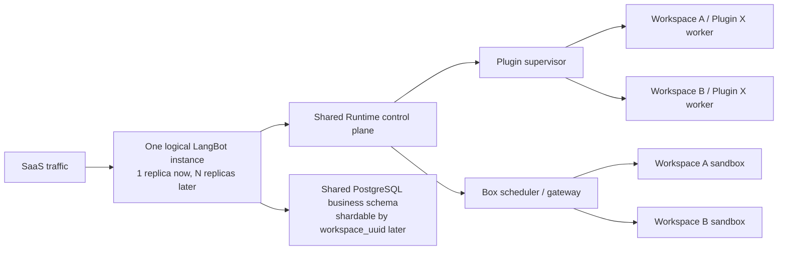

# Cloud v2 多租户架构待决策项

状态：`OPEN`
创建日期：2026-07-19

本文只记录架构质疑、候选方案和决策条件，不代表最终结论。在正式决策前，
[implementation-decisions.md](./implementation-decisions.md) 中已经落地的方案仍是当前实现基线；
正式结论需要再同步回主架构、决策日志、实施清单和协议设计。

## 0. 已确认的 SaaS 拓扑前提

1. SaaS 只有一个逻辑 LangBot 实例，全部 Workspace 都是该实例内的租户。
2. 产品和领域模型中不引入 Cell 内多个 CloudInstance、Workspace Placement 或 Workspace 到 CloudInstance 的路由。
3. 当前不实现分布式，但必须允许同一个逻辑实例未来运行多个 Core replica、Runtime supervisor replica、
   Box gateway/worker 和 PostgreSQL shard；这些只是内部实现，不成为新的租户或产品实体。
4. 所有副本共享稳定的 `instance_uuid`；`replica_id`、`worker_id` 和进程地址是短期运行身份，不能写进业务资源的永久主键。
5. `workspace_uuid` 始终是数据、任务和运行时的分片键。当前所有 Workspace 可以路由到同一个副本和数据库，
   将来可以在不改变外部 API 的情况下路由到不同副本或 shard。
6. generation/epoch 继续保留，但语义是执行所有权、故障转移和任务撤销，不再代表 Workspace 在多个 CloudInstance 之间 Placement。
7. 新增 Account 或 Workspace 只新增数据行；不能因为未来可能分布式而提前创建租户专属部署、数据库或队列。

“单个 LangBot 实例”表示单个逻辑服务和安全域，不等于永远只能有一个 OS 进程或一个 Kubernetes replica。
当前代码字段 `placement_generation` 在完成架构迁移前继续兼容，但目标语义和候选命名是 `execution_generation`。

## 1. 本轮重构的最高目标

本轮 Cloud v2 重构的核心目标是：

> 共享可信控制面和基础设施池，隔离不可信执行单元；减少需要独立部署、扩缩容和运维的组件，使新增 Account 或 Workspace 的静态成本接近零。

这里的“减少组件”主要指减少独立 Deployment、Service、数据库、消息系统和租户专属常驻进程，
不是通过合并安全边界来减少代码模块或必要的隔离进程。

统一评估原则：

1. 注册一个新 Account、创建一个空 Workspace，不应创建 Deployment、Pod、数据库、schema 或常驻 Runtime。
2. 闲置 Workspace 不应占用 Plugin 或 Box worker；成本应随实际使用增长。
3. 可信 gateway、supervisor、scheduler、artifact cache 和 worker pool 可以多租户共享。
4. 一个不可信插件进程或 Box sandbox 不能同时服务多个 Workspace。
5. 默认使用共享池；dedicated 只作为高隔离、大客户或合规套餐，不另造一套协议。
6. 优先复用 PostgreSQL transaction、outbox、advisory lock 和现有对象存储；没有明确容量证据前不新增 Kafka、专用 Runtime 数据库或专用租户调度数据库。
7. “多租户”必须同时覆盖身份、路由、存储、缓存、日志、配额、撤销和故障恢复，不能只给请求增加 `workspace_uuid`。

## 2. 候选的简化拓扑

下图是本轮讨论的候选方向，不是已批准拓扑：

`Shared Runtime control plane` 可以先是一个逻辑边界和一套协议，不强制 Plugin 与 Box 运行在同一个高权限进程中。
Box worker 需要更高的宿主机权限，仍应与 Plugin supervisor 使用不同的进程、身份和 worker pool；
两者可以复用 tenant lease、generation fence、quota 和调度模型。

## 3. D-001：Plugin Runtime 控制面是否多租户

### 3.1 质疑

当前决策是 “Plugin Runtime binds to exactly one Workspace”。新的质疑是：

> Plugin Runtime 的可信控制面应服务多个 Workspace，但每个插件执行进程必须只属于一个 Workspace，不能跨租户复用。

状态：`OPEN`，当前决策被质疑但尚未废止。

### 3.2 当前实现事实

- SDK `RuntimeContext` 只有一个不可重绑的 `workspace_binding`。
- Runtime 只有一个全局 control handler 和 PluginManager；插件、handler、任务与安装目录都处于 Runtime 全局集合。
- Core `PluginRuntimeConnector` 也绑定一个 `ActionContext`，并拒绝其他 Workspace。
- 插件本身已经以子进程运行，但包目录只按 author/name 组织，依赖安装会修改 Runtime 全局 Python 环境；
  包、依赖、debug 凭证和 supervisor 状态尚未按多租户 registry 设计。
- 如果直接按 Workspace 复制当前 Runtime，会复制 Deployment、固定内存、控制连接和本地存储，空 Workspace 也产生常驻成本。

### 3.3 不可妥协的不变量

1. 一个插件执行进程只能绑定一个
   `(instance_uuid, workspace_uuid, placement_generation, installation_uuid)`。
2. 插件不能通过 payload、Host API 参数或重连选择 Workspace。
3. 插件进程的 cwd、tmp、可写目录、secret、日志、配额和网络策略不能跨 Workspace。
4. 相同 artifact 或 dependency cache 可以只读共享，但执行进程、配置和持久数据不能共享。
5. generation、installation revision 或 installation UUID 变化后，旧进程必须失去 Host API 和副作用权限。
6. Supervisor 不能直接加载第三方插件代码；插件代码只在隔离 worker 中执行。

### 3.4 候选方案

| 方案                                                      | 部署与进程模型                                                       | 新增 Workspace 静态成本 | 隔离与运维                                                 |
| --------------------------------------------------------- | -------------------------------------------------------------------- | ----------------------- | ---------------------------------------------------------- |
| A. 每 Workspace 一个 Runtime                              | 每个 Workspace 复制 supervisor，内部再启动插件进程                   | 高                      | 隔离直观，但组件数随 Workspace 线性增长                    |
| B. SaaS 实例共享 Supervisor，插件进程按 installation 隔离 | 一个共享 supervisor 管理多个租户，每个活跃安装一个绑定进程或 sandbox | 近零                    | 改造较大，但最符合成本目标                                 |
| C. 共享 Supervisor，每 Workspace 一个 worker 承载多个插件 | 控制面共享，Workspace 内插件共享一个执行进程                         | 近零                    | 进程数更少，但同租户插件互相影响，且偏离当前每插件进程模型 |

### 3.5 当前倾向（非决策）

倾向方案 B：

- 把“只绑定一个 Workspace”的边界从整个 Plugin Runtime 下沉到每个插件 installation worker 和它的 Host connection。
- Runtime Supervisor 以整个逻辑 SaaS 实例为共享边界，持有多租户 registry、调度、artifact cache 和进程生命周期。
- 当前可以只有一个 active Supervisor；未来增加 replica 时，以 installation lease 保证同一 installation 只有一个 owner。
- Core 与 Supervisor 使用一条或少量可多路复用的可信控制连接；每个 action 都带服务端生成或验签的 tenant lease。
- 插件进程使用一次性 capability 注册，capability 至少绑定
  `instance_uuid + workspace_uuid + generation + installation_uuid + runtime_revision + artifact_digest`。
- Supervisor 使用进程的不可变 binding 注入 Host API context，继续丢弃插件 payload 中的 scope 字段。
- 新 Workspace 不启动 Runtime；安装并启用插件后才创建 worker。无后台任务的插件可 idle eviction，有常驻事件或定时任务的插件按 entitlement 保持 resident。
- artifact 与 venv 可以按 digest 只读复用；安装实例使用私有运行目录。公开 SaaS 的第三方插件最终应使用 cgroup 加内核级 sandbox，单纯同 UID 子进程只适合作为受信插件兼容层。

为了减少组件，MVP 不新增 Runtime 专用数据库或消息队列：PostgreSQL 中的 plugin installation 记录保存 desired state，
Core 连接或重连时向可重建的 Supervisor replay；Supervisor 只保存运行态、lease 和缓存。

### 3.6 需要正式决定的问题

- Supervisor 多副本后如何按 `(workspace_uuid, installation_uuid)` 分片、续租和故障转移，且不暴露新的 CloudInstance 概念。
- 公共 SaaS 首版是否强制容器/nsjail，还是允许受信插件使用普通进程。
- 默认是否保持“每 installation 一个进程”；是否允许同 Workspace 的受信插件合并 worker。
- 插件 manifest 如何声明 `on_demand`、`resident`、后台任务和资源规格。
- content-addressed artifact/venv cache 的版本、签名、淘汰和供应链校验规则。
- Runtime protocol v2 是直接做 multiplexed control connection，还是先用多条 Workspace-bound connection 过渡。
- 单 Supervisor 快速恢复是否满足 MVP，还是首发就需要多副本 installation lease。

### 3.7 决策验收条件

- 两个 Workspace 同时安装同名、同版本和不同版本插件，进程、配置、storage、日志和 Host API 均不可串租户。
- 一个插件 worker 崩溃、超额或被撤销，只影响对应 installation。
- 新建但不使用插件的 Workspace 不增加常驻进程。
- Supervisor 重启可由 PostgreSQL desired state 恢复，不依赖本地租户状态作为权威真相。
- 旧 generation 的插件回调、消息、副作用和存储访问全部失败关闭。

## 4. D-002：Box 控制面是否多租户

### 4.1 质疑

新的质疑是：

> Box 的 gateway、调度和 worker pool 应在整个逻辑 SaaS 实例内共享，不应按 Workspace 或用户复制；每个 sandbox、session 和 managed process 仍必须是单租户执行边界。

状态：`OPEN`。

### 4.2 当前实现事实

- Box 已经用 `instance_uuid + workspace_uuid` 派生持久 namespace，并用 generation 派生运行时 namespace。
- Box server 的 generation fence 已按 `(instance_uuid, workspace_uuid)` 建索引，说明一个进程内已有多 Workspace 数据结构基础。
- 但 RPC 控制连接仍通过共享 secret 绑定一个 trusted instance；一个 Box server 不能安全地直接接收多个 Core instance。
- generation、活跃任务和 stale-session 目录主要保存在单进程内存中；多副本 gateway 无法共享 owner 和 fence 状态。
- 当前远程 connector 是 Core 到 Box 的长连接，不是可被多个 Core replica 共享的 session scheduler。
- `INIT`、`SHUTDOWN` 和 backend 配置仍是整个 Box 进程的全局操作，不能直接暴露给多租户 Core 连接。
- 当前 orphan cleanup 不能区分其他 gateway/worker replica 的有效容器；现有 Kubernetes 方案挂载 `docker.sock`，
  不能直接作为整个 SaaS 实例共享的安全边界。

### 4.3 不可妥协的不变量

1. 一个 sandbox、session 或 managed process 在生命周期内只能属于一个
   `(instance_uuid, workspace_uuid, placement_generation)`。
2. Workspace 不能指定 host path、特权挂载、worker 节点或其他租户的 session ID。
3. persistent Workspace data 与 ephemeral generation/session data 必须使用不同 namespace 和生命周期。
4. generation 切换必须撤销旧 attach token、stdin/stdout relay、进程和不可回滚副作用。
5. 配额、公平调度、网络策略、CPU、内存、PID、磁盘和端口都按 Workspace 或 workload lease 执行。
6. warm pool 可以共享镜像和空闲容量，但不能并发共享一个未重置的 sandbox。

### 4.4 候选方案

| 方案                                                   | 模型                                             | 成本 | 主要风险                                     |
| ------------------------------------------------------ | ------------------------------------------------ | ---- | -------------------------------------------- |
| A. 每 Workspace 一个 Box                               | 独立 Box service 与 worker                       | 高   | 组件和空闲容量重复                           |
| B. SaaS 实例共享 Box gateway + 按 session 分配 sandbox | gateway 多租户，sandbox 单租户，worker pool 共享 | 低   | 需要 lease、路由和公平调度                   |
| C. 多租户并发共享同一个 sandbox                        | 只做目录或进程 namespace                         | 最低 | 不足以承载不可信代码，拒绝作为 SaaS 默认方案 |

### 4.5 当前倾向（非决策）

倾向方案 B：

- 整个 SaaS 实例共享 Box gateway/scheduler；新 Workspace 不创建 Box 组件，第一次执行时才从池中分配 sandbox。
- 当前 gateway 可以单副本运行；未来多副本时通过 session lease 决定 owner，客户端协议不感知具体 gateway replica。
- sandbox 以 session 或 managed workload 为隔离单元，不能同时承载多个 Workspace；空闲 sandbox 可以彻底销毁或证明已重置后回到 warm pool。
- Core 不再使用“一个静态 token + 首次绑定 instance”的信任模型，而是使用 mTLS 服务身份加短期 workload lease；lease 绑定 instance、Workspace、generation、session、资源规格和 expiry。
- gateway 从可信 lease 派生 namespace，外部请求不能直接提供物理路径或 worker 选择。
- `INIT` 改为运维级版本化配置；普通 Core 连接不能执行关闭整个 SaaS Box gateway 的 `SHUTDOWN`。
- generation fence、session owner 和 attach-token 状态必须能跨 gateway 副本共享。MVP 优先复用 PostgreSQL/advisory lock；只有延迟或吞吐证据明确时才增加 Redis 等组件。
- persistent skill/workspace data 使用稳定 Workspace namespace；运行态文件、端口和进程使用 generation/session namespace。
- 共享 SaaS worker 不直接向 gateway 暴露宿主机 `docker.sock`；选择受限 K8s workload API、gVisor、Kata、microVM
  或同等级边界，由后续隔离实现决策确定。

Plugin Supervisor 与 Box gateway 可以共享 Runtime lease、quota、审计和调度协议，甚至共用一个逻辑 Runtime API，
但 Box worker 所需的宿主机权限和网络策略更高，不应与 Plugin Supervisor 运行在同一个高权限进程或安全池中。

### 4.6 需要正式决定的问题

- Box sandbox 的默认生命周期是每请求、每会话还是可恢复的长会话。
- 首版隔离实现选 nsjail、rootless container、microVM，还是按 workload 风险分层。
- session owner、lease 和 attach token 首版保存在 PostgreSQL，还是确有必要使用 Redis。
- persistent skill/workspace 文件由对象存储同步、共享卷还是专用文件服务提供。
- warm pool 的重置证明、镜像版本、容量水位和跨租户复用条件。
- Plugin 与 Box 是否共用一个 Runtime gateway deployment，还是只共享协议与 library。安全上至少要保持 worker pool 和凭证分离。

### 4.7 决策验收条件

- 两个 Workspace 使用相同逻辑 session ID、端口、进程名和文件名时完全隔离。
- 一个 Workspace 的高负载、超额、sandbox escape 测试或 generation 切换不影响其他 Workspace 的数据与授权。
- 空 Workspace 不占 Box worker；短任务可以复用 warm capacity，而不是创建租户专属 service。
- gateway 任一副本重启后，仍能正确识别 session owner、当前 generation 和撤销状态。
- attach token 不能跨 Workspace、generation、session 或用途重放。

## 5. D-003：SaaS 业务数据库使用 PostgreSQL 的租户拓扑

### 5.1 已知方向与待决策点

已知方向：SaaS 多租户版本使用 PostgreSQL 作为业务数据库。

仍待决定的不是数据库产品，而是租户拓扑：

> Workspace 使用共享 database/shared schema、schema-per-tenant、database-per-tenant，还是共享默认加 dedicated 逃生通道。

状态：`OPEN`。

### 5.2 当前实现事实

- Core 已支持 SQLAlchemy `asyncpg` 和 PostgreSQL Alembic migration，但连接配置仍是单数据库基础实现。
- 租户业务表已经具有非空 `workspace_uuid`、Workspace 复合唯一键、部分复合外键和作用域索引。
- Repository/Service 已执行应用层 Workspace scoping，但尚未建立生产 SaaS 的 RLS、transaction-local tenant context、连接池和在线迁移规范。
- 当前 Cloud v2 文档仍保留 Cell/CloudInstance 级 database 或 schema namespace，与已确认的单逻辑实例前提冲突，
  而且会增加数据库逻辑单元、连接池和迁移次数。
- 当前 `execute_async` 风格不能表达完整的 tenant transaction、RLS context、generation fence 与 outbox 原子提交，
  需要统一的 `TenantUnitOfWork`。
- Core 启动路径仍会创建表和执行 migration；共享 SaaS schema 需要独立 migration job 和 revision compatibility gate。
- 数据库元数据绑定稳定的 SaaS `instance_uuid` 是合理的，但不能假设数据库只有一个 Core 进程 owner；
  未来 replica/shard 的运行所有权由 lease/ExecutionState 表达，不能改变业务实例身份。

### 5.3 候选方案

| 方案                                                         | 新增 Workspace 成本 | 连接池与迁移                                    | 隔离           | 适用场景                         |
| ------------------------------------------------------------ | ------------------- | ----------------------------------------------- | -------------- | -------------------------------- |
| A. Shared database + shared schema + `workspace_uuid` + RLS  | 最低，只新增数据行  | 一套 pool、一套 migration                       | 行级，多层防御 | SaaS 默认候选                    |
| B. Shared database + schema per Workspace                    | 中高                | schema、search_path、migration 数量线性增长     | namespace 级   | 少量中型租户，不适合海量免费用户 |
| C. Database per Workspace                                    | 最高                | database、凭证、pool、备份和 migration 线性增长 | 强             | dedicated 企业套餐               |
| D. SaaS shared schema 为默认，超大或合规租户迁移到 dedicated | 默认成本低          | 默认统一，例外独立                              | 分级           | 推荐的长期拓扑候选               |

### 5.4 当前倾向（非决策）

倾向方案 D，默认数据面采用方案 A：

- 单个逻辑 SaaS 实例使用共享 PostgreSQL business database/schema 承载全部 Workspace；所有业务行带全局唯一 `workspace_uuid`。
- 数据访问必须经过以 `workspace_uuid` 为输入的 shard router abstraction；当前 router 固定返回同一数据库，未来才允许映射到其他 shard。
- 应用层 Repository/Service scope 继续保留；SaaS PostgreSQL 从第一版启用 RLS 作为第二道防线，而不是以后再补。
- 应用连接角色不得拥有 `BYPASSRLS`，关键表使用 `FORCE ROW LEVEL SECURITY`；migration、repair 和审计使用不同的受控角色。
- 每个业务事务使用 `SET LOCAL` 写入 tenant context，绝不依赖连接级 session variable 或 `search_path`，避免 PgBouncer/SQLAlchemy 复用连接时串租户。
- 跨 Workspace parent-child 关系继续使用复合外键；hot table 按 `workspace_uuid` hash 或时间分区，不为每个 Workspace 建表。
- execution generation 的写 fence 使用 PostgreSQL row/advisory lock，并与业务写入、outbox 同事务提交。
- 第一阶段用 PostgreSQL outbox polling 代替 Kafka；Runtime desired state、短期 lease 和低规模 session directory 也优先复用 PostgreSQL，达到容量边界后再引入新组件。
- dedicated database 只给合规、数据驻留、超大数据量或强故障域客户，仍使用同一 schema、migration 和应用协议。

Control Plane 数据与 Core 业务数据应保持逻辑 database/schema 和角色隔离。MVP 可以在同一个物理 PostgreSQL cluster
上使用不同 database/schema/role 来减少托管组件，但不能让 Core 应用角色访问 Control Plane 表；
未来因容量或数据驻留进行物理分片时，仍属于同一个逻辑 LangBot 实例。

OSS 继续默认 SQLite，并保留 PostgreSQL 自托管选项；RLS 和共享 SaaS pool 是 Cloud PostgreSQL adapter 的附加防御，
不能把开源单 Workspace 强制改为依赖 PostgreSQL。

### 5.5 备份、恢复和数据生命周期

- PITR 是 SaaS database/cluster 级恢复手段，不能直接等同于单 Workspace 恢复。
- 必须提供 Workspace 级逻辑导出、删除、迁移和选择性恢复工具；恢复时重写或验证 Workspace/instance/generation 归属。
- 大对象仍进入对象存储，PostgreSQL 保存稳定引用、checksum 和 owner；不要把插件包、文档原文和 sandbox 文件全部塞进业务表。
- Monitoring 等高增长表需要 retention、按时间分区和归档策略；在容量证据出现前先留在 PostgreSQL，避免过早引入分析数据库。
- 是否首版同时使用 pgvector 以减少向量数据库组件，是独立待决策项，不由“业务数据库使用 PostgreSQL”自动推出。

### 5.6 需要正式决定的问题

- SaaS 是否从第一版强制 RLS；当前倾向是“是”。
- RLS context 只使用 `workspace_uuid`，还是同时验证稳定 `instance_uuid` 与 execution generation。
- 单个业务数据库的容量、分片和迁移阈值；Workspace 如何在线搬迁到另一个内部 shard 或 dedicated database。
- Control Plane 与 Core 是否允许共用物理 PostgreSQL cluster、但使用独立 database/schema/role。
- Runtime lease、Box session directory 和短期幂等状态首版是否全部复用 PostgreSQL。
- Workspace 级 export、delete、restore 和合规审计的产品 SLA。
- pgvector 是否作为 SaaS MVP 默认向量后端，以进一步减少组件。

### 5.7 决策验收条件

- 在故意遗漏应用层 Workspace filter 的测试查询中，RLS 仍阻止跨租户读取和写入。
- PgBouncer transaction pooling、异常回滚、连接复用和后台任务场景不会残留 tenant context。
- migration 只执行一次即可覆盖共享 schema 中所有 Workspace，不产生租户级 schema drift。
- generation fence、业务写入和 outbox 在同一事务内具备可证明的提交顺序。
- 单 Workspace 可导出、删除和迁移，不依赖恢复整个 SaaS database。
- 新建 Workspace 只新增目录与业务行，不创建 database、schema、role 或专属连接池。

## 6. 三项决策之间的关系

三项质疑指向同一个架构原则：

> 多租户共享的是可信控制面、连接池、缓存和容量池；租户独占的是不可信执行进程、sandbox、secret 和数据作用域。

建议讨论顺序：

1. 先决定 Plugin Runtime 的新边界，因为它会明确 “shared supervisor / tenant worker” 的通用 lease 模型。
2. 再决定 Box，复用或修正同一套 tenant lease、generation、quota 和 worker ownership 语义。
3. 最后确定 PostgreSQL tenant context、RLS 和 lease/outbox 持久化方式，为前两者提供最小共享状态底座。
4. 三项都确定后，删除主架构中的 Cell/CloudInstance 产品模型，改成“单逻辑实例、当前单副本、内部可水平扩展”的拓扑。

## 7. 当前不做分布式时仍必须保留的能力

1. 所有运行时协议继续携带稳定 `instance_uuid`、`workspace_uuid` 和 execution generation；不能依赖进程地址表达身份。
2. Core、Plugin Supervisor 和 Box gateway 的本地内存都不是 desired state、lease 或撤销状态的唯一真相。
3. 创建、重试、回调、outbox 和 worker 注册都有稳定 idempotency key；重复投递不会产生第二个 owner 或副作用。
4. Plugin installation 和 Box session 使用有期限、可续租的单 owner lease；当前单副本也走同一代码路径。
5. Repository/UoW 不允许无边界跨 Workspace 事务；`workspace_uuid` 从第一天就是可用于数据库分片的路由键。
6. schema migration、任务扫描、监控聚合和运维接口不能假设永远只有一个 Core 进程。
7. 外部 API 不暴露 replica、worker 或 shard 标识；未来扩容不改变 Workspace URL、UUID 或客户端协议。
8. 只有出现容量、可用性或地域需求时才增加 replica/shard；预留协议不等于现在部署额外组件。

## 8. 本轮明确不做的事情

- 不因提出质疑而立即修改现有 Plugin/Box 协议或数据库 migration。
- 不把待决策倾向写成已完成承诺。
- 不为减少组件而允许第三方插件进程或 Box sandbox 跨 Workspace 共享。
- 不在缺少容量证据时引入新的 broker、租户数据库或专用调度服务。
- 不修改旧 Space 部署模型；Cloud v2 仍按绿地方案设计。
- 不实现多个 CloudInstance、Workspace Placement 或 Cell Router；未来分布式只作为单逻辑实例内部的副本和分片能力。
