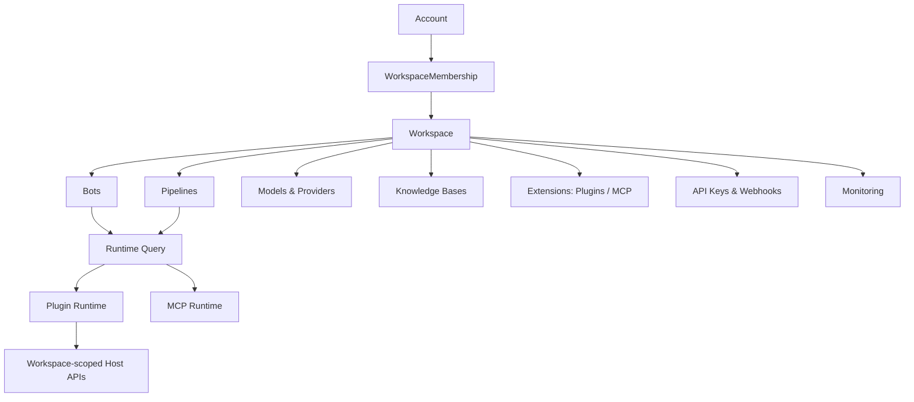

# LangBot 多租户与多用户改造方案

## 目标

本方案面向 LangBot 从“单实例单管理员”演进到 SaaS 友好的“多 workspace、多账户、多权限”架构。

核心定义：

- Account：登录主体。一个自然人或服务账号，可加入多个 workspace。
- Workspace：租户边界。一个 workspace 内可拥有多个用户、机器人、流水线、模型、知识库、扩展、监控数据与 API Key。
- Membership：账户与 workspace 的关系，承载角色与权限。
- Role/Permission：workspace 内权限，不再用“是否是当前唯一用户”来决定访问能力。

目标体验：

- 新用户登录后可以创建 workspace、加入 workspace、切换 workspace。
- 同一个账户可加入多个 workspace，每个 workspace 权限不同。
- 一个 workspace 可邀请多个用户协作，并分别设置 owner/admin/editor/viewer 等权限。
- 所有业务资源默认属于某个 workspace，所有 API 默认在当前 workspace 下工作。
- Plugin SDK、MCP、知识库、模型调用、监控日志都能拿到稳定的 workspace 上下文，并且不跨租户泄露数据。

## 调研结论

### 当前 LangBot 的单用户假设

LangBot 现在已经有 `users` 表和 JWT 登录，但仍是单用户/单租户模型：

- `src/langbot/pkg/entity/persistence/user.py` 的 `User` 只保存 `user/password/account_type/space_*`，没有角色、状态、workspace 关系。
- `src/langbot/pkg/api/http/service/user.py` 通过 `is_initialized()` 判断系统是否已有用户；`create_or_update_space_user()` 在系统已初始化且邮箱不匹配时拒绝新用户，这直接限制了多用户登录。
- `src/langbot/pkg/api/http/controller/group.py` 的 `AuthType.USER_TOKEN` 验证后只向 handler 注入 `user_email`；JWT payload 也只有 `user`，没有 `account_id`、`workspace_id`、`role`、`permissions`。
- `src/langbot/pkg/api/http/service/apikey.py` 的 API Key 只验证 key 是否存在，没有 owner、scope、workspace。
- `web/src/app/infra/http/BaseHttpClient.ts` 从 `localStorage.token` 读取单个 token，并在所有请求上加 `Authorization`；前端没有 workspace selector，也没有当前 workspace 上下文。

当前登录流程更像“初始化一个本地管理账号”，而不是 SaaS 账户体系。要支持多用户，必须把“初始化状态”和“首个 workspace 创建”拆开。

### 业务资源当前都是全局资源

主要持久化表没有租户字段：

- Bot：`bots`
- Pipeline：`legacy_pipelines`、`pipeline_run_records`
- Model：`model_providers`、`llm_models`、`embedding_models`、`rerank_models`
- Plugin：`plugin_settings`
- MCP：`mcp_servers`
- RAG：`knowledge_bases`、`knowledge_base_files`、`knowledge_base_chunks`
- Monitoring：`monitoring_messages`、`monitoring_llm_calls`、`monitoring_sessions`、`monitoring_errors`、`monitoring_embedding_calls`、`monitoring_feedback`
- API Key：`api_keys`
- Webhook：`webhooks`
- Metadata：`metadata`
- Binary storage：`binary_storages`

对应服务也直接 select 全表，例如：

- `BotService.get_bots()` 返回所有 bot。
- `PipelineService.get_pipelines()` 返回所有 pipeline。
- `ModelProviderService.get_providers()` 返回所有 provider。
- `MCPService.get_mcp_servers()` 返回所有 MCP server。
- 插件和二进制存储没有 workspace 维度，插件 workspace storage 在 SDK 里还硬编码为 `default`。

所以改造重点不是只给用户表加字段，而是给资源访问层统一加入 workspace scope。

### 运行时也存在全局单例假设

`src/langbot/pkg/core/stages/build_app.py` 初始化的是一个全局 `Application`，其中包含单例：

- `platform_mgr`
- `pipeline_mgr`
- `model_mgr`
- `tool_mgr`
- `plugin_connector`
- `sess_mgr`
- `rag_mgr`
- `vector_db_mgr`

当前运行时把所有 bot、pipeline、model、plugin、MCP 都加载到同一套内存管理器。多租户改造需要决定：是共享运行时并在对象上带 workspace 过滤，还是每个 workspace 拆 runtime shard。第一阶段建议共享进程、强制 workspace-aware；等规模变大后再演进为按 workspace 分片。

### Plugin SDK 对 workspace 的假设

SDK 当前只认识 bot/pipeline/query/session，不认识租户：

- `src/langbot_plugin/api/entities/builtin/pipeline/query.py` 的 `Query` 有 `query_id/launcher_type/launcher_id/sender_id/bot_uuid/pipeline_uuid`，没有 `workspace_id/account_id`。
- `src/langbot_plugin/api/entities/builtin/provider/session.py` 的 `Session` 只按 `launcher_type + launcher_id` 表达会话。
- `src/langbot_plugin/api/proxies/langbot_api.py` 暴露 `get_bots/get_llm_models/invoke_llm/list_tools/vector_*` 等 Host API，都是全局语义。
- `src/langbot_plugin/runtime/io/handlers/plugin.py` 的 `set_workspace_storage/get_workspace_storage` 把 `owner_type` 设为 `workspace`，但 `owner` 固定为 `default`。
- LangBot 侧 `src/langbot/pkg/plugin/handler.py` 处理插件请求时，会把 `GET_BOTS`、`GET_LLM_MODELS`、`VECTOR_*` 等转到全局服务。

这意味着多租户落地时，不能只在 Web API 层过滤；插件可以通过 Host API 访问全局资源，所以 SDK/Runtime 通信也必须传递 workspace context。

## 开源版与商业版产品边界

LangBot 是开源软件，但多 workspace 能力本质上是 SaaS 控制面能力。如果把完整多 workspace、成员协作、订阅权益和配额代码都放进开源仓库，只靠本地 feature flag 或本地 license check，无法有效避免第三方 fork 后自建 SaaS。因此建议采用 open-core 架构：开源版保留单 workspace 执行能力，账户、订阅、权益和多 workspace 协作能力放到 LangBot Space/Cloud Control Plane 和商业模块中。

### 版本边界

推荐拆成三层：

- `LangBot Core OSS`：开源，自托管，默认只有一个隐式 `default workspace`。它可以在数据结构上兼容 workspace，但产品能力上不提供创建多个 workspace、切换 workspace、成员邀请、成员权限管理、审计和多租户配额。
- `LangBot Space / Cloud Control Plane`：托管控制面，负责 account、workspace、membership、subscription、billing、entitlement、license token、workspace quota、marketplace 权益等能力。
- `LangBot Commercial Module`：商业闭源或私有包，承载多 workspace、团队协作、RBAC、自定义角色、审计日志、SAML/SSO、企业私有化授权等能力。

企业私有化版本可以采用 `LangBot Core + Commercial Module + License Token` 的形式交付。开源 Core 仍然可独立运行，但只能作为单 workspace 自托管产品，不提供 SaaS 多租户控制面。

### OSS 中如何保留兼容但不开放多 workspace

为了让后续商业版复用同一套资源隔离模型，OSS 代码里可以保留 `workspace_uuid` 相关字段和默认 workspace 迁移，但应限制为单 workspace：

- 首次初始化时创建一个 `Default Workspace`。
- 所有资源自动归属这个 default workspace。
- 不暴露 `POST /api/v1/workspaces`。
- 不暴露 workspace switcher。
- 不暴露成员邀请和成员角色管理。
- 不支持一个 account 加入多个 workspace。
- 不支持 workspace 数量大于 1。
- 前端不展示 workspace selector。
- API 层如果收到非 default workspace 的 `X-Workspace-Id`，直接拒绝。

也就是说，OSS 可以是 workspace-aware，但不是 multi-workspace-enabled。这样做的价值是：代码结构提前适配租户隔离，未来商业版不用重写所有资源模型；同时开源版用户无法直接通过 UI/API 获得 SaaS 型多租户能力。

### 账户、订阅和权益抽到 Space

账户和订阅体系建议从 LangBot Core 中抽出，交给 Space 控制面：

```text
LangBot Space
  -> Account
  -> Workspace
  -> Membership
  -> Subscription
  -> Entitlement
  -> License Token

LangBot Core
  -> Validate entitlement / license
  -> Run bots, pipelines, plugins, MCP, RAG
  -> Enforce local resource scope
  -> Report usage
```

这样做有几个原因：

- 账号体系如果完全在本地，第三方容易直接改库创建 workspace/membership。
- 订阅、配额和商业权益如果完全在本地，容易绕过。
- Space 可以统一处理 OAuth、组织、邀请、付款、发票、套餐、权益、Marketplace 分发权限。
- LangBot Core 只作为执行面消费 Space 下发的 entitlement，减少商业规则暴露。

### Entitlement 设计

Space 向 LangBot Core 下发签名权益，可以是在线校验，也可以为企业版提供短期/长期离线 license token。

示例：

```json
{
  "edition": "oss",
  "workspace_limit": 1,
  "member_limit": 1,
  "multi_workspace": false,
  "rbac": false,
  "audit_log": false,
  "custom_roles": false,
  "sso": false,
  "commercial_use": false,
  "expires_at": 1893456000
}
```

OSS 默认权益：

- `workspace_limit = 1`
- `member_limit = 1`
- `multi_workspace = false`
- `rbac = false`
- `audit_log = false`
- `sso = false`

Cloud/Pro/Enterprise 权益：

- `workspace_limit > 1`
- `member_limit > 1`
- `multi_workspace = true`
- `rbac = true`
- 可按套餐打开 audit、custom roles、SSO、usage reporting、enterprise support 等能力。

Core 执行面需要在关键入口强制校验 entitlement：

- 创建 workspace。
- 邀请成员。
- 修改成员角色。
- 切换 workspace。
- 创建超过 quota 的资源。
- 开启商业模块功能。

### 商业模块边界

以下能力不建议进入 OSS 仓库的完整实现：

- 多 workspace 创建和切换。
- Workspace 成员邀请。
- Workspace RBAC 和自定义角色。
- Workspace 审计日志。
- Workspace 级用量和配额管理。
- 订阅、账单、发票。
- 企业 SSO/SAML/OIDC。
- 在线/离线 license 管理。
- 多租户 SaaS 运营控制台。

OSS 仓库可以保留接口占位、默认 workspace 兼容和必要的数据隔离字段，但完整交互、管理 UI、权益校验器和多 workspace policy engine 应由 Space 或商业模块提供。

### 防自建 SaaS 的现实边界

技术上无法 100% 阻止别人 fork 开源代码后自行改造。更可靠的策略是组合：

- 不把完整商业多 workspace 实现放进 OSS。
- Space 控制面提供账号、订阅、权益、Marketplace 和官方托管能力。
- 商业模块闭源或私有分发。
- 使用商标、云服务条款和商业 license 限制“自称官方 LangBot SaaS”或未经授权商用托管。
- 如果当前开源 license 对托管商用限制不足，需要单独评估 license 策略，必要时引入 open-core license 或新增商业附加条款。具体 license 调整需要法律评审。

结论：多 workspace 的底层 schema 可以在 OSS 中以 default workspace 兼容方式铺路，但多 workspace 产品能力、账户订阅权益、协作管理和 SaaS 控制面应放到 Space/商业模块，不作为开源版可直接使用的能力。

## 推荐总体架构

采用“单实例多 workspace，资源行级隔离，运行时上下文隔离”的架构：



原则：

- 账户全局唯一，workspace 是所有业务资源的归属边界。
- 所有 HTTP handler 在进入业务服务前解析出 `RequestContext(account, workspace, membership, permissions)`。
- 所有 service 方法显式接收 `ctx` 或 `workspace_id`，禁止在业务服务里无条件 select 全表。
- 运行时对象的 key 从 `uuid` 扩展为 `(workspace_id, uuid)` 或使用全局唯一 uuid 但必须记录 workspace_id 并校验。
- 插件/MCP/知识库/模型调用都按 query 所属 workspace 过滤可用资源。

## 数据模型设计

### Account

替代现有 `users` 的语义，建议保留表名但升级字段，避免过大迁移：

字段建议：

- `id`
- `uuid`
- `email`
- `password_hash`
- `display_name`
- `avatar_url`
- `account_type`: `local | space`
- `status`: `active | disabled | deleted`
- `space_account_uuid`
- `space_access_token`
- `space_refresh_token`
- `space_access_token_expires_at`
- `space_api_key`
- `created_at`
- `updated_at`

兼容策略：

- 旧字段 `user` 迁移为 `email`，可以短期保留 alias。
- 旧 `password` 迁移为 `password_hash`，也可先保持列名不变，service 层改命名。
- JWT 中不要继续只放 email，应放 `sub=account_uuid`。

### Workspace

新增 `workspaces`：

- `uuid`
- `name`
- `slug`
- `avatar_url`
- `type`: `personal | team`
- `status`: `active | suspended | deleted`
- `default_language`
- `created_by_account_uuid`
- `created_at`
- `updated_at`

每个账户首次登录时自动创建一个 personal workspace。旧单用户实例迁移时创建一个 `Default Workspace`。

### WorkspaceMembership

新增 `workspace_memberships`：

- `workspace_uuid`
- `account_uuid`
- `role`: `owner | admin | developer | operator | viewer`
- `status`: `active | invited | disabled`
- `invited_by_account_uuid`
- `joined_at`
- `created_at`
- `updated_at`

唯一索引：

- `(workspace_uuid, account_uuid)`

### WorkspaceInvitation

新增 `workspace_invitations`：

- `uuid`
- `workspace_uuid`
- `email`
- `role`
- `token_hash`
- `expires_at`
- `accepted_at`
- `created_by_account_uuid`
- `created_at`

用于邀请外部用户加入 workspace。Space OAuth 登录时可以根据 email 自动匹配未接受邀请。

### Role 与 Permission

先用固定角色，后续再做自定义角色。

建议权限：

- `workspace.manage`
- `member.view`
- `member.invite`
- `member.update_role`
- `member.remove`
- `bot.view`
- `bot.manage`
- `pipeline.view`
- `pipeline.manage`
- `model.view`
- `model.manage`
- `knowledge.view`
- `knowledge.manage`
- `extension.view`
- `extension.manage`
- `monitoring.view`
- `apikey.manage`
- `webhook.manage`
- `billing.view`
- `billing.manage`

角色映射：

| Role | 说明 | 权限 |
| --- | --- | --- |
| owner | workspace 拥有者 | 全部权限；可转让 owner；不可被其他角色移除 |
| admin | 管理员 | 除 owner 转让和删除 workspace 外的全部权限 |
| developer | 构建者 | 管理 bot、pipeline、model、knowledge、extension、webhook，可看监控 |
| operator | 运营者 | 查看和启停 bot、查看监控、查看配置，不可改密钥和删除资源 |
| viewer | 只读成员 | 只读资源和监控 |

### 业务资源加 workspace_uuid

以下表需要新增 `workspace_uuid`：

- `bots`
- `legacy_pipelines`
- `pipeline_run_records`
- `model_providers`
- `llm_models`
- `embedding_models`
- `rerank_models`
- `plugin_settings`
- `mcp_servers`
- `knowledge_bases`
- `knowledge_base_files`
- `knowledge_base_chunks`
- `monitoring_*`
- `api_keys`
- `webhooks`
- `binary_storages`
- `metadata`

索引建议：

- 所有资源表加 `(workspace_uuid, created_at)` 或 `(workspace_uuid, updated_at)`。
- 资源唯一键从单列改为 workspace 复合唯一：
  - `bots.uuid` 可保持全局唯一，但查询仍必须带 workspace。
  - `plugin_settings` 主键从 `(plugin_author, plugin_name)` 改为 `(workspace_uuid, plugin_author, plugin_name)`。
  - `mcp_servers.name` 如果未来要求唯一，必须是 `(workspace_uuid, name)`。
  - `metadata.key` 改为 `(workspace_uuid, key)`，系统级 metadata 单独放 `system_metadata` 或使用 `workspace_uuid=NULL`。
  - `binary_storages.unique_key` 建议改为 `workspace_uuid + owner_type + owner + key` 的 hash。

### API Key

API Key 必须归属于 workspace：

- `workspace_uuid`
- `created_by_account_uuid`
- `scopes`
- `expires_at`
- `last_used_at`
- `status`

验证 API Key 后生成 `RequestContext`：

- `account_uuid=None` 或 service account uuid
- `workspace_uuid=key.workspace_uuid`
- `permissions=key.scopes`

这样 `/api/v1/platform/bots/<uuid>/send_message` 之类接口不会跨 workspace 操作 bot。

## 后端改造方案

### RequestContext

新增统一上下文对象，例如：

```python
class RequestContext:
    account_uuid: str | None
    workspace_uuid: str
    role: str | None
    permissions: set[str]
    auth_type: Literal["user_token", "api_key"]
```

改造 `RouterGroup.route()`：

- `USER_TOKEN`：验证 JWT，读取 `account_uuid`，再从 header/query/cookie 中解析 current workspace。
- `API_KEY`：验证 API Key，直接得到 workspace。
- `USER_TOKEN_OR_API_KEY`：两者都返回同一种 `RequestContext`。
- handler 参数从可选 `user_email` 升级为可选 `ctx`；兼容期同时支持 `user_email`。

当前 workspace 传递方式：

- 推荐 header：`X-Workspace-Id: <workspace_uuid>`
- Web 前端同时把当前 workspace 存在 localStorage。
- 如果未传，后端用账户最近使用 workspace 或第一个 active membership。

JWT payload：

```json
{
  "sub": "account_uuid",
  "email": "user@example.com",
  "iss": "LangBot-...",
  "exp": 1234567890
}
```

不要把 workspace 写死在 JWT 里，否则切换 workspace 需要刷新 token。可以额外支持短 TTL workspace token，但第一阶段不必。

### 服务层改造模式

所有 service 方法增加 `ctx` 或 `workspace_uuid`：

```python
async def get_bots(self, ctx: RequestContext, include_secret: bool = True):
    require(ctx, "bot.view")
    query = sqlalchemy.select(Bot).where(Bot.workspace_uuid == ctx.workspace_uuid)
```

需要改造的服务：

- `UserService`：拆成 AccountService + WorkspaceService 更清晰。
- `ApiKeyService`：按 workspace 管理 key。
- `BotService`：所有 bot 查询/创建/更新/删除按 workspace。
- `PipelineService`：所有 pipeline 查询/默认 pipeline 按 workspace。
- `ModelProviderService` 和 model services：按 workspace 隔离 provider 和 model。
- `MCPService`：按 workspace 管理 MCP server，运行时按 workspace host。
- `KnowledgeService/RAGRuntimeService`：按 workspace 管理 KB、文件、collection。
- `MonitoringService`：记录和查询都带 workspace。
- `WebhookService`：按 workspace 管理 webhook。
- `PluginRuntimeConnector`：插件安装、设置、配置按 workspace。

### HTTP API 形态

保留现有路径，靠 `X-Workspace-Id` 表示当前 workspace，可减少前端和 SDK 破坏：

- `GET /api/v1/workspaces`
- `POST /api/v1/workspaces`
- `GET /api/v1/workspaces/current`
- `PUT /api/v1/workspaces/current`
- `GET /api/v1/workspaces/<workspace_uuid>/members`
- `POST /api/v1/workspaces/<workspace_uuid>/invitations`
- `PUT /api/v1/workspaces/<workspace_uuid>/members/<account_uuid>`
- `DELETE /api/v1/workspaces/<workspace_uuid>/members/<account_uuid>`

现有资源 API：

- `/api/v1/platform/bots`
- `/api/v1/pipelines`
- `/api/v1/provider/*`
- `/api/v1/plugins`
- `/api/v1/mcp`
- `/api/v1/knowledge`

继续保留，但必须从 `RequestContext.workspace_uuid` 过滤。

对外 API Key 也使用相同路径，只是由 key 决定 workspace。

### 初始化流程

现有 `/api/v1/user/init` 含义改为“创建首个账号和首个 workspace”：

1. 如果系统没有任何 account：
   - 创建 account。
   - 创建 personal/team workspace。
   - 创建 owner membership。
   - 创建默认 pipeline。
   - 标记 wizard status 到该 workspace metadata。
2. 如果系统已有 account：
   - 禁止无邀请注册，除非配置允许公开注册。
   - Space OAuth 登录后，如果没有 membership，引导创建 workspace 或接受邀请。

`/api/v1/user/account-info` 不应再只返回 first user，应返回：

- `initialized`
- `registration_mode`
- `space_enabled`
- `default_login_methods`

登录成功后前端调用 `/api/v1/workspaces` 选择 workspace。

### 运行时隔离

第一阶段采用共享进程 + workspace-aware runtime：

- `RuntimeBot` 增加 `workspace_uuid`。
- `RuntimePipeline` 增加 `workspace_uuid`。
- `Query` 增加 `workspace_uuid`，从 bot/pipeline 派生。
- `SessionManager.get_session()` key 从 `(launcher_type, launcher_id)` 改为 `(workspace_uuid, bot_uuid, launcher_type, launcher_id)`。
- `PipelineManager.pipeline_dict` key 可保持 pipeline uuid，但所有 load/get 都校验 workspace；如果 uuid 不是全局唯一则改为 `(workspace_uuid, pipeline_uuid)`。
- `ModelManager` provider/model 加 workspace 过滤；`get_model_by_uuid` 必须确保 query workspace 可访问。
- `ToolManager` 中 MCP tools、plugin tools 按 query workspace 过滤。

后续规模化时可演进：

- workspace runtime shard：每个 workspace 一套 plugin runtime/MCP runtime。
- 大客户独立进程或独立数据库。

## Plugin SDK 与 Runtime 改造

### Query/Event 增加 workspace context

SDK `Query` 增加：

- `workspace_uuid: str`
- `workspace_slug: str | None`
- `account_uuid: str | None`，仅 Web/API 触发时可能有，聊天平台消息通常为空。

Event 模型通过 `event.query.workspace_uuid` 可拿到租户上下文；序列化时也应包含这些字段。

向后兼容：

- 字段可选，默认 `None`。
- 老插件不感知这些字段也能跑。
- 新插件可通过 `ctx.event.query.workspace_uuid` 或新增 `ctx.get_workspace()` 访问。

### Host API 默认按当前 workspace 限制

`LangBotAPIProxy` 的以下方法必须由 Host 端按 workspace 过滤：

- `get_bots`
- `get_bot_info`
- `send_message`
- `get_llm_models`
- `invoke_llm`
- `list_plugins_manifest`
- `list_commands`
- `list_tools`
- `call_tool`
- `invoke_embedding`
- `vector_*`
- `list_knowledge_bases`
- `retrieve_knowledge`

建议新增显式方法：

- `get_workspace_info()`
- `get_current_account()`
- `get_workspace_storage(...)`

但不要让插件传入任意 workspace id 来越权访问。插件请求的 workspace 应由 Runtime 根据当前 query/plugin connection 填充。

### Workspace storage 修复

当前 SDK runtime 中：

```python
data["owner_type"] = "workspace"
data["owner"] = "default"
```

必须改为：

- 如果请求来自 query/event：owner 为 `workspace_uuid`。
- 如果请求来自后台插件任务：owner 为 plugin 安装所属 workspace。
- Host 侧 `binary_storages` 加 `workspace_uuid`，并在 unique key 中包含 workspace。

Plugin storage 建议也同时加 workspace：

- 现在 plugin storage owner 是 `author/name`，这会导致同一插件在不同 workspace 的私有数据冲突。
- 应改为 `(workspace_uuid, plugin_id, key)`。

### 插件安装与配置

`plugin_settings` 从全局变为 workspace-scoped：

- 同一个插件可安装到多个 workspace。
- 每个 workspace 有自己的 enabled、priority、config、install_source、install_info。
- 插件 runtime 列表需要能按 workspace 过滤。

实现路线有两种：

1. 共享插件进程，插件代码只加载一份，设置和调用时附带 workspace。
2. 每个 workspace 一个插件容器实例，隔离最彻底但资源占用更高。

推荐第一阶段采用方案 1，但要求：

- 所有 RuntimeToLangBot/PluginToRuntime action 都能携带 `workspace_uuid`。
- 插件 config 获取时按 workspace 返回。
- 插件 page API 请求必须校验当前用户在该 workspace 有访问权限。

### MCP

MCP server 是租户资源：

- `mcp_servers.workspace_uuid`。
- MCP session key 从 `server_name` 改为 `(workspace_uuid, server_name)` 或使用全局 uuid。
- Pipeline extension preferences 中绑定 MCP server uuid 时，只能绑定同 workspace 的 server。
- MCP tool 列表在 query 执行时按 query.workspace_uuid + pipeline 绑定关系过滤。

## 前端改造

### Workspace selector

Home layout 顶部或 sidebar 增加 workspace selector：

- 当前 workspace 名称和头像。
- 切换 workspace 后写入 `localStorage.currentWorkspaceId`。
- 所有请求自动带 `X-Workspace-Id`。
- 切换后刷新 sidebar 数据和页面缓存。

`BaseHttpClient` request interceptor 增加：

```ts
const workspaceId = localStorage.getItem("currentWorkspaceId");
if (workspaceId) config.headers["X-Workspace-Id"] = workspaceId;
```

### 用户与成员管理页面

新增页面：

- `/home/workspace/settings`
- `/home/workspace/members`
- `/home/workspace/invitations`

能力：

- owner/admin 邀请成员。
- owner/admin 修改成员角色。
- owner 移除成员、转让 owner。
- 所有人可切换 workspace。
- viewer/operator 在 UI 上隐藏不可操作按钮，但后端仍做权限校验。

### 登录与注册

登录后流程：

1. `authUser` 拿 token。
2. `initializeUserInfo()` 获取 account info。
3. `GET /api/v1/workspaces`。
4. 如果没有 workspace：进入创建 workspace 向导。
5. 如果有多个 workspace：默认进入最近使用 workspace，可切换。

注册页不再表达“初始化管理员账号”，而是：

- 首次系统启动：创建首个 owner + default workspace。
- 后续：根据配置允许公开注册，或只能接受邀请。

### 旧页面影响

需要逐个检查这些页面的数据加载是否都依赖当前 workspace：

- Bots
- Pipelines
- Plugins/Market/MCP
- Knowledge
- Monitoring
- Models dialog
- API integration dialog
- Wizard

## 迁移方案

### 迁移阶段 0：准备

- 引入 `workspaces`、`workspace_memberships`、`workspace_invitations`。
- 给 `users` 增加 `uuid/status/display_name` 等字段。
- 创建 `RequestContext`，但先不强制所有服务改完。

### 迁移阶段 1：默认 workspace

对现有实例执行迁移：

1. 创建 `Default Workspace`。
2. 找到现有第一个 user，设为 owner。
3. 所有已有资源写入 `workspace_uuid=default_workspace_uuid`。
4. `metadata` 迁入 default workspace；确实全局的配置放到 `system_metadata`。
5. `binary_storages` 中 `owner_type=workspace, owner=default` 改为 owner 为 default workspace uuid。
6. 插件 `plugin_settings` 归入 default workspace。

### 迁移阶段 2：服务层强制 scope

- 改所有 service 查询，必须要求 `workspace_uuid`。
- API Key 迁移为 workspace key。
- 所有写操作必须检查权限。
- 监控和任务查询按 workspace 过滤。

### 迁移阶段 3：运行时上下文

- `Query`、`Session`、`RuntimeBot`、`RuntimePipeline` 增加 workspace。
- Plugin/MCP/Model/RAG runtime 全部按 workspace 过滤。
- 修复 SDK workspace storage。

### 迁移阶段 4：前端多 workspace

- 登录后 workspace 选择。
- Header/sidebar workspace switcher。
- 成员和邀请管理。
- 所有 API 请求带 `X-Workspace-Id`。

### 迁移阶段 5：安全收敛

- 添加跨 workspace 越权测试。
- 添加 API Key scope 测试。
- 添加插件 Host API 过滤测试。
- 添加 MCP 和 RAG 隔离测试。

## 安全边界

必须防的场景：

- 用户 A 修改 URL 中 bot uuid，访问用户 B workspace 的 bot。
- API Key 来自 workspace A，但调用 workspace B 的 bot。
- 插件通过 `get_bots()` 枚举所有 workspace 的 bot。
- 插件通过 `workspace_storage` 读取其它 workspace 的数据。
- MCP server 名称相同导致 session 复用。
- monitoring session_id 相同导致数据串租户。
- Space OAuth 登录时，同 email 账户被错误绑定到已有本地 account。

建议策略：

- 所有资源访问都使用 `workspace_uuid + resource_id`。
- 所有 service 方法入口做权限检查。
- 插件 Host API 的 workspace 不信任插件入参，只信任 query/runtime connection 上下文。
- API Key 只授予最小 scope，默认不允许成员管理。
- owner 角色不能被普通 admin 移除或降权。

## 实施优先级

### P0：基础租户骨架

- Account uuid/status。
- Workspace / Membership / Invitation。
- RequestContext。
- JWT 改为 account uuid。
- 前端 current workspace header。

### P1：资源行级隔离

- Bots、Pipelines、Models、MCP、Plugins、Knowledge、Monitoring、API Keys 全部加 workspace_uuid。
- service 查询统一加 workspace filter。
- 权限矩阵落地。

### P2：运行时隔离

- Query、Session、RuntimeBot、RuntimePipeline 加 workspace。
- Plugin Host API 和 MCP tools 按 workspace 过滤。
- SDK workspace storage 从 `default` 改为真实 workspace。

### P3：协作体验

- 邀请成员。
- 成员列表和角色管理。
- workspace switcher。
- 最近使用 workspace。

### P4：SaaS 运维增强

- Workspace 级用量统计。
- Workspace 级限额：max_bots/max_pipelines/max_extensions/tokens/storage。
- 审计日志。
- workspace suspend/delete。
- 可选自定义角色。

## 测试计划

后端测试：

- 账户可加入多个 workspace。
- 同账户在不同 workspace 权限不同。
- viewer 不能创建/修改资源。
- API Key 只能访问所属 workspace。
- 所有资源 list/get/update/delete 都不能跨 workspace。
- 默认 workspace 迁移后旧数据可用。

运行时测试：

- 两个 workspace 使用相同 `launcher_id` 不共享 session。
- 两个 workspace 使用相同 MCP server name 不共享 MCP session。
- 插件 `get_bots()` 只能看到当前 workspace bot。
- 插件 `workspace_storage` 在不同 workspace 读写隔离。
- Pipeline 只调用当前 workspace 绑定的插件和 MCP tools。

前端测试：

- 登录后自动进入最近 workspace。
- 切换 workspace 后列表数据变化。
- 无权限按钮隐藏，直接调用 API 也被后端拒绝。
- 邀请成员流程完整。

迁移测试：

- SQLite 老实例迁移。
- PostgreSQL 老实例迁移。
- 已有 local account 迁移为 default workspace owner。
- 已有 Space account token 和 Space model provider API key 不丢失。

## 关键实现注意事项

- 不建议在第一版做数据库 schema-per-tenant。LangBot 当前 ORM 和运行时均以单库单表为主，先做 shared schema + workspace_uuid 成本更低。
- 不建议每个 workspace 立即启动独立 plugin runtime。先共享 runtime，强制 action 带 workspace；大客户隔离可作为后续部署形态。
- 不要只在前端过滤 workspace。插件、API Key、MCP、RAG 都能绕过前端，必须在后端和运行时层过滤。
- `metadata` 要拆清楚：wizard status 属于 workspace，系统版本/迁移信息属于 system。
- `users.user` 用 email 当主键语义不稳，应尽快引入 `account_uuid` 并让 JWT 以 uuid 为准。
- `plugin_settings` 当前主键没有 workspace，改造时要先改主键/唯一约束，否则同插件无法在多个 workspace 配不同配置。

## 建议落地顺序

1. 新增 workspace/account/membership 表和 RequestContext。
2. 迁移旧数据到 default workspace。
3. 改 auth 和前端请求头，让每个请求都有 current workspace。
4. 从最核心资源开始逐个加 scope：bot -> pipeline -> provider/model -> plugin/MCP -> knowledge -> monitoring。
5. 改 SDK Query/Event 和 runtime storage。
6. 上成员管理 UI 和邀请。
7. 做越权测试和迁移测试。

这个顺序的好处是可以较早让主 UI 在一个 workspace 下继续工作，同时把最危险的跨租户泄露面逐步收紧。
