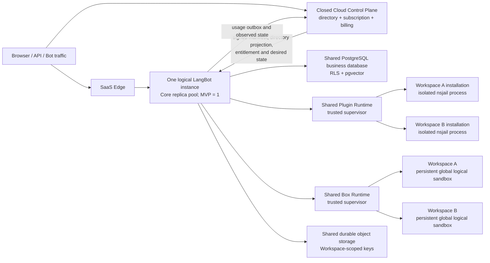

# LangBot Workspace 多用户与 SaaS 多租户架构

状态：`ARCHITECTURE BASELINE — isolation kernel implemented; SaaS activation gates remain`

本文描述 Cloud v2 的目标架构和安全边界。详细的 Runtime、Box、PostgreSQL、pgvector 与 stdio MCP 决策以
[pending-architecture-decisions.md](./pending-architecture-decisions.md) 为权威来源；已经落地的实现选择记录在
[implementation-decisions.md](./implementation-decisions.md)。

“隔离内核已实现”仅表示开源 Core/SDK 已具备多租户数据和运行时隔离所需的基础能力，
不表示闭源控制面、计费、生产部署或 Cloud v2 已经可以上线。

## 1. 架构决策摘要

Cloud v2 采用以下模型：

> SaaS 对外只有一个逻辑 LangBot 实例，全部 Workspace 都是该实例内的租户；
> 开源 Core 提供完整隔离内核，闭源 Cloud Control Plane 管理 SaaS 目录、订阅、权益和计费。

核心决策如下：

1. `Workspace` 是数据、成员、权限、用量和不可信执行的租户边界，不是一个 Pod、namespace、数据库或独立 LangBot 部署。
2. SaaS 注册 Account 时自动创建个人 Workspace；这只新增目录与业务记录，不创建租户专属服务、数据库、队列或 Runtime。
3. OSS 每个 LangBot 实例只能存在一个 Workspace，但该 Workspace 可以有多个 Account、邀请和固定角色。
4. SaaS 才允许一个 Account 拥有或加入多个 Workspace，并在 WebUI 中切换当前 Workspace。
5. MVP 可以各运行一个 Core、Plugin Runtime 和 Box Runtime 进程；未来增加副本或 PostgreSQL shard 仍属于同一个逻辑实例的内部扩展，不改变产品模型和外部 API。
6. 一个共享 Plugin Runtime 控制面管理所有 Workspace，但每个运行中的 plugin installation 独占一个 nsjail 进程；enabled-resident 是 desired semantics，只读代码和依赖可按已验证摘要共享。
7. 一个共享 Box Runtime 管理所有 Workspace；首期符合 entitlement 的 Workspace 最多拥有一个持久 `global` 逻辑 sandbox，实际命令继续以 nsjail 子进程执行。
8. SaaS 业务数据使用 PostgreSQL shared schema、应用层 scope 与 RLS 双重隔离；pgvector 位于同一个业务数据库并作为 SaaS 默认向量后端。
9. stdio MCP 有独立实例开关，Cloud v2 首期强制关闭，不能由 Box availability 或套餐能力隐式开启。
10. 闭源 Control Plane 可以作为模块化单体复用现有账户、支付和运营能力，但历史 Cloud 的租户专属部署模型不进入新架构。
11. Workspace 创建、释放、export、单 Workspace restore 和在线迁移的具体流程仍待后续决策。

本轮重构的最高目标是：

> 共享可信控制面和基础设施池，隔离不可信执行单元；减少独立部署和常驻组件，使新增 Account 或空 Workspace 的静态成本接近零。

减少组件数量不意味着合并安全边界。插件进程、sandbox、secret、可写文件和租户数据仍必须严格隔离。

## 2. 范围与非目标

### 2.1 本方案覆盖

- OSS 单 Workspace 多用户、邀请和固定 RBAC。
- SaaS 多 Workspace 账户、成员和 Workspace 切换模型。
- HTTP、WebSocket、API Key、Bot、Webhook、后台任务和内部调用的可信 Workspace 上下文。
- Bot、Pipeline、Provider、Knowledge、Plugin、MCP、RAG、Session、Storage 和 Monitoring 的租户隔离。
- Plugin Runtime 与 Box Runtime 的共享控制面和进程级隔离。
- SaaS PostgreSQL shared schema、RLS 与 pgvector 边界。
- 开源 Core 与闭源 Control Plane 的职责、协议和故障边界。
- 当前单副本运行和未来同一逻辑实例内横向扩展的兼容约束。
- 分阶段实施、激活门禁和验收策略。

### 2.2 本方案不覆盖

- 兼容或原地升级历史 Cloud 的租户专属部署方案。
- 为每个 Workspace 创建独立服务、数据库、schema、role、bucket、PVC、队列或 Runtime。
- 当前阶段实现多副本调度、跨地域 active-active 或 PostgreSQL 在线分片迁移。
- 第一版自定义角色、SAML、SCIM 或企业离线授权。
- 第一版 Workspace 级 BYOK E2B WebUI 配置。
- Cloud v2 首期 stdio MCP。
- Workspace export、释放、单租户恢复和在线迁移的具体产品流程。

历史客户数据、账户和财务记录如需迁移，应单独立项；旧部署拓扑不作为本架构的设计约束。

## 3. 术语与不变量

### 3.1 术语

| 术语 | 定义 |
| --- | --- |
| Account | 登录主体。OSS 中是实例本地账户；SaaS 中是全局账户 |
| Workspace | 逻辑 LangBot 实例内的租户，是资源、成员、权限、用量和不可信执行的首要边界 |
| Membership | Account 与 Workspace 的关系，包含固定角色、状态和权限版本 |
| Invitation | 邀请一个 Account 或邮箱加入 Workspace 的一次性凭证 |
| Logical Instance | 对外唯一的 LangBot 服务与安全域，拥有稳定 `instance_uuid`，不等同于某个进程或 Pod |
| Replica | Core、Plugin Runtime 或 Box Runtime 的短期内部运行副本，不是产品实体 |
| Execution Generation | Workspace 执行所有权和撤销的单调代数，用于隔离旧任务、旧连接和故障转移 |
| Billing Account | SaaS 付款主体，可以为一个或多个 Workspace 付费 |
| Entitlement | Control Plane 签发、Core 与 Runtime 本地执行的功能和数值额度快照 |
| Cloud Control Plane | 闭源 SaaS 控制面，管理全局身份、Workspace 目录、订阅、权益、计费和生命周期 |
| LangBot Core | 开源数据面，执行 Bot、Pipeline、Plugin、MCP、RAG 等业务并实施最终授权与隔离 |

当前代码中的 `placement_generation` 字段在迁移完成前保留兼容；其架构语义和目标命名均为
`execution_generation`，不表达 Workspace 属于某个产品级部署单元。

### 3.2 必须始终成立的不变量

1. SaaS 只有一个稳定 `instance_uuid`；所有副本共享该身份。
2. `replica_id`、`worker_id`、Pod 名称、进程地址和数据库连接地址都是短期运行信息，不能进入业务资源的永久主键或外部 URL。
3. `workspace_uuid` 是租户数据、任务、缓存、文件、日志、用量和运行时隔离的稳定键，也是未来内部路由与分片的候选键。
4. OSS 一个实例最多一个 Workspace；SaaS 才能激活多个 Workspace。
5. 一个 Workspace 可以有多个 Account；一个 SaaS Account 可以加入多个 Workspace。
6. 所有租户业务资源都具有非空 `workspace_uuid`，并使用 `(workspace_uuid, resource_uuid)` 定位。
7. Workspace 选择器只是路由输入，不是授权凭证；服务端必须重新验证 Account、Membership、资源所有权和权限。
8. API Key、Bot、Webhook、后台任务、Plugin 与 Box 调用从可信所有权或绑定派生 Workspace，不能信任调用方自报 scope。
9. SaaS 缺少有效 Workspace 上下文时必须失败关闭，不能回退到第一个、最近或 OSS 默认 Workspace。
10. Core 是资源访问、运行时授权和 entitlement 执行的最后一道边界；Control Plane 不同步代理每条消息或普通资源请求。
11. 一个不可信插件进程只能属于一个 installation；一个 sandbox/session 只能属于一个 Workspace。
12. execution generation 失效后，旧任务、连接、回调和副作用必须被拒绝。
13. 本地进程表、缓存和临时目录都可重建，不能成为 desired state、撤销状态或业务数据的唯一真相。
14. 创建空 Workspace 不启动插件 worker、sandbox 或租户专属常驻组件。
15. 未来横向扩展不能改变 Workspace UUID、外部 API、权限模型或隔离语义。

## 4. 产品与部署模型

### 4.1 SaaS 逻辑拓扑



这里的“一个逻辑实例”是一个服务、安全域和稳定身份，不是“永远只有一个 OS 进程”。
MVP 不实现分布式，但从第一天保留内部扩展所需的身份、幂等、generation 和 owner 抽象。

### 4.2 容量演进

| 阶段 | 内部部署形态 | 新 Workspace 静态成本 | 启用条件 |
| --- | --- | --- | --- |
| M0 单副本 MVP | 一个 Core、一个共享 Plugin Runtime、一个共享 Box Runtime、一个 PostgreSQL business database | 只新增目录和业务行 | 当前目标 |
| M1 同逻辑实例横向扩展 | 按容量增加 Core/Runtime 副本；使用 owner lease、fencing 和 generation；PostgreSQL 可增加 shared shard | 不创建 Workspace 专属部署 | 出现容量或可用性证据后 |
| M2 Dedicated 资源等级 | 特定 workload 使用独享 worker pool、sandbox class 或 database shard，但沿用相同身份、协议和 schema | 仅购买该等级的客户承担 | 合规、驻留或超大负载需求 |

M1 是 M0 的透明扩容，M2 是相同架构下的资源等级。外部 API 只认识稳定的
`instance_uuid` 和 `workspace_uuid`，不认识 replica、worker、pool 或 shard。

### 4.3 当前不做分布式时必须预留的能力

1. 运行时协议携带稳定 `instance_uuid`、`workspace_uuid` 和 `execution_generation`，不依赖进程地址表达身份。
2. Plugin installation 和 Box session 使用稳定 owner 抽象；启用第二个副本前再实现带 expiry、CAS 和 fencing token 的 lease。
3. 创建、重试、回调、worker 注册和 outbox 使用稳定 idempotency key，重复投递不能产生第二个 owner 或副作用。
4. Repository/UoW 不允许无边界跨 Workspace 事务；`workspace_uuid` 可直接作为未来 shard key。
5. schema migration、后台任务扫描、监控聚合和运维接口不能假设永远只有一个 Core 进程。
6. Runtime 重启通过 durable desired state reconciliation 恢复，不依赖原进程或本地 cache。
7. 只有出现容量、可用性、地域或合规证据后才增加副本、lease store 或 shard router；预留协议不等于提前部署组件。

### 4.4 组件边界

- Core、Plugin Runtime 和 Box Runtime 可以由发布与故障域决定是否共用 Pod，但必须保持独立进程身份、容器和 security context。
- Core 不能继承 nsjail、cgroup 或 mount namespace 所需的高权限。
- Plugin Runtime 与 Box Runtime 不合并为一个高权限进程。
- MVP 不新增 Runtime 专用数据库、Box 专用数据库、Kafka、Redis、租户级 scheduler 或 artifact service。
- 可信 supervisor、数据库连接池、只读 artifact cache 和基础容量可以多租户共享。

## 5. OSS 与 SaaS 产品行为

### 5.1 能力矩阵

| 能力 | OSS | SaaS |
| --- | --- | --- |
| Workspace 数量 | 实例固定一个 | Account 可拥有或加入多个，受 ProductPolicy 约束 |
| Workspace 成员 | 多用户 | 多用户，受 entitlement 约束 |
| 邀请成员 | 支持 | 支持 |
| 固定 RBAC | 支持 | 支持 |
| 自定义角色 | 不支持 | 后续商业能力 |
| Workspace 创建 | 首次初始化创建唯一 Workspace | 注册自动创建个人 Workspace；后续创建受 ProductPolicy 约束 |
| Workspace 切换 | 无需展示 | 支持 |
| 订阅与计费 | 无远端依赖 | 闭源 Control Plane 管理 |
| 租户隔离 | 完整实现 | 完整实现 |

OSS edition policy 应表达为：

```text
workspace_limit = 1
members_enabled = true
invitations_enabled = true
fixed_rbac_enabled = true
multi_workspace_enabled = false
```

不能用 `member_limit = 1`、关闭邀请或移除 RBAC 来实现单租户限制。

### 5.2 OSS 初始化和邀请

首次初始化在一个事务中完成：

1. 创建本地 Account。
2. 创建实例唯一 Workspace。
3. 创建 owner Membership。
4. 创建默认 Pipeline、metadata 等 Workspace 初始资源。
5. 标记实例初始化完成。

初始化后默认关闭公开注册。后续用户由 owner/admin 创建一次性 Invitation，注册或登录后接受邀请并加入唯一 Workspace。
OSS 后续注册不创建第二个 Workspace。未配置 SMTP 时，系统返回只展示一次的邀请链接供管理员通过可信渠道发送。

### 5.3 SaaS 注册和邀请

普通注册由 Control Plane 通过幂等工作流完成：

1. 创建或确认全局 Account 与 AuthIdentity。
2. 创建 personal Workspace 和 owner Membership。
3. 创建初始 Subscription/Entitlement 投影。
4. 完成 verified email、速率限制和基础风控。
5. 将 Account、Workspace 和 Membership 投影到 Core。
6. Core 达到要求的目录 revision 后返回可访问 route。

注册只创建逻辑记录，不启动 Runtime 或租户专属基础设施。

通过邀请注册的新用户也创建自己的 personal Workspace，同时加入受邀 Workspace；已注册用户接受邀请时只新增目标 Membership。
个人 Workspace 与团队 Workspace 的付费关系必须由 ProductPolicy 明确，不允许代码根据名称或创建路径隐式推断。

### 5.4 Invitation 安全规则

- token 使用至少 256-bit 加密安全随机数，数据库只保存 hash。
- token 具有 `expires_at`、`accepted_at`、`revoked_at`，只能使用一次。
- Membership 创建与 token 消费在同一事务中提交。
- Invitation 不能授予 owner；owner 转移使用独立流程。
- SaaS 接受邀请时必须验证目标邮箱；OAuth 邮箱相同不能跳过 token 和显式确认。
- Workspace 必须始终至少有一个 active owner；admin 不能移除或降级 owner。
- 浏览器邀请链接把 secret 放在 URL fragment 中，页面读取后立即清除 fragment，并只短期保存在 `sessionStorage`。

### 5.5 固定 RBAC

Core 权威定义 `owner`、`admin`、`developer`、`operator` 和 `viewer` 固定角色。
权限按能力划分，例如资源查看、资源管理、运行操作、成员管理、provider secret 管理、审计查看和数据导出。

规则：

- 普通资源可见性不自动授予 secret 可见性。
- 跨 Workspace 猜测资源 UUID 返回 404，不泄露存在性。
- 同 Workspace 资源存在但缺少权限时返回 403。
- 最后一个 owner 不能被删除或降级。
- 前端隐藏或禁用无权限入口只改善体验；后端仍必须执行所有授权检查。

## 6. 开源与闭源职责边界

### 6.1 LangBot Core OSS

Core 负责：

- 本地 Account、Workspace、Membership 和 OSS Invitation。
- 固定 RBAC 与单 Workspace edition policy。
- 业务资源及其 Workspace scope。
- HTTP、WebSocket、后台任务和运行时请求上下文。
- Plugin、MCP、RAG、Box、Session、Storage 和 Monitoring 隔离。
- SaaS Account/Workspace/Membership 的版本化执行投影。
- InstanceManifest、EntitlementSnapshot 和 Runtime 控制通道验证。
- 通用 capability 与数值 quota enforcement。
- UsageEvent/business outbox 和基础安全审计。

Core 是 Bot、Pipeline、Model、Knowledge、Plugin installation、MCP configuration 和 Monitoring 数据的权威来源，
也是每个业务和运行时请求的最终授权边界。

### 6.2 Closed Cloud Control Plane

Control Plane 负责：

- SaaS 全局 Account、AuthIdentity、Session、OIDC 和后续 SSO。
- SaaS Workspace、Membership 和 Invitation 的权威目录。
- Workspace 创建、暂停、归档和删除工作流。
- BillingAccount、Product、PlanVersion、Price、Subscription、Invoice、Refund 和 provider event。
- Entitlement 计算、签名与版本。
- Usage ledger、聚合、额度和欠费策略。
- 实例 manifest、release、capacity、内部 desired state 和 observed state。
- SaaS 运营后台、平台角色和高级审计。

首期不把这些职责拆成多个租户、计费和调度微服务。推荐以一个独立于 Core 的闭源模块化单体承载，
并通过模块边界复用已有账户、OAuth、支付、邮件和运营能力。历史 Cloud 的租户专属部署代码不复用。

Control Plane 不保存 Bot、Pipeline、Model 或 Knowledge 等业务内容，也不代理普通消息执行。

### 6.3 SaaS Adapter

Core 中只保留薄的协议适配层：

- 验证 InstanceManifest、Account token 和 JWKS。
- 消费 DirectoryEvent 并写入本地投影。
- 缓存并验证 EntitlementSnapshot。
- 将 UsageEvent 写入 durable outbox。
- 接收 execution desired state 并上报 observed state。

适配层不得 monkey patch ORM、绕过 Core 权限检查或在普通资源请求中同步调用 Control Plane。

### 6.4 Source of Truth

| 数据 | OSS | SaaS |
| --- | --- | --- |
| Account、Workspace、Membership | Core 本地数据库 | Control Plane 权威，Core 保存版本化投影 |
| Invitation | Core 本地数据库 | Control Plane 权威，不向 Core 投影 pending secret |
| Bot、Pipeline、Model、KB、Plugin、MCP | Core | Core |
| Subscription、Payment、Invoice、Usage ledger | 无远端依赖 | Control Plane |
| Feature 和 quota | 本地 edition policy | Control Plane 签发，Core/Runtime 验证执行 |
| Execution generation | OSS 固定本地值 | Control Plane desired state，Core 执行 |
| 运行时授权 | Core | Core 根据本地投影和 entitlement 执行 |

SaaS 不维护两套可写目录。Control Plane 是目录权威写模型；Core 只保存带 revision 的执行投影。

## 7. 控制面协议

### 7.1 InstanceManifest

仅设置 `system.edition=cloud`、环境变量或前端 feature flag 不得启用 SaaS 多 Workspace。
Cloud bootstrap 必须验证由预置根信任签名的 InstanceManifest，并据此安装闭源 Workspace policy。

Manifest 至少绑定：

```text
iss, aud, sub, jti, iat, nbf, exp
instance_uuid
release
capabilities
tenant_isolation_version
execution_generation
delegated issuers and keyset revision
```

签名错误、audience 不匹配、过期、generation 回滚或信任链缺失时必须失败关闭，不能降级为 OSS 默认 Workspace。

### 7.2 DirectoryEvent 与目录新鲜度

Control Plane 通过 transactional outbox 发布 Account、Workspace 和 Membership 的版本化事件。
Core 使用 inbox 按 `event_id` 去重，以 aggregate revision 拒绝旧写，并追踪连续应用水位。

要求：

- 事件和 batch 经过实例绑定的强认证与签名。
- 重复、乱序、延迟、断流和全量 replay 都安全。
- 删除使用 tombstone。
- 新实例先导入带 high watermark 的 snapshot，再消费增量。
- projection 未就绪或落后于授权 lease 要求时，交互与自动化请求按策略失败关闭。
- SaaS pending Invitation、email 和 token hash 不进入 Core 投影。

MVP 可采用一个共享、原子且可恢复的 Control Plane store；未来多副本不能继续使用进程内状态承担一次性 token 或目录水位。

### 7.3 EntitlementSnapshot

Entitlement 使用版本化签名快照，至少绑定：

```text
instance_uuid
workspace_uuid
plan_revision
entitlement_revision
status
features
limits
nbf, exp, grace_until
```

Core 校验 issuer、audience、subject、instance、revision、时间和签名；旧 revision 不覆盖新快照。
套餐名称和价格规则只存在于闭源 Control Plane，Core 与 Runtime 只理解通用 capability 和数值限额。

Control Plane 故障时，已缓存且仍有效的快照可继续执行；过期后只能进入明确、有限的 grace 模式或失败关闭。

### 7.4 UsageEvent 与 outbox

用量事件 append-only、至少一次投递，Control Plane 按 `event_id` 去重。事件至少包含：

```text
event_id
instance_uuid
workspace_uuid
execution_generation
meter
quantity_integer
unit
source
occurred_at
entitlement_revision
schema_version
```

Core 不计算账单金额，也不在普通请求中同步扣费。业务写入与相应 business outbox 必须在同一事务中提交；
generation-aware write fence 与 outbox 原子性尚是 SaaS 激活门禁。

### 7.5 Desired state 与 observed state

闭源控制面发布版本化的 release、capacity 和 execution desired state，Core/Runtime 幂等 reconcile 并上报 observed state。
desired state 只描述同一逻辑实例内部的执行所有权和容量，不产生新的产品级实例或租户实体。

Workspace 安全状态由 directory revision 决定，订阅状态由 entitlement revision 决定，执行撤销由
execution generation 决定。三者取最严格有效状态，但任何通道都不能修改另一个通道的权威字段。

## 8. 身份、鉴权与请求上下文

### 8.1 上下文模型

租户业务入口统一解析不可变的 `RequestContext`：

```python
@dataclass(frozen=True)
class RequestContext:
    instance_uuid: str
    workspace_uuid: str
    execution_generation: int
    principal_type: str
    principal_uuid: str
    permissions: frozenset[str]
    auth_method: str
    entitlement_revision: int | None
    request_id: str
```

不同入口的 Workspace 来源：

| 入口 | Workspace 来源 |
| --- | --- |
| Browser Account token | `X-Workspace-Id` 只作候选；服务端校验 Membership |
| API Key | key 记录绑定的 Workspace，忽略 caller selector |
| Public Bot / Webhook | Bot 或 webhook route 的可信所有权 |
| Background job | durable payload 中的完整 scope，执行前重新验证 generation |
| Plugin Host API | 认证控制连接和 immutable action context |
| Box operation | 已验证 entitlement、admission grant 和 Runtime namespace |
| System operation | 显式、最小能力的 SystemContext，禁止隐式全局上下文 |

禁止从模块全局变量、进程默认 Workspace、请求 payload 或“第一个 Workspace”推断 scope。

### 8.2 Account token 与 Workspace discovery

- 新 JWT 使用稳定 Account UUID 作为 `sub`，并绑定 issuer、当前 `instance_uuid` audience 和 expiry。
- 账户级 Workspace discovery 是一个窄 bootstrap capability，只列出该 Account 的 active Membership，不能执行租户业务。
- multi-Workspace 模式下，tenant route 缺少 selector 必须拒绝；OSS singleton 模式可由 policy 选择唯一 Workspace。
- Account token 不直接证明任一 Workspace 权限；Membership 必须在服务端解析并验证状态与 revision。

### 8.3 API Key、WebSocket 与长任务

- API Key 只持久化 hash，raw secret 仅返回一次；记录绑定 Workspace、固定 scopes、状态、expiry 和 creator。
- Dashboard WebSocket 在升级后认证，并在每条入站消息前重新验证 Account、Membership、权限、资源所有权和 generation。
- 长时间 LLM、MCP、Plugin 或 Box 调用在产生副作用或接受结果前再次校验 execution generation。
- 临时凭证交换绑定发起者、Workspace、instance 和 generation；其他 scope 查询返回与不存在相同的 404。

### 8.4 错误语义

| 场景 | 语义 |
| --- | --- |
| 未认证或 token 无效 | 401 |
| 同 Workspace 资源存在但权限不足 | 403 |
| 资源不存在或属于其他 Workspace | 404 |
| edition / entitlement / quota 禁止 | 稳定领域错误码，不伪装为 500 |
| execution generation 过期 | fail closed，并停止旧运行态 |
| 未处理异常 | 稳定 `internal_error` + request ID；细节只进入服务端日志 |

## 9. Core 数据模型

### 9.1 Account、Workspace 与 Membership

核心实体至少包含：

```text
Account
  uuid
  email_normalized
  display_name
  status
  auth bindings

Workspace
  uuid
  name
  status
  source: local | cloud_projection
  directory_revision

WorkspaceExecutionState
  workspace_uuid
  instance_uuid
  execution_generation
  status
  write_fenced_at
  revision

WorkspaceMembership
  workspace_uuid
  account_uuid
  role
  status
  directory_revision
```

约束：

- Membership 对 `(workspace_uuid, account_uuid)` 唯一。
- Workspace 的 source 不允许通过可变本地配置从 local 升级成 cloud projection。
- Cloud projection 只有在 manifest、instance binding、目录 revision 和 execution state 均有效时才可路由。
- OSS bootstrap 只创建或修复 local singleton Workspace。

### 9.2 Invitation

OSS Invitation 存在 Core 本地数据库；SaaS Invitation 只存在于闭源目录。

```text
WorkspaceInvitation
  uuid
  workspace_uuid
  email_normalized
  role
  token_hash
  expires_at
  accepted_at
  revoked_at
  created_by
```

数据库约束必须保证同一 Workspace 与邮箱只有一个有效邀请，并保证 token hash 全局唯一。

### 9.3 业务资源

所有租户资源显式包含 `workspace_uuid`，包括但不限于：

- Bot、Pipeline、Provider、Model、Knowledge Base 和 vector record。
- Plugin installation、MCP configuration、API Key 和 webhook binding。
- Query、Message、Session、Monitoring、Usage 和 AuditEvent。
- Upload、ObjectRef、Skill、Runtime desired state 和 temporary credential session。

唯一键、索引、缓存 key、object key、日志维度和幂等键都必须包含 Workspace scope。
服务层不得暴露可绕过 Workspace 条件的普通 `get(id)`、`list()` 或 `delete(id)`。

### 9.4 防御性约束

- tenant table 的 `workspace_uuid` 非空并有外键。
- SaaS PostgreSQL 关键表启用并强制 RLS。
- 需要全局唯一的 opaque token 使用 hash 唯一索引，不依赖 Workspace 内唯一。
- owner 保底、Membership revision、invitation one-shot 等规则同时由 service 和数据库事务保护。
- 任何跨 Workspace 运维操作必须走显式受审计的 system capability，不得复用普通 repository。

## 10. PostgreSQL、pgvector 与存储

### 10.1 数据库边界

- OSS 继续默认 SQLite，并可显式选择自托管 PostgreSQL。
- SaaS 使用一个 PostgreSQL business database、一个 `public` shared schema 和共享连接池。
- 创建 Workspace 不创建 database、schema、role 或专属连接池。
- 每个 tenant transaction 使用 `SET LOCAL` 建立 scope，并由统一 TenantUnitOfWork 保证 context 与 SQL 使用同一事务和连接。
- 应用层 Workspace scope 是第一道边界，`ENABLE` + `FORCE ROW LEVEL SECURITY` 是第二道边界。
- runtime role 必须是非 owner、最小权限、无 superuser、无 `BYPASSRLS`、无 role membership 和跨 schema 权限。
- schema、extension、policy 和 ACL 只由独立 release migrator 创建与验证；Cloud runtime 不执行 DDL。
- PostgreSQL 仅承载业务数据和 pgvector，不成为 Plugin/Box 通用协调数据库、进程目录或新的控制面数据库。

首期 migrator 和 runtime URL 必须连接同一个 host、port、database，但使用不同 role。
生产部署还必须证明 runtime credential 无法连接 PostgreSQL 集群中的其他 database；专用 endpoint 或经验证的 HBA/proxy 隔离仍是激活门禁。

### 10.2 Transaction 与后台任务

- 一个 TenantUnitOfWork 只绑定一个 Workspace、一个 execution generation 和一个事务所有者任务。
- 子任务不能继承并提交、回滚或关闭父任务的 tenant session。
- 长时间 LLM 或网络等待不持有数据库连接；每次数据库 helper 打开短事务。
- detached task 只在父事务提交后启动，并自行建立新 scope；父事务回滚时取消待启动任务。
- generation-aware write fence 必须保持到 commit，并与 business outbox 原子提交；该能力完成前不得激活 SaaS 写流量。

### 10.3 pgvector

- SaaS 默认使用同一业务 PostgreSQL 中的 pgvector，不静默回退到 Chroma。
- 向量身份至少为 `(workspace_uuid, knowledge_base_uuid, vector_id)`。
- 向量操作使用相同 tenant context 与 RLS 契约。
- embedding 维度显式存储和校验；不匹配时失败关闭，不截断、补齐或改用无界扫描。
- extension、表、constraint 和 ANN index 由 release migration 创建。
- OSS 默认仍可使用 SQLite + Chroma；选择 pgvector 时遵守相同 scope。

### 10.4 Object storage

- 大对象、plugin artifact、upload、knowledge 文件和 sandbox 文件不作为 PostgreSQL blob 存储。
- durable object key 和 metadata 都包含 Workspace scope；临时 staging 可包含 generation，但稳定业务引用不能因未来 generation 切换而永久失效。
- 现有 generation-scoped opaque key 在固定 generation 的 OSS 中安全，但 Cloud cutover 前必须实现稳定 final identity 或原子引用迁移。
- public image 与 private document 使用不同 capability；不能把通用 upload key 当作公开读取凭证。

## 11. Plugin Runtime

### 11.1 共享 supervisor、独立 worker

整个逻辑实例共享一个可信 Plugin Runtime 逻辑控制面；M0 由一个 supervisor replica 承担。新 Workspace 不创建专属 Runtime、连接、卷或进程。

每个运行中的 plugin installation 独占一个 nsjail worker process tree；enabled-resident 是 desired semantics。worker 运行期间永久绑定：

```text
instance_uuid
workspace_uuid
execution_generation
installation_uuid
runtime_revision
artifact_digest
```

插件不能通过 payload、Host API 参数、环境变量或重连改变该绑定。Supervisor 不在自身解释器中加载第三方插件代码。
停用、删除、revision/generation 变化或 entitlement 撤销时，旧 worker 必须停止并失去 Host API 权限。

### 11.2 文件和进程边界

```text
data/plugin-runtime/
├── artifacts/sha256/<artifact_digest>/code/   # 已验证、只读共享
├── environments/sha256/<environment_digest>/ # 原子发布、只读共享
└── installations/<installation_uuid>/
    ├── home/                                  # 私有可写
    ├── tmp/                                   # 私有可写
    └── data/                                  # 私有持久数据
```

- 同插件同版本只有在 package digest 完全相同且完整性已验证时才共享只读代码。
- dependency environment key 包含 artifact/requirements digest、Python ABI、Runtime version 和 installer schema。
- installation 进程、配置、secret、home、tmp、data 和日志永不合并。
- namespace、private `/proc`、mount、PID、IPC、UTS、cgroup 与 rlimit 阻止读取其他文件、枚举或 signal 其他进程。
- Cloud 不从 artifact 自动加载 `.env`；secret 只由可信控制面按 installation 注入。
- 插件 egress 必须阻止访问 Core loopback、Box Runtime、数据库和平台 metadata endpoint。

### 11.3 统一资源上限

资源限制只来自实例级 `data/config.yaml`，并支持现有环境变量覆写；plugin manifest 不能声明、放宽或覆盖。

```yaml
plugin:
  worker:
    max_cpus: 1.0
    max_memory_mb: 512
    max_pids: 128
    max_open_files: 256
    max_file_size_mb: 512
    require_hard_limits: true
```

CPU、内存和 PID 使用 cgroup 硬限制，open files 和单文件大小使用 rlimit。
Cloud deployment profile 强制 nsjail；硬限制不可用时 readiness 失败，不能降级为普通子进程。
installation 总磁盘配额需要可原子拒绝写入的 quota provider，不能以目录扫描冒充硬限制。

### 11.4 Desired state 与恢复

- PostgreSQL 中的 installation desired state 与 durable binary storage 是权威状态。
- Runtime 本地进程表、nsjail 目录、artifact/venv cache 都可重建。
- Runtime 重连执行实例范围 full reconciliation，清理 stale worker 并恢复 enabled installation。
- dependency preparation 失败记录在对应 installation，不启动半就绪 worker，也不阻塞其他 installation。
- desired semantics 要求 enabled installation 常驻，不做 idle eviction；是否按负载回收以后再决定。
- 当前 Supervisor 可在 Runtime 重连或 Core apply/reconcile 时恢复 desired state，但尚未为意外退出的 worker
  实现带有界 backoff 的 completion callback；这项可靠性缺口在 Cloud 激活前必须补齐并验证。

真实 Linux/nsjail/cgroup 与受控 egress 的 Cloud 部署验证尚未完成，是生产激活门禁。

## 12. Box Runtime 与 stdio MCP

### 12.1 共享 Box 控制面

整个逻辑实例共享一个可信 Box Runtime 逻辑控制面；M0 由一个 Runtime replica 承担。Core 与 Runtime 控制通道绑定稳定 instance identity，
每个 operation 绑定 `workspace_uuid`、`execution_generation`、session revision 和短期 admission grant。

首期 entitlement 模型：

```json
{
  "features": {
    "managed_sandbox": true,
    "external_sandbox": false
  },
  "limits": {
    "managed_sandbox_sessions": 1
  }
}
```

闭源订阅模块把套餐映射为该通用 capability；Core 与 Runtime 不判断 `plan == pro`。
预期 Pro 得到 `managed_sandbox_sessions = 1`，其他套餐为 `0`。

### 12.2 Sandbox 模型

- 合资格 Workspace 首次使用时懒创建一个持久 `global` 逻辑 session。
- `global` 表示 Workspace 内默认逻辑 sandbox，不表示跨 Workspace 共享。
- session TTL 不自动回收；Runtime 重启后进程和临时目录失效，但 `/workspace` 持久数据保留。
- 每次普通命令在 Box Runtime 容器内启动一个 one-shot nsjail 子进程。
- 首期禁止 managed background process 和 network，避免 session 被当成常驻共享主机。
- Core 与 Runtime 通过认证 random-marker challenge 证明看到同一 durable volume，不能只比较路径字符串。
- 文件同步、attachment 和 skill mount 沿用现有 nsjail 机制，但所有 host path 解析必须由可信 Workspace context 派生并防止 symlink/path escape。

Cloud readiness 必须证明 cgroup、namespace、mount、Workspace/Skill/ephemeral byte quota 和 inode quota 均为硬限制。
当前普通 nsjail backend 不具备全部硬磁盘能力，因此 Cloud Box 应失败关闭，直到绿地部署提供并验证真实 quota provider；
不能把软目录扫描写成“生产已就绪”。

### 12.3 外部 E2B

非 Pro 用户后续可在 WebUI 配置 Workspace 自有的远程 E2B sandbox。该功能尚未实现，首期不纳入。
未来 credential 必须属于 Workspace、加密存储且读取受 secret 权限保护，不消耗 Cloud managed sandbox 配额。

### 12.4 stdio MCP 独立开关

```yaml
mcp:
  stdio:
    enabled: true
```

- OSS 默认 `true` 保持兼容。
- Cloud v2 通过 `MCP__STDIO__ENABLED=false` 强制关闭。
- 该 gate 独立于 `box.enabled`、managed sandbox entitlement 和 session quota。
- gate 同时覆盖 create、update、test、bootstrap load 和最终 Runtime execution。
- 已有 stdio 配置在 gate 关闭时保留但不启动，并返回明确的 feature-disabled 错误。
- HTTP/SSE 等远程 MCP transport 不受影响。

## 13. HTTP API 与 WebUI

### 13.1 Core API

OSS 与 SaaS 执行面共用通用 Workspace API：

```text
GET    /api/v1/workspaces
GET    /api/v1/workspaces/{workspace_uuid}
GET    /api/v1/workspaces/{workspace_uuid}/members
POST   /api/v1/workspaces/{workspace_uuid}/invitations
PATCH  /api/v1/workspaces/{workspace_uuid}/members/{account_uuid}
DELETE /api/v1/workspaces/{workspace_uuid}/members/{account_uuid}
```

Cloud policy 下，目录 mutation 由闭源 Control Plane 负责；Core 对本地创建、邀请和成员修改返回稳定的
`control_plane_required`，只提供执行投影的安全读取。

所有 tenant resource route 必须经过统一 decorator/middleware：

1. 认证 principal。
2. 解析可信 Workspace。
3. 校验 Workspace/ExecutionState。
4. 校验 Membership 或资源绑定。
5. 校验 permission 和 entitlement。
6. 创建 RequestContext 与 TenantUnitOfWork。

### 13.2 SaaS Control Plane API

SaaS 产品 API 包含：

```text
POST /cloud/workspaces
GET  /cloud/workspaces
POST /cloud/workspaces/{workspace_uuid}/invitations
POST /cloud/invitations/{token}/accept
GET  /cloud/workspaces/{workspace_uuid}/subscription
POST /cloud/workspaces/{workspace_uuid}/checkout
GET  /cloud/workspaces/{workspace_uuid}/usage
```

这些 API 管理目录、产品和计费，不直接操作 Bot/Pipeline 等 Core 业务资源。

### 13.3 WebUI

OSS：

- 首次注册进入唯一 Workspace。
- owner/admin 可邀请成员并管理固定角色。
- 不展示 Workspace 切换器和创建第二 Workspace 的入口。

SaaS：

- 登录先获取 Account 级 Workspace 列表，再显式选择当前 Workspace。
- 当前 Workspace UUID 保存在受控客户端状态中；所有 tenant request 自动附带 selector。
- 切换 Account 或 Workspace 时清理缓存、WebSocket、上传、表单、错误和 optimistic state，不能显示前一租户数据。
- 页面 refresh、新 tab 和邀请跳转恢复同一个经过授权的 Workspace；失效 Membership 不回退到其他 Workspace。
- UI 权限变化必须响应式更新，但 API 仍是最终授权边界。

## 14. 故障、安全与降级

### 14.1 Fail-closed 场景

以下情况必须拒绝新的租户业务和副作用：

- Cloud manifest 缺失、签名失败、audience 错误或回滚。
- Account token、Membership、Workspace status 或 execution generation 无效。
- 目录投影未就绪或落后于有效 lease 要求。
- Entitlement 缺失、过期且不在明确 grace 范围内。
- Runtime 控制通道认证失败或实例绑定不一致。
- Plugin nsjail/cgroup hard limit 在 Cloud profile 下不可用。
- Box 的任一硬存储或 namespace capability 无法证明。
- PostgreSQL RLS、runtime role、schema、catalog 或 endpoint 隔离校验失败。
- stdio MCP 在 Cloud profile 下被尝试启用。

不能把上述错误静默降级为 OSS singleton、普通子进程、Chroma、软 quota 或 caller-supplied Workspace。

### 14.2 撤销语义

- Membership 删除或降权必须影响下一次 HTTP 请求，并使长连接在下一条消息前重新授权。
- Workspace 暂停禁止新交互、自动化工作负载和新副作用；恢复只允许当前 generation。
- entitlement 到期按 capability 明确停止新创建或新执行，不隐式删除已有数据。
- generation 变化使旧 worker、session、callback、cached runtime object 和 outbox publisher 失效。
- 控制面暂时不可达时，只能在有效签名快照和本地投影允许的范围内继续；过期后失败关闭。

### 14.3 安全清单

- 所有 identifier 使用不可猜 UUID，但不把随机性当成授权。
- 所有 token/secret 只存 hash 或加密值，raw secret 一次展示。
- 日志、trace、metric、cache 和 object key 都包含 Workspace 维度并过滤 secret。
- Provider、Bot、Plugin、MCP 配置的 read response 递归遮蔽 credential。
- Runtime control、debug、registration 和 attachment capability 分离，不能复用万能 secret。
- untrusted code 不访问 Core loopback、数据库、其他 Runtime、宿主文件系统或 metadata endpoint。
- bulk operation、后台扫描和 monitoring 聚合使用显式 tenant/system capability。
- 所有跨 Workspace 运维操作记录 principal、reason、scope、request ID 和结果。

## 15. 实现状态与 SaaS 激活门禁

### 15.1 已实现的隔离内核

当前分支已经实现或具备基础的部分包括：

- OSS singleton Workspace、多 Account、Invitation 和固定 RBAC。
- trusted RequestContext、Workspace-scoped repository 和资源所有权检查。
- tenant-aware Plugin SDK protocol 与 Runtime installation binding。
- shared Plugin Runtime / Box Runtime 控制协议和 execution generation fence。
- stdio MCP 独立 gate。
- PostgreSQL shared schema、transaction-local scope、FORCE RLS 与 pgvector adapter。
- Cloud bootstrap 默认不可由普通配置激活，并对缺失安全能力失败关闭。

这些是代码能力边界，不等于完成闭源 SaaS 产品或生产部署验收。

### 15.2 尚未完成的激活门禁

以下事项完成并取得真实环境证据前，不得宣称 Cloud v2 production-ready：

1. 闭源 Control Plane 的全局目录、注册、邀请、订阅、计费、entitlement 签发和签名 manifest bootstrap；横向扩展前 OAuth exchange 与目录投影还必须使用原子共享存储。
2. 普通业务写入贯穿 commit 的 generation-aware fence，以及与外部副作用同事务的 business outbox。
3. generation cutover 后稳定的 durable object identity 或原子对象引用迁移。
4. 所有 tenant-configurable outbound URL 的 SSRF 防护与 tenant-safe egress；Plugin Runtime 还需在真实 Linux/nsjail/cgroup v2 环境验证 namespace、资源限制和文件隔离。
5. Plugin Runtime 对意外退出的 enabled worker 实现 completion callback、有界 backoff 和自动恢复，并验证不会形成跨租户重启风暴。
6. Plugin installation data 的 production hard disk quota provider，能够在写入边界原子拒绝超额，不能以目录扫描代替。
7. Box Runtime 的 production hard quota provider，包括 Workspace、Skill、root/tmp/home 的 byte 与 inode quota；真实部署还必须在启动和重连时通过共享卷 marker challenge。
8. PostgreSQL runtime credential 的专用 endpoint 或 HBA/proxy 跨 database 隔离证明、生产 migration/rollback 流程，以及 legacy pgvector migration 失败后精确恢复 RLS/FORCE 并可安全重试的集成证据。
9. 闭源目录事件、lease、snapshot、entitlement 和 usage/outbox 的重放、断流与灾难恢复验证。
10. 真实浏览器多 Account/RBAC/邀请/刷新场景已完成；仍需生产 Runtime 重启、worker crash、断流、异常回滚和闭源 Control Plane 的 fault-injection 验收。

### 15.3 有意暂缓的产品决策

- Workspace 创建后的休眠、释放、删除和保留策略。
- Workspace export 与单 Workspace restore。
- 非 Pro Workspace 的 BYOK E2B WebUI。
- 多副本 owner lease 的 store、TTL、fencing token 和转移顺序。
- PostgreSQL shard resolver、在线迁移和 dedicated shard 产品规则。
- artifact/cache 的签名来源、撤销、GC 和磁盘配额机制。
- custom roles、SSO、SCIM 和企业合规能力。

暂缓项不得被实现代码用隐式默认值提前固化。

## 16. 实施顺序

### Phase 0：契约和基线

- 固定术语、RequestContext、角色矩阵、edition policy 和错误语义。
- 建立升级备份、回滚和跨租户负向测试基线。

### Phase 1：OSS tenancy kernel

- Account、Workspace、Membership、Invitation。
- singleton bootstrap、多用户邀请、RBAC 和前端权限。

### Phase 2：数据与入口隔离

- 为所有资源补充 Workspace scope。
- HTTP、API Key、Bot、Webhook、WebSocket、后台任务和 storage 统一上下文。
- SQLite migration recovery 与 PostgreSQL RLS 集成测试。

### Phase 3：Runtime 与 SDK 隔离

- Plugin installation binding、nsjail、资源上限和 artifact replay。
- Box admission、session namespace、skill/attachment 文件边界。
- MCP gate、RAG/vector 与 long-running generation revalidation。

### Phase 4：闭源 SaaS 控制面

- signed manifest bootstrap。
- 全局目录、注册、邀请、Subscription、Entitlement 和 Usage ledger。
- projection、lease、outbox、reconciliation 和运维后台。

### Phase 5：生产部署激活

- 真实 Linux Plugin/Box hard isolation。
- PostgreSQL credential、migration、backup 和 rollback 验证。
- 完整浏览器/API/Runtime E2E 和故障注入。
- 所有激活门禁通过后才开启多 Workspace Cloud policy。

### Phase 6：同逻辑实例内部扩展

- 有容量证据后增加副本、owner lease 和 fencing。
- 有地域、合规或规模证据后增加 shared/dedicated shard。
- 保持外部身份、API 和 Workspace URL 不变。

## 17. 测试与验收

### 17.1 数据隔离

- 两个 Workspace 使用相同 resource UUID、name、vector ID 和 cache key，不发生冲突或越权。
- 故意遗漏应用层 Workspace filter 时，PostgreSQL RLS 仍阻止跨租户读写。
- 连接池复用、异常回滚、子任务、后台任务和 transaction pooling 不残留 tenant context。
- 跨 Workspace 猜测返回 404；同租户缺权限返回 403。

### 17.2 产品行为

- OSS 首个 Account 创建唯一 Workspace；第二个 Account 只能通过邀请加入；创建第二 Workspace 返回 edition error。
- 邀请覆盖有效、已使用、撤销、过期、邮箱不匹配和并发接受。
- owner/admin/developer/operator/viewer 的 API 和 WebUI 权限一致。
- SaaS 普通注册和邀请注册都创建个人 Workspace，但不创建专属部署或 Runtime。

### 17.3 Runtime

- 两个 Workspace 安装同一已验证 artifact 时只共享只读 code/env，进程、secret、home/tmp/data、日志和 Host API 完全隔离。
- cgroup、rlimit、namespace、egress 和 generation fence 在真实 Linux 环境生效。
- Runtime restart/cache loss 通过 durable desired state 与 binary storage 恢复。
- 两个 Workspace 的 Box session、files、process、skill、attachment 和 quota 完全隔离。
- stdio MCP gate 对 UI、API、bootstrap 和最终 execution 同时生效。

### 17.4 Control Plane 与故障

- DirectoryEvent 重复、乱序、缺口、snapshot + replay 和过期 lease 均安全。
- Entitlement 旧 revision、签名错误、过期和撤销均失败关闭。
- UsageEvent 重放不重复计费；业务事务回滚不发送副作用。
- Runtime、Core 或 Control Plane 重启不创建重复 Workspace、worker 或 sandbox。
- manifest、数据库安全校验或 hard quota 缺失时实例保持不可激活，而不是静默降级。

### 17.5 浏览器端到端

真实浏览器至少覆盖：

1. clean database 首位 owner 注册与 singleton Workspace bootstrap。
2. owner 创建邀请，第二个用户注册/登录并接受。
3. 角色在 viewer/operator/developer/admin 间变化时，导航、控制项和 API 结果同步变化。
4. Account/Workspace 切换清空前一 scope 状态，refresh 和新 tab 恢复正确 Workspace。
5. 第二 Workspace edition limit，以及 invitation used/revoked/expired/email mismatch 的可见错误。
6. 直接 API 越权、伪造 selector 和跨租户 UUID 猜测不能绕过 UI。

## 18. 最终结论

Cloud v2 的产品模型只有一个逻辑 LangBot 实例和实例内多个 Workspace。
当前选择单副本 MVP 是为了减少组件和新增租户成本，不是把单进程假设写进业务身份或协议。
未来需要容量或高可用时，在同一逻辑实例内部增加 Core/Runtime 副本和 PostgreSQL shard，
Workspace 的 UUID、权限、数据边界和外部 API 均保持不变。

开源 Core 必须完整实现安全的 Workspace 隔离和 OSS 单 Workspace 多用户；闭源 Control Plane
管理 SaaS 的全局目录、订阅、权益、计费和生命周期。共享可信控制面、连接池、只读 artifact 和数据库组件，
同时让每个不可信插件进程、sandbox、secret、可写文件和 tenant transaction 保持独占边界，
才能在不增加每租户部署的前提下最大化降低新增用户成本。

在闭源控制面、事务 fence/outbox、真实 Runtime hard isolation、Box hard quota 和 PostgreSQL 生产隔离等门禁完成之前，
本架构仍处于隔离内核阶段，不应被描述为可上线的 SaaS 多租户部署。
