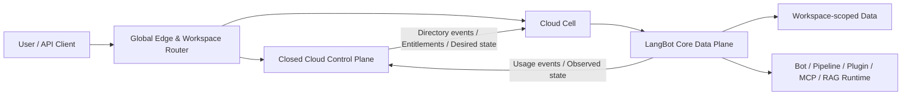
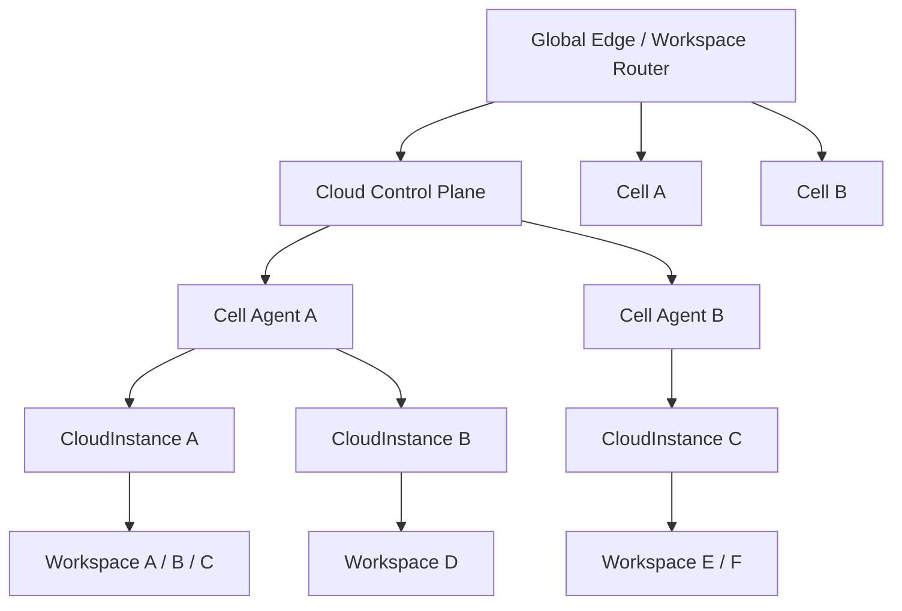

# LangBot Workspace 多用户与 SaaS 多租户架构

## 1. 决策摘要

本方案采用以下架构：

> 开源 LangBot Core 提供完整的租户隔离内核和单 Workspace 多用户能力；SaaS 使用独立闭源 Cloud Control Plane 管理全局账户、多 Workspace、计费、权益、放置和 Cloud 生命周期。

这是本次设计的核心边界：

- Workspace 是 LangBot 实例内的逻辑租户边界，不是一个 Pod，也不是一个 Kubernetes namespace。
- OSS 每个 LangBot 实例只能存在一个 Workspace，但该 Workspace 可以有多个用户、邀请和固定角色权限。
- SaaS 一个账户可以拥有或加入多个 Workspace；一个 LangBot CloudInstance 可以承载多个 Workspace。
- SaaS 普通注册会自动创建个人 Workspace。通过邀请注册的新用户也会创建个人 Workspace，并同时加入受邀 Workspace。
- OSS 首位用户创建实例唯一 Workspace；后续用户通过邀请加入该 Workspace，不再创建第二个 Workspace。
- 数据隔离、权限校验、运行时隔离必须留在开源 Core 中，不能依赖闭源服务在线代理每次请求。
- SaaS 全局账户、Workspace 目录、Membership、Invitation、Subscription、Billing、Entitlement 和 Placement 由闭源控制面维护；Core 只保存执行所需的 Account、Workspace 和 Membership 版本化投影，不投影 pending Invitation secret。
- 现有 Space 的 Pod-per-account、namespace-per-account 和 Pod subscription 模型不进入新架构。Cloud 部署按绿地方案重新设计。
- 现有 Space 只复用账户交互、OAuth、支付适配器、邮件、财务后台和生命周期可靠性经验，不复用旧 Cloud 领域模型。

推荐将 Cloud Control Plane 做成独立进程、独立发布、独立数据库和独立信任域的闭源服务。第一阶段可以和 Space 放在同一个私有代码仓库中，但不能作为 LangBot Core 的 Python 闭源补丁，也不应继续把新 Cloud 逻辑堆进现有 Space 单体。

## 2. 范围与非目标

### 2.1 本方案覆盖

- OSS 单 Workspace 多用户、邀请和固定 RBAC。
- SaaS 多 Workspace 账户与成员模型。
- Workspace 行级数据隔离。
- HTTP、API Key、Bot、Webhook 和内部服务鉴权。
- Query、Session、Plugin、MCP、RAG、Box、Storage 和 Monitoring 运行时隔离。
- SaaS Control Plane 与 LangBot Data Plane 的协议边界。
- Workspace 级订阅、权益、用量和计费模型。
- 新 Cloud v2 的 Cell、CloudInstance、Placement 和 Router 架构。
- 分阶段实施和验收策略。

### 2.2 本方案不覆盖

- 兼容旧 Space 的 Pod、账户 namespace 或旧 CloudPlan 部署方式。
- 在旧 Pod 模型上原地升级为多租户。
- 旧 Cloud 客户数据和基础设施的具体迁移执行方案。
- 第一版自定义角色、SAML、SCIM 或企业离线授权。
- 第一版跨 Cell active-active。
- 第一版 database-per-workspace 或 schema-per-workspace。

如果未来需要迁移旧 Cloud 的账户、财务记录或客户数据，应单独立项；旧部署模型不作为新架构的设计约束。

## 3. 术语与不变量

### 3.1 术语

| 术语                | 定义                                                                                                                                      |
| ------------------- | ----------------------------------------------------------------------------------------------------------------------------------------- |
| Account             | 登录主体。OSS 中是实例本地账户；SaaS 中是全局账户                                                                                         |
| Workspace           | LangBot 实例内的逻辑租户；active 后属于一个 LangBot Instance，是资源、成员、权限、运行时和计费的主要边界                                  |
| Membership          | Account 与 Workspace 的关系，包含角色、状态和权限版本                                                                                     |
| Invitation          | 邀请一个用户或邮箱加入 Workspace 的一次性凭证；SaaS 要求 verified email                                                                   |
| LangBot Core        | 开源数据面，运行 Bot、Pipeline、Model、Plugin、MCP、RAG 等业务                                                                            |
| Cloud Control Plane | 闭源 SaaS 控制面，管理全局身份、Workspace 目录、计费、权益、放置和运维                                                                    |
| CloudInstance       | 一个可承载多个 Workspace 的 LangBot 逻辑部署单元，拥有独立 Manifest、Core deployment、数据 namespace、release 和 runtime ownership domain |
| Cell                | 一个区域或故障域中的基础设施与运维单元，共享计算和存储集群但承载多个逻辑隔离的 CloudInstance                                              |
| Placement           | Workspace 到 Cell 和 CloudInstance 的版本化放置关系                                                                                       |
| BillingAccount      | 付款主体，可以为一个或多个 Workspace 付费                                                                                                 |
| Entitlement         | 控制面签发、Core 本地执行的功能和额度快照                                                                                                 |

### 3.2 必须始终成立的不变量

1. SaaS 中一个 active 或 routable Workspace 在任一时刻必须且只能属于一个有效 CloudInstance placement；provisioning、dormant 或 archived Workspace 可以暂时没有 Placement。OSS Workspace 直接属于本地 LangBot Instance，不使用 Cloud Placement。
2. 一个 CloudInstance 可以承载多个 Workspace。
3. OSS 一个实例最多只有一个 Workspace。
4. Workspace 可以有多个 Account；Account 在 SaaS 可以加入多个 Workspace。
5. 所有租户业务资源都有非空 workspace_uuid。
6. 所有资源读取和写入都使用 workspace_uuid 与 resource_id 共同定位。
7. Workspace 选择器不是授权凭证；服务端必须重新验证 Membership。
8. Core 是资源访问和运行时授权的最后一道边界。
9. Control Plane 不参与每条消息或每个普通资源请求的同步鉴权。
10. SaaS 缺少有效 Workspace 上下文时必须失败，不能回退到第一个或最近 Workspace。
11. 后台任务和运行时任务必须携带显式 Workspace 或受约束的 SystemContext。
12. Workspace、Deployment 和 BillingAccount 是三个不同概念，不能再次合并为 Pod。

Control Plane 可以先创建 status = provisioning 或 dormant 的 Workspace directory record，但它只是全局索引，不承载 LangBot 业务资源。SaaS Workspace 只有获得唯一 active Placement 后才成为可使用的实例内租户；所有 Bot、Pipeline、Plugin 等资源始终落在该 CloudInstance 内。OSS 初始化时直接在本地实例创建 active Workspace。

## 4. 产品行为

### 4.1 OSS 与 SaaS 能力矩阵

| 能力                                  | OSS                          | SaaS                                    |
| ------------------------------------- | ---------------------------- | --------------------------------------- |
| 每个 Account 可拥有的 Workspace       | 不适用；本地实例只有一个     | 由 ProductPolicy 决定                   |
| 每个 CloudInstance 可承载的 Workspace | 固定 1                       | 由 RuntimeClass 和 capacity policy 决定 |
| Workspace 成员数                      | 多用户                       | 按 Workspace 权益                       |
| 邀请成员                              | 支持                         | 支持                                    |
| 固定 RBAC                             | 支持                         | 支持                                    |
| 自定义角色                            | 不支持                       | 后续商业能力                            |
| Workspace 创建                        | 仅初始化时创建唯一 Workspace | 注册自动创建，也可按权益继续创建        |
| Workspace 切换                        | 无需展示                     | 支持                                    |
| 全局账户                              | 无                           | 支持                                    |
| 订阅与计费                            | 无远端依赖                   | 控制面管理                              |
| SSO、SCIM                             | 不支持                       | 后续商业能力                            |
| 租户隔离                              | 必须完整实现                 | 必须完整实现                            |

OSS 的 edition policy 应表达为：

```text
workspace_limit = 1
members_enabled = true
invitations_enabled = true
fixed_rbac_enabled = true
multi_workspace_enabled = false
```

不能再使用 member_limit = 1，也不能通过关闭邀请或关闭 RBAC 来限制 OSS。

### 4.2 OSS 注册与邀请

首次初始化必须在一个数据库事务内完成：

1. 创建本地 Account。
2. 创建实例唯一 Workspace。
3. 创建 owner Membership。
4. 创建默认 Pipeline、metadata 等 Workspace 初始资源。
5. 标记实例初始化完成。

初始化完成后默认关闭公开注册。后续用户流程：

1. owner 或 admin 创建 Invitation。
2. 被邀请用户打开一次性邀请链接并完成注册。
3. 接受 Invitation。
4. 原子创建或激活 Membership。
5. 用户进入实例唯一 Workspace。

OSS 后续注册不创建新 Workspace。这是“注册自动创建 Workspace”规则在单 Workspace edition 下唯一必要的例外。

OSS 不能强制依赖 SMTP。未配置邮件服务时，管理员可以生成只展示一次的一次性邀请链接并通过可信渠道发送；配置邮件后再由系统发送并校验邮箱。可以提供显式配置允许管理员直接创建本地用户或开放注册，但新用户仍只能加入唯一 Workspace，默认角色不得高于 viewer。

### 4.3 SaaS 普通注册

普通注册必须由 Control Plane 通过幂等工作流完成：

1. 创建全局 Account 和 AuthIdentity。
2. 创建 personal Workspace。
3. 创建 owner Membership。
4. 创建个人免费 Subscription 或 Entitlement。
5. 完成 verified email、速率限制和基础风控。
6. 首次访问需要运行资源时再为 Workspace 分配 Placement。
7. 将 Workspace、Account 和 Membership 投影到目标 Core。
8. 目标 Core 就绪后返回可访问 route。

注册请求必须带 idempotency key，任何步骤重试都不能创建重复 Account、Workspace、Subscription 或 Placement。

逻辑 personal Workspace directory record 可以在注册事务中立即创建，但在 Placement active 前不能创建 LangBot 业务资源，也不应为每个未活跃账户启动完整 Runtime。Control Plane 需要对未使用的免费 Workspace 懒分配、休眠和回收，防止邀请或注册风暴放大基础设施成本。

### 4.4 SaaS 邀请注册

邀请一个未注册用户时：

1. 用户通过一次性 Invitation token 完成注册。
2. Control Plane 创建全局 Account。
3. 按产品要求创建该用户的 personal Workspace 和 owner Membership。
4. 同时接受目标 Workspace 的 Invitation。
5. 登录后默认进入受邀 Workspace。

如果用户已注册，接受邀请只创建目标 Membership，不再创建新的 personal Workspace。

个人 Workspace 建议使用独立的免费 entitlement，不自动成为团队 Workspace 的付费席位或额外付费对象。是否计入账户可拥有 Workspace 上限，应在 ProductPolicy 中显式定义，不能由代码隐式推断。

### 4.5 Invitation 安全规则

- token 使用至少 256-bit 加密安全随机数，数据库只保存 hash。
- token 有 expires_at、accepted_at、revoked_at，并且只能使用一次。
- 重发邀请必须撤销旧 token。
- 同一 workspace_uuid 与 normalized_email 同时只能有一个有效邀请。
- 接受邀请必须锁定记录，Membership 创建和 token 消费在同一事务内提交。
- Invitation 不能授予 owner；owner 转移使用独立流程。
- SaaS 或启用邮件验证的 OSS 中，OAuth 邮箱相同不能自动接受邀请，必须验证 token、显式确认并要求 verified email。
- 未配置 SMTP 的 OSS 使用邀请链接本身作为高熵、单次使用的授权证明，并记录创建者、接受者、来源 IP 和审计事件。
- Workspace 必须始终至少有一个 active owner。
- admin 不能移除或降级 owner。

## 5. 当前代码现状

### 5.1 LangBot Core 仍是单用户模型

当前代码已有 users 表和 JWT，但仍围绕单管理员初始化：

- src/langbot/pkg/entity/persistence/user.py 的 User 没有稳定 account_uuid、角色或 Workspace 关系。
- src/langbot/pkg/api/http/service/user.py 的 JWT 仍主要使用 email 标识用户。
- 同一服务通过 initialized guard 拒绝第二个不匹配的 Space 用户。
- src/langbot/pkg/api/http/controller/group.py 只向 handler 注入 user_email，没有统一 RequestContext。
- API Key 没有 Workspace 所属和 scope。
- Web 客户端只保存 token，没有可信的当前 Workspace 上下文。

### 5.2 业务资源没有租户字段

以下资源目前以实例全局方式存取：

- bots
- legacy_pipelines
- pipeline_run_records
- model_providers
- llm_models
- embedding_models
- rerank_models
- plugin_settings
- mcp_servers
- knowledge_bases、files、chunks
- monitoring 相关表
- api_keys
- webhooks
- binary_storages
- metadata

对应 Service 中仍存在直接查询全表的路径。因此只增加 Workspace API 不会形成租户隔离，必须逐表、逐服务和逐运行时完成 scope 改造。

### 5.3 运行时是实例级单例

当前 Application 中的 platform、pipeline、model、tool、plugin、session、RAG 和 vector manager 主要是进程内单例。第一阶段不能简单把现有进程扩成多个活跃副本，也不能假设加一个 workspace_uuid 字段后所有缓存和连接自然隔离。

### 5.4 Plugin SDK 不认识可信 Workspace

当前 Query、Session 和 Host API 协议没有完整的 Workspace 上下文。SDK 的 workspace storage 仍使用 default owner。插件可以通过 Host API 枚举或调用全局资源，因此隔离必须进入连接、协议和 Host handler，而不只是 Web API。

## 6. 架构选择

### 6.1 推荐方案

采用以下三部分：

1. LangBot Core OSS tenancy kernel。
2. 独立闭源 Cloud Control Plane。
3. 每个 Cell 内的 Cell Agent 和 LangBot Data Plane。



### 6.2 为什么使用独立闭源服务

独立 Control Plane 的优点：

- 商业规则、支付密钥、集群凭证和平台管理权限不进入数据面。
- Account 可跨多个 Cell 和 CloudInstance 加入 Workspace。
- 订阅、权益、用量、路由和部署可以独立扩容和高可用。
- Core 与控制面通过版本化协议耦合，不依赖 Python ABI 或同进程插件。
- Control Plane 故障时 Core 可以使用本地投影和权益快照继续处理已有工作负载。

第一阶段不需要拆成大量微服务。可以先做模块化单体，但必须拥有独立部署单元和数据库。

### 6.3 为什么不使用 Core 内闭源模块

不推荐把 SaaS 多租户和计费做成 Core 内闭源模块：

- 会把支付、全局身份和集群密钥带进数据面。
- 与 Core 发布版本强耦合，难以独立扩容和回滚。
- 多 Cell 路由和全局账户无法由单实例模块可靠管理。
- 数据面被入侵时会扩大到计费和云运维信任域。

Core 内闭源模块可以保留为未来企业离线授权的交付形态，但不作为官方 SaaS 主架构。

### 6.4 为什么不能把隔离能力全部闭源

以下能力必须在开源 Core 中完整存在：

- Account、Workspace、Membership、Invitation 基础模型。
- OSS 单 Workspace edition policy。
- 固定角色和权限映射。
- RequestContext 和 WorkspaceScoped Repository。
- 所有资源的 Workspace 行级隔离。
- API Key、Webhook、Bot route 的 Workspace 绑定。
- Plugin、MCP、RAG、Box、Session、Storage 和 Monitoring 隔离。
- Entitlement 验签、额度执行钩子和 Usage Outbox。
- 跨租户测试。

否则 OSS 多用户本身不安全，SaaS 也会把最关键的隔离边界变成网络依赖。

### 6.5 商业边界的现实限制

Core 为了安全地支持 OSS 多用户，必须包含 Workspace schema、scope 和固定 RBAC；测试环境也必须能构造多个 Workspace 验证隔离。因此技术上无法阻止第三方 fork 后移除 OSS 的 Workspace 数量限制。

官方 SaaS 的商业边界应建立在闭源 Control Plane、计费、全局目录、Cloud 运维、官方服务和商标授权上，而不是故意削弱 Core 的隔离能力。不要把一个本地环境变量或可修改的前端 feature flag 当作商业保护。

## 7. 开源与闭源职责边界

### 7.1 LangBot Core OSS

Core 负责：

- 实例本地 Account 和 AuthIdentity。
- Workspace、Membership，以及 OSS 本地 Invitation。
- 固定 RBAC。
- 业务资源及其 Workspace scope。
- 运行时资源和连接隔离。
- 本地身份、SaaS 身份投影和 Membership 投影；SaaS pending Invitation 不进入 Core。
- 本地 edition policy。
- Cloud InstanceManifest 和 EntitlementSnapshot 验签。
- 本地 quota enforcement。
- UsageEvent durable outbox。
- 基础安全审计事件。

Core 是 Bot、Pipeline、Model、Knowledge、Plugin installation、MCP configuration 和 Monitoring 数据的权威来源。

### 7.2 Closed Cloud Control Plane

Control Plane 负责：

- SaaS 全局 Account、AuthIdentity、Session、OIDC 和后续 SSO。
- SaaS Workspace directory。
- SaaS Membership 和 Invitation 权威状态。
- Workspace 创建、归档、暂停和删除工作流。
- BillingAccount、Product、PlanVersion、Price 和 Subscription。
- Order、PaymentAttempt、ProviderEvent、Invoice 和 Refund。
- Entitlement 计算和签名。
- Usage ledger、聚合、额度和欠费策略。
- Cell、CloudInstance、Placement、Route 和 Domain。
- RuntimeClass、Release 和 DesiredState。
- SaaS 运营后台、平台角色和高级审计。

Control Plane 不保存 Bot、Pipeline、Model 或 Knowledge 等业务资源，也不代理普通 Bot 消息执行。

### 7.3 SaaS Adapter

Core 内只保留薄的协议适配层：

- 验证 InstanceManifest、Account token 和 JWKS。
- 消费 DirectoryEvent 并写入本地投影。
- 缓存 EntitlementSnapshot。
- 将 UsageEvent 写入 outbox。
- 上报 ObservedState。

适配层不得 monkey patch ORM，不得绕过 Core 的权限检查，也不得在一次普通资源请求中同步调用 Control Plane。

### 7.4 Provider 接口

建议在 Core 定义稳定接口：

```python
class IdentityProvider:
    async def authenticate(self, credential) -> PrincipalContext: ...

class WorkspaceDirectoryProvider:
    async def resolve_membership(
        self,
        account_uuid: str,
        workspace_uuid: str,
    ) -> WorkspaceMembership: ...

class EditionPolicyProvider:
    async def can_create_workspace(self, account_uuid: str) -> bool: ...

class EntitlementProvider:
    async def get_snapshot(self, workspace_uuid: str) -> EntitlementSnapshot: ...

class UsageSink:
    async def append(self, event: UsageEvent) -> None: ...
```

OSS 使用 LocalProvider；SaaS 使用本地 ProjectionProvider 和签名快照，不使用每请求 RemoteProvider。

## 8. Source of Truth 与同步协议

### 8.1 Source of Truth

| 数据                                         | OSS                 | SaaS                                    |
| -------------------------------------------- | ------------------- | --------------------------------------- |
| Account、Workspace、Membership               | Core 本地数据库     | Control Plane 权威，Core 保存版本化投影 |
| Invitation                                   | Core 本地数据库     | Control Plane 权威，不向 Core 投影      |
| Bot、Pipeline、Model、KB、Plugin、MCP        | Core                | Core                                    |
| Subscription、Payment、Invoice、Usage ledger | 无远端依赖          | Control Plane                           |
| Feature 和 Quota                             | 本地 edition policy | Control Plane 签发，Core 验签执行       |
| Placement 和 Route                           | 不适用              | Control Plane                           |
| Execution generation                         | Core 本地固定 epoch | Control Plane DesiredState，Core 执行   |
| 运行时授权                                   | Core                | Core 根据本地投影和 entitlement 执行    |

SaaS 中不是两套并行真相。Control Plane 的 directory 是权威写模型；Core 的 Account、Workspace 和 Membership 是带 revision 的本地读模型和执行模型。

### 8.2 DirectoryEvent

Control Plane 通过 transactional outbox 发布：

- account.upserted
- workspace.upserted
- workspace.status_changed
- membership.upserted
- membership.removed

SaaS Invitation 创建、撤销和接受只在 Control Plane directory 内流转；接受成功后发布最终 membership.upserted。Core 不接收 pending Invitation、email 或 token hash。

每个事件至少包含：

```text
event_id
event_type
aggregate_id
aggregate_revision
instance_sequence
instance_uuid
workspace_uuid
occurred_at
payload
schema_version
```

目录事件只表达 Account、Workspace 和 Membership。Placement、release 和 runtime capacity 只进入 DesiredState 流，不能由两个 revision 体系同时修改。

传输与恢复要求：

- Control Plane outbox 向受认证的 broker 发布，或通过 mTLS HTTPS 发送签名 event batch。
- Broker 使用 producer ACL；event batch 使用由 InstanceManifest 授权的 JWS key 签名并绑定 audience。
- 以 workspace_uuid 为主要 partition key；Account 事件按 account_uuid 分区。
- Control Plane 为每个目标 instance_uuid 维护 gap-free 的逻辑 directory log offset，作为 instance_sequence；不能直接假设 PostgreSQL sequence 或预分配自增 ID 无空洞。
- 顺序只保证到 aggregate，Core 以 aggregate_revision 判断新旧，不依赖全局顺序。
- Core 使用 inbox 按 event_id 去重，只接受比本地 revision 更新的事件。
- Core 同时追踪 instance_sequence 缺口，只把无缺口的最大连续序号记为 contiguous_applied_sequence。
- 因 aggregate_revision 过旧而业务 no-op 的已验签事件，仍要在 inbox 事务提交后把该 instance_sequence 标记为 processed。
- 删除使用 tombstone，不依赖物理删除顺序。
- 新实例先导入带 high_watermark 的全量 snapshot，再从该 cursor 消费增量。
- 断流或 cursor 超出保留期时重新做 snapshot reconciliation。
- schema_version 采用向后兼容演进；移除字段必须经过双读和版本退役窗口。
- Core 持久化 projection readiness 和 applied watermark，并向 Control Plane ACK。
- 注册、邀请接受和 Placement 切换只有在目标 Core 的 contiguous_applied_sequence 达到要求水位后才返回 ready route。

Control Plane 周期性签发两种短期 lease：

- InteractiveDirectoryLease：约束交互账户和 Membership 授权，TTL 较短。
- WorkspaceStatusLease：约束 Bot、Webhook、Workspace API Key 等自动化工作负载能否继续运行，TTL 可以稍长但必须有硬上限。

两种 lease 的 JWS protected header 都包含 alg、kid 和 typ，payload 至少包含：

```text
iss
aud = langbot-instance:{instance_uuid}
sub = {instance_uuid}
jti
iat
nbf
exp
instance_uuid
min_required_sequence
schema_version
keyset_revision
```

Core 只有在 projection_ready = true 且 contiguous_applied_sequence 大于等于 min_required_sequence 时才能接受 lease。投影落后时先等待同步或 reconciliation，超过请求时限后 fail closed。Lease 只证明投影新鲜度，不替代具体 Membership 或 Workspace status 检查。

instance_sequence 只在 committed outbox logical log 中形成。如果底层实现发生保留号、回滚或废弃，必须写入可验签的 no-op 或 skip record；snapshot reconciliation 也可以原子重置到一个明确 high_watermark，不能留下永久空洞。

Lease signer 只能把已经提交且可从 directory log 连续重放的 committed watermark 写入 min_required_sequence，不能使用数值最大的已分配 ID，也不能为尚未可重放的状态签发新鲜度证明。

重复、乱序、延迟、断流和全量重放都必须安全。

### 8.3 InstanceManifest

仅配置 system.edition = cloud 不足以启用 SaaS 多 Workspace。Core 镜像必须内置官方 root public key bundle，或在部署时通过独立安全通道注入 pinned root key 和 issuer。该信任根不能来自待验的 Manifest。

InstanceManifest 由 root key 签名，再授权 Gateway assertion、DirectoryEvent、DirectoryLease 和 Entitlement 使用的下级 issuer 与 JWKS。公网 Account token 的信任配置属于 Edge 全局身份配置，不由 Data Plane Manifest 授权。JWS protected header 至少包含 alg、kid 和 typ；kid 不放在业务 payload 中。

```text
iss
aud = langbot-instance:{instance_uuid}
sub = {instance_uuid}
jti
iat
nbf
exp
instance_uuid
cell_uuid
gateway_assertion_issuer
gateway_jwks_uri
directory_event_issuer
directory_event_audience
directory_jwks_uri
entitlement_issuer
entitlement_jwks_uri
keyset_revision
release
capabilities
tenant_isolation_version
generation
```

Manifest 校验要求：

- 使用 out-of-band root bundle 验证签名。
- aud 与目标 instance_uuid 精确匹配。
- iss、sub、nbf、exp、jti 和 generation 有效。
- 默认只允许很小的可配置时钟偏差。
- root 和 delegated key 轮换使用重叠有效期与递增 keyset_revision。
- 紧急撤销通过 root-signed key revocation manifest，并限制本地缓存最长期限。
- Manifest 续签应在有效期过半前完成；其 exp 必须覆盖计划中的最大 Entitlement grace 和安全余量。

Manifest 缺失、签名错误、audience 不匹配或 generation 回滚时，SaaS 实例必须 fail closed，不能自动降级成 OSS default Workspace。

### 8.4 EntitlementSnapshot

建议使用非对称签名 JWS。Protected header 至少包含 alg、kid 和 typ；payload 至少包含标准 claims 和业务字段：

```json
{
  "iss": "cloud_control_plane",
  "aud": "langbot-instance:instance_uuid",
  "sub": "workspace_uuid",
  "jti": "snapshot_uuid",
  "iat": 0,
  "nbf": 0,
  "exp": 0,
  "instance_uuid": "instance_uuid",
  "workspace_uuid": "workspace_uuid",
  "subject_type": "workspace",
  "plan_revision": 12,
  "entitlement_revision": 42,
  "status": "active",
  "features": {
    "box": true,
    "custom_roles": false
  },
  "limits": {
    "members": 20,
    "bots": 50,
    "pipelines": 100,
    "storage_bytes": 107374182400
  },
  "grace_until": 0
}
```

Core 只信任当前有效 Manifest 授权的 entitlement issuer 和 key，校验 issuer、audience、subject、instance_uuid、revision、nbf、exp 和 signature。旧 revision 不得覆盖新快照。now 超过 exp 后不能继续视为 active，只能按 grace_until 进入受限的已有工作负载宽限模式。Entitlement 的 grace 不延长 Account token 或 Membership authorization lease。

### 8.5 UsageEvent

Usage 采用 append-only、至少一次投递：

```text
event_id
workspace_uuid
instance_uuid
placement_generation
meter
quantity_integer
unit
source
occurred_at
entitlement_revision
schema_version
```

Control Plane 按 event_id 去重，并记录 received_at。Data Plane 不提交 billing period、price 或最终金额；中央 ledger 根据 occurred_at、不可变 Subscription/Price version 和迟到事件策略推导账期与价格。entitlement_revision 只用于审计事件发生时执行的权益版本。

Core 不在普通请求中同步扣费。未来若需要本地实时额度，可以设计签名 BudgetLease，但不属于 Cloud v2 MVP；模型 token 如果经过中央模型网关，可由网关作为权威计量来源。

### 8.6 DesiredState 与 ObservedState

Cell Agent 拉取或接收版本化 DesiredState，并幂等 reconcile：

- CloudInstance release。
- RuntimeClass。
- capacity。
- route。
- placement generation。

Cell Agent 上报 ObservedState。Space Web API 或 Control Plane Web API 不直接持有并使用集群管理员凭证执行任意 K8s CRUD。

Workspace 的安全或管理员状态只由 Directory aggregate 的 revision 决定；订阅状态只由 Entitlement revision 决定；Placement 只由 DesiredState generation 决定。Core 计算三者的最严格有效状态，但任何通道都不能修改另一个通道的字段。

## 9. 身份、鉴权与请求上下文

### 9.1 上下文分层

建议分为四层：

```python
class PrincipalContext:
    account_uuid: str | None
    api_key_uuid: str | None
    principal_type: str

class WorkspaceContext:
    workspace_uuid: str
    membership_uuid: str | None
    role: str | None
    permissions: frozenset[str]
    membership_revision: int

class RequestContext:
    instance_uuid: str
    placement_generation: int
    request_id: str
    auth_type: str
    principal: PrincipalContext
    workspace: WorkspaceContext
    entitlement_revision: int

class ExecutionContext:
    instance_uuid: str
    workspace_uuid: str
    placement_generation: int
    bot_uuid: str | None
    pipeline_uuid: str | None
    query_uuid: str | None
    trigger_principal: PrincipalContext | None
```

服务方法不得通过全局变量或最近 Workspace 获取上下文。Gateway 的签名内部 assertion、直接进入 Core 的本地请求、后台任务、Plugin Host 调用和 runtime lease 都必须生成或继承当前 placement_generation。

### 9.2 Account token

SaaS Account access token 使用非对称签名和短 TTL，至少包含：

```json
{
  "sub": "account_uuid",
  "iss": "cloud_control_plane",
  "aud": "langbot_cloud_edge",
  "iat": 0,
  "exp": 0,
  "jti": "token_uuid",
  "token_version": 3
}
```

JWT 表示全局账户身份，不直接授予任何 Workspace 权限，也不需要因切换 Workspace 重新签发。公网 Account token 只发给 Edge 或 Cloud BFF，Data Plane 不直接接受该 audience。

OSS token 同样应从 email 主体迁移到 account_uuid，并保留 issuer、audience、expiry 和 token version。

### 9.3 Workspace 选择

浏览器和 REST 客户端可发送：

```http
X-Workspace-Id: workspace_uuid
```

规则：

- 该 header 只是选择器，不是授权证明。
- SaaS Workspace 资源接口缺少选择器时返回 workspace_required。
- SaaS 不得自动选择最近或第一个 Workspace。
- OSS 可以因为实例只有一个 Workspace 而省略 header，后端解析到唯一 Workspace。
- API endpoint 路径中的 workspace_uuid 仍必须与 RequestContext 一致。

公网 Edge 可以使用外部 header 或稳定 route 选择 Workspace，但必须移除客户端提供的内部上下文 header。Edge 只验证 Account token、route 和 Placement generation，不同步调用 Control Plane 验证 Membership；Membership 的最终判定只由 Core 本地投影完成。

Edge 通过 mTLS 注入短期、instance-scoped 的签名内部 assertion，至少包含：

```text
iss = gateway_assertion_issuer
aud = langbot-instance:{instance_uuid}
sub = account_uuid
jti
iat
exp
auth_type
workspace_uuid
instance_uuid
placement_generation
directory_min_sequence
source_token_jti
```

Edge 的 route projection 由 Control Plane 异步发布，并使用与 Core 相同的 directory sequence 坐标；directory_min_sequence 只要求 Core 已追平到该水位，不代表 Membership 已通过。Core 验证 assertion issuer、audience、签名、短 TTL、Workspace、Placement generation 和投影水位，然后再加载 Membership。

如果未来 Edge 为了提前拒绝无权限请求而缓存 Membership，该缓存只能作为优化，不能成为放行依据，并且必须遵守相同的 watermark 与 lease 规则。

### 9.4 API Key、Bot 和 Webhook

API Key：

- 绑定 workspace_uuid。
- 绑定 scopes、status、expires_at。
- 数据库只保存 key hash。
- 可选绑定 service_account_uuid。
- 不能通过 header 切换到其他 Workspace。

Bot/Webhook：

- 通过不可猜的 route token、bot_uuid 或发布记录反查 Workspace。
- 不信任公网传入的 workspace_uuid。
- webhook route token 可轮换和撤销。
- Workspace slug 只用于展示，不能作为授权依据。

### 9.5 错误语义

- 资源不存在或属于其他 Workspace：返回 404。
- 资源属于当前 Workspace但权限不足：返回 403。
- SaaS 缺少 Workspace：返回 400 workspace_required。
- Membership inactive 或 Workspace suspended：返回 403。
- Entitlement 不允许新建或超限：返回明确的 edition_limit 或 quota_exceeded。

## 10. Core 数据模型

### 10.1 Account

升级现有 users 语义，建议字段：

- uuid
- email_normalized
- display_name
- avatar_url
- status
- source: local 或 cloud_projection
- projection_revision
- created_at
- updated_at

OSS 本地凭证单独放在 local_credentials：

- account_uuid
- password_hash
- password_updated_at
- token_version

OAuth 身份不要只按 email 绑定，本地模式新增 auth_identities：

- provider
- provider_subject
- account_uuid
- email_at_link_time
- created_at

唯一键为 provider 与 provider_subject。

SaaS 投影直接使用 Control Plane 的全局 Account UUID，不再维护另一套 external_account_uuid。投影只包含显示身份和授权所需状态，绝不包含 password_hash、OAuth refresh token、浏览器 session secret 或支付凭证。

### 10.2 Workspace

新增 workspaces：

- uuid
- instance_uuid
- name
- slug
- type: personal 或 team
- status: provisioning、active、suspended、archived、deleted
- created_by_account_uuid
- source: local 或 cloud_projection
- projection_revision
- created_at
- updated_at

OSS 数据库必须用约束和 edition policy 保证一个实例只有一个 Workspace。SaaS Workspace 必须与签名 InstanceManifest 的 instance_uuid 一致。

dormant 是 Control Plane directory 的未放置状态，不写入 Core workspaces。开始 Placement 后，目标 Core 才收到 provisioning Workspace 投影；Placement active 后再切换为 active。

### 10.3 WorkspaceExecutionState

Core 本地新增 workspace_execution_states，统一表达当前实例可接受的写入 generation：

- workspace_uuid
- instance_uuid
- active_generation
- state: provisioning、active、migrating、draining、inactive
- write_fenced
- source: local 或 cloud
- desired_state_revision
- updated_at

OSS 使用 LocalExecutionStateProvider，在初始化事务中创建 generation = 1、state = active、write_fenced = false 的固定本地状态，不消费 Cloud DesiredState。SaaS 使用 CloudExecutionStateProvider，由 DesiredState consumer 更新，不由用户 API 修改。

每个 Unit of Work 或 Repository 写入口都必须验证：

- RequestContext 或 ExecutionContext 的 placement_generation 等于 active_generation。
- write_fenced = false。
- state 允许当前操作。

校验必须与提交形成同一个事务协议，不能只在事务开始前 check：

- 普通写事务对 WorkspaceExecutionState 行持有 shared transaction lock，验证 generation 后一直持有到 commit。
- fence 操作获取 exclusive lock，等待已有写事务提交或回滚，再设置 write_fenced 和新 generation。
- PostgreSQL 可以使用行锁或 transaction advisory lock；SQLite 使用单写事务和显式 maintenance fence 实现同一语义。
- DB outbox 与业务写入同事务保存 operation_id 和 generation。
- Object Store、平台消息、Plugin Host 等不可回滚副作用由 outbox dispatcher 执行，并在实际副作用前再次校验 generation。
- Object Store 大文件先写 generation-scoped staging key，校验后再发布最终引用；旧 generation 的 staging data 可回收。
- 无法让外部平台原生校验 fencing token 时，dispatcher 必须保证单 owner，并在切换前 drain。

旧 generation 即使仍能连接数据库也不能提交写入或发出新副作用。读请求是否允许在 draining 阶段继续，由迁移策略显式决定。

### 10.4 WorkspaceMembership

新增 workspace_memberships：

- uuid
- workspace_uuid
- account_uuid
- role
- status: active、disabled、removed
- invited_by_account_uuid
- joined_at
- projection_revision
- created_at
- updated_at

唯一键：

- workspace_uuid 与 account_uuid。

角色先固定为：

| Role      | 说明                                              |
| --------- | ------------------------------------------------- |
| owner     | Workspace 所有者，可转让 owner                    |
| admin     | 管理成员和绝大多数资源，不能处理 owner            |
| developer | 管理 Bot、Pipeline、Model、Knowledge、Plugin、MCP |
| operator  | 运行和观察工作负载，不能读取或修改敏感密钥        |
| viewer    | 只读非敏感资源和监控                              |

固定权限矩阵：

| Permission             | owner | admin              | developer | operator | viewer |
| ---------------------- | ----- | ------------------ | --------- | -------- | ------ |
| workspace.view         | 是    | 是                 | 是        | 是       | 是     |
| workspace.update       | 是    | 是                 | 否        | 否       | 否     |
| workspace.delete       | 是    | 否                 | 否        | 否       | 否     |
| owner.transfer         | 是    | 否                 | 否        | 否       | 否     |
| member.view            | 是    | 是                 | 是        | 是       | 是     |
| member.invite          | 是    | 是                 | 否        | 否       | 否     |
| member.update_role     | 是    | 是，不能操作 owner | 否        | 否       | 否     |
| member.remove          | 是    | 是，不能操作 owner | 否        | 否       | 否     |
| resource.view          | 是    | 是                 | 是        | 是       | 是     |
| resource.manage        | 是    | 是                 | 是        | 否       | 否     |
| runtime.operate        | 是    | 是                 | 是        | 是       | 否     |
| provider_secret.manage | 是    | 是                 | 是        | 否       | 否     |
| api_key.manage         | 是    | 是                 | 否        | 否       | 否     |
| audit.view             | 是    | 是                 | 否        | 否       | 否     |
| data.export            | 是    | 是                 | 否        | 否       | 否     |
| billing_link.manage    | 是    | 否                 | 否        | 否       | 否     |

resource 代表 Bot、Pipeline、Model、Knowledge、Plugin、MCP 和 Webhook；具体 Service 可以再拆细粒度 permission，但默认映射不得放宽。Monitoring 普通查看属于 resource.view，安全审计属于 audit.view。

权限映射在 Core 中有单一代码定义。自定义角色后续由控制面下发角色策略，但 Core 仍负责执行。Workspace role 不授予 BillingAccount 或平台管理权限。

### 10.5 WorkspaceInvitation

新增 workspace_invitations：

- uuid
- workspace_uuid
- normalized_email
- role
- token_hash
- status
- expires_at
- accepted_at
- revoked_at
- created_by_account_uuid
- created_at
- updated_at

该表只用于 OSS 本地邀请，是本地权威表。SaaS Invitation 只存在于 Control Plane；Data Plane 不保存 pending email、token 或 token hash，接受邀请后只接收 Membership 投影。

### 10.6 业务资源

以下表新增非空 workspace_uuid：

- bots
- legacy_pipelines
- pipeline_run_records
- model_providers
- llm_models
- embedding_models
- rerank_models
- plugin_settings 或 plugin_installations
- mcp_servers
- knowledge_bases
- knowledge_base_files
- knowledge_base_chunks
- monitoring 相关表
- api_keys
- webhooks
- binary_storages
- Workspace metadata

建议：

- 每个租户表都有 workspace_uuid 与 created_at 或 updated_at 的索引。
- 父子表使用包含 workspace_uuid 的复合外键。
- 关联关系使用 workspace_uuid、parent_uuid、child_uuid 共同约束。
- 全局唯一 uuid 仍保留，但所有 Repository 查询必须同时带 workspace_uuid。
- plugin_settings 唯一键改为 workspace_uuid、plugin_author、plugin_name。
- mcp_servers 的名称只在 Workspace 内唯一。
- binary storage key 必须包含 instance_uuid、workspace_uuid、owner_type、owner 和 key。

metadata 拆为：

- system_metadata：实例版本、迁移和全局运行信息。
- workspace_metadata：wizard、页面设置和 Workspace 配置。

### 10.7 API Key

新增或升级字段：

- uuid
- workspace_uuid
- created_by_account_uuid
- key_hash
- scopes
- status
- expires_at
- last_used_at
- created_at

当前全局 API Key 在 SaaS 模式必须禁用。

### 10.8 防御性数据库约束

- 所有租户表 workspace_uuid 为 NOT NULL。
- 复合外键阻止跨 Workspace 关联。
- owner 最后一个成员保护使用事务锁和服务层约束。
- SaaS 投影 revision 单调增加。
- PostgreSQL RLS 可以在后续作为 defense-in-depth，但不能替代 Repository 和 Service 权限检查。

## 11. Control Plane 数据模型

建议按领域拆分。

### 11.1 Identity 与 Directory

```text
accounts
auth_identities
sessions
workspaces
workspace_memberships
workspace_invitations
workspace_routes
```

平台管理员角色和 Workspace 角色必须彻底分开。

### 11.2 Billing

```text
billing_accounts
billing_account_memberships
billing_account_workspaces
products
plan_versions
prices
plan_features
subscriptions
subscription_items
orders
order_items
payment_attempts
provider_events
invoices
refunds
credit_ledger
```

Payment provider webhook 先按唯一 provider_event_id 持久化，再通过 outbox 异步履约。支付事务中不能直接创建 Deployment。

### 11.3 Entitlement 与 Usage

```text
entitlement_grants
entitlement_snapshots
usage_events
usage_aggregates
budget_leases
```

### 11.4 Cloud

```text
cells
cloud_instances
workspace_placements
workspace_routes
runtime_classes
releases
deployment_operations
domains
desired_states
observed_states
outbox_events
inbox_events
audit_logs
```

Space 已有 Instance 模型表达 OAuth 连接记录，新模型应明确命名为 CloudInstance 或 RuntimeShard，不能复用旧名字造成语义冲突。

## 12. Billing 与权益设计

### 12.1 计费主体

推荐：

- Subscription 的主要 subject 是 Workspace。
- BillingAccount 是付款主体。
- 一个 BillingAccount 可以为多个 Workspace 付款。
- Account 级权益控制可拥有或新建的 Workspace 数量。
- Workspace 级权益控制成员、Bot、Pipeline、Plugin、MCP、Token、Storage 等限额。

这样团队 Workspace 可以独立升级、暂停或迁移，同时企业客户可以统一付款。

BillingAccount 使用独立 Membership 和角色：

| Billing role   | 能力                                                   |
| -------------- | ------------------------------------------------------ |
| owner          | 管理付款方式、成员、Workspace 绑定、订阅、发票和所有权 |
| billing_admin  | 管理付款方式、订阅和发票，不能转移所有权               |
| billing_viewer | 只读账单、发票和用量                                   |

将 Workspace 绑定到 BillingAccount 必须同时满足 Workspace 侧 billing_link.manage 授权和 BillingAccount 侧 owner 或 billing_admin 授权。Workspace admin 不会因为角色而自动看到同一 BillingAccount 下其他 Workspace 的发票。平台管理员角色同样独立，并且所有 support 操作需要审计。

### 12.2 Personal Workspace

SaaS 注册自动创建的 personal Workspace 建议默认绑定免费 entitlement：

- 不因接受团队邀请而产生额外账单。
- 可以限制 Bot、模型额度和成员数。
- 是否可邀请其他用户由产品计划决定。
- 升级 personal Workspace 时创建或绑定 BillingAccount。

### 12.3 Subscription 状态

建议状态机：

```text
trialing -> active
trialing -> expired
active -> past_due -> grace -> suspended
past_due -> active
grace -> active
suspended -> active
active -> canceled_at_period_end -> canceled
canceled_at_period_end -> active
```

past_due、grace 或 suspended 只有在支付恢复、ProviderEvent 已幂等入账并重新签发 Entitlement 后才回到 active。canceled_at_period_end 可以在当前 period 结束前撤销；已经 canceled 的订阅重新购买时创建新 Subscription 或新 versioned lifecycle，不原地篡改历史。

Subscription 是权益来源，PaymentOrder 只是一次交易。Product、PlanVersion 和 Price 一旦用于账单就不可变，只能新建版本。不得继续用订单成功或 Pod 到期日期直接代表订阅真相。

### 12.4 产品权益与部署规格分离

必须拆开：

- Product、PlanVersion、Price、Entitlement：用户购买什么。
- RuntimeClass、CapacityProfile、Release：平台如何部署。
- Placement isolation_tier：shared 或 dedicated。

同一 Product 可以随容量策略变化而放在不同 RuntimeClass；独享实例只是 placement policy，不是新的租户模型。

## 13. 现有 Space 的复用边界

对最新 Space 架构的结论是：外围能力可复用，旧 Cloud 核心模型不可复用。

本次审查基于 langbot-space origin/main 4c1de05778f3，关键事实锚点：

- internal/entities/persistence/account.go：AccountResources 仍以 MaxPods 等账户级资源建模。
- internal/entities/persistence/payment.go：PaymentOrder 直接包含 PlanType、BillingCycle、PodUUID 和 PodSubdomain。
- internal/entities/persistence/cloud_plan.go：CloudPlan 同时保存价格、产品限制、镜像、CPU、内存和 PVC。
- internal/entities/persistence/pod.go：Pod 同时保存账户、部署和订阅状态。
- internal/service/cloud.go：namespace 仍由 Account UUID 派生，Pod 删除路径会操作账户 namespace。
- internal/controller/tasks/lifecycle_consumer.go：retry、heartbeat、generation、fencing 和 reconcile 模式值得复用。

### 13.1 复用与重构矩阵

| 模块             | 结论            | 可复用内容                                       | 新架构要求                                                               |
| ---------------- | --------------- | ------------------------------------------------ | ------------------------------------------------------------------------ |
| Account 与 OAuth | 部分复用        | GitHub、Google、邮箱验证、Device Flow 和交互     | 采用 Account、AuthIdentity、Session；provider subject 绑定，不能只按邮箱 |
| Payment          | 适配器级复用    | Stripe、EPay 签名、回调解析、金额单位转换        | 新建 ProviderEvent、PaymentAttempt、Order、Invoice、Refund               |
| Plan             | 规则思路复用    | 本地化名称、价格展示、feature limit、试用和审计  | Product entitlement 与 RuntimeClass 完全分离                             |
| Credit 与 Usage  | 账本思路复用    | before、after balance 和交易记录                 | 改为 BillingAccount 或 Workspace，增加 reference 和 idempotency          |
| Email            | 高度复用        | SMTP、Resend、i18n template、HTML layout、幂等头 | 事务邮件进入持久队列，重写 Pod 相关模板                                  |
| Admin            | UI 和查询可复用 | 用户、订单、收入、支出列表                       | 显式平台角色、审计、限时 support impersonation                           |
| Lifecycle        | 设计经验复用    | generation、fencing、retry、heartbeat、reconcile | 由 Cell Agent 和 DeploymentOperation 实现                                |
| Marketplace      | 独立保留        | 插件市场和公共站点                               | 不承担数据面租户授权                                                     |
| Pod 与 K8s       | 废弃            | 无领域模型复用                                   | 使用 Cell、CloudInstance、Placement 和 DesiredState                      |

### 13.2 必须废弃的旧模型

- AccountResources.MaxPods。
- AccountUUID 到 namespace 的映射。
- Pod 同时承载部署、租户、套餐和订阅状态。
- 删除 Pod 时删除整个账户 namespace。
- PaymentOrder 中的 PodUUID 和 PodSubdomain。
- CloudPlan 同时包含售价、feature、image、CPU、memory 和 PVC。
- Pod 到期、续费和购买任务作为 Subscription 真相。
- Space Web API 直接操作 Kubernetes 资源。

这些模型与 Workspace 内嵌于 LangBot 实例的方向根本不同，不做兼容层。

### 13.3 推荐代码组织

- 保留 Space 作为 Marketplace、公共网站和 Cloud Portal/BFF。
- 新建独立部署的 closed Cloud Control Plane。
- 从 Space 提取 OAuth、Payment、Email 和 Admin 共享内部 Go package。
- Control Plane 从第一天使用版本化 SQL migration，不依赖 AutoMigrate 作为生产 schema 变更机制。
- Cell Agent 独立部署，只持有当前 Cell 所需的最小凭证。

## 14. Cloud v2 部署架构

### 14.1 拓扑



一个 Cell 提供共享基础设施：

- Cell Agent 和 Cell ingress。
- 计算资源池。
- PostgreSQL cluster。
- Valkey 或 Redis cluster。
- Object Store 和 Secret Store 接入。
- Box sandbox worker pool。
- 日志、指标和审计出口。

每个 CloudInstance 在 Cell 内拥有独立的：

- InstanceManifest 和 release。
- Core deployment 与 service route。
- PostgreSQL database 或 schema namespace。
- cache、lock 和 secret prefix。
- runtime ownership domain。
- capacity budget。

物理 PostgreSQL、Valkey 和 Object Store 可以由同一个 Cell 共享，但 CloudInstance 的逻辑 namespace 不能共享。Router 的实际目标是 CloudInstance service，而不是一个无法区分实例的 Cell-wide Core API。

所有权矩阵：

| 层级          | 拥有内容                                                               | 不是它的职责                       |
| ------------- | ---------------------------------------------------------------------- | ---------------------------------- |
| Cell          | Agent、ingress、compute pool、存储集群、故障域和区域                   | Workspace Membership、Subscription |
| CloudInstance | Core deployment、Manifest、DB namespace、release、runtime owner 和容量 | 全局账户、支付                     |
| Workspace     | 成员关系投影、业务资源、Plugin worker、Storage prefix 和 Entitlement   | 物理集群、付款身份                 |

由于一个 CloudInstance 使用独立数据 namespace，Core 普通 Repository 在 namespace 内以 workspace_uuid 过滤；跨 namespace 的 Router、Storage、Cache 和运维协议必须同时使用 instance_uuid 与 workspace_uuid。

### 14.2 Placement

workspace_placements 至少包含：

```text
workspace_uuid
cell_uuid
cloud_instance_uuid
isolation_tier
region
residency
state
generation
desired_release
created_at
updated_at
```

Router 缓存 route_key 到 cell_uuid、cloud_instance_uuid、generation。路由切换必须 CAS generation，旧 generation 的内部请求和 runtime owner 必须被拒绝。

### 14.3 第一阶段运行约束

当前 Core manager 和平台连接是进程内单例。Cloud v2 MVP 应：

- 每个 CloudInstance 的完整 Core 只运行一个 active replica。
- 一个 runtime owner 可以服务多个 Workspace，但所有索引、连接和任务必须 Workspace-aware。
- 只有 Edge、Portal 和 Control Plane 可以在此阶段独立无状态扩展。
- 为每个 CloudInstance 设置 Workspace 和负载上限。
- dedicated 套餐仍使用同一 Workspace 模型，只分配独享 CloudInstance 或 Cell。

当前 Core 尚未拆分 API 和 runtime，因此不能宣称 API replica 可独立扩展，也不能直接把现有整体 Deployment replicas 从 1 改为 2；否则平台长连接、scheduler、插件和消息发送可能重复执行。

### 14.4 后续 HA

演进方向：

- 将 API 与 runtime ownership 拆分。
- runtime worker 按 Workspace 或 Bot 获取 lease。
- lease 带 generation 和 fencing token。
- scheduler、platform adapter 和 plugin worker 都受 lease 约束。
- 旧 worker 恢复后不能继续发送消息或写入新 generation。
- PostgreSQL 使用多 AZ 和 PITR。
- Object Store 启用版本化。
- Valkey 只做缓存、锁和临时状态，不作为权威数据库。

第一阶段不做单 Workspace 跨 Cell active-active。优先实现 Cell 内多 AZ 和跨 Cell 备份恢复。

### 14.5 Workspace 迁移

未来 Workspace 在 CloudInstance 间迁移的通用流程：

1. Placement 进入 migrating。
2. 目标实例建立 Manifest、Entitlement、directory projection 和数据副本。
3. 通过 snapshot 与 delta 或 CDC 追平并记录 source watermark。
4. 在源端开启 write fence，停止新写入并排空 API、job 和 outbox。
5. 完成 final delta，校验 target watermark、资源计数和 checksum。
6. 提升 placement generation；源数据库拒绝旧 generation 的后续写入。
7. 冻结旧 runtime owner并停止旧平台连接。
8. CAS 切换 route。
9. 目标实例确认 projection、entitlement 和 runtime ready 后启动新 owner。
10. 保留源端只读快照和回滚 generation 窗口。

该流程不依赖旧 Space Pod，也不要求 Workspace 等于 Deployment。

## 15. Core 服务层改造

### 15.1 WorkspaceScoped Repository

所有业务 Service 显式接收 RequestContext：

```python
async def get_bot(self, ctx: RequestContext, bot_uuid: str) -> Bot:
    require(ctx, "bot.view")
    stmt = (
        select(Bot)
        .where(Bot.workspace_uuid == ctx.workspace.workspace_uuid)
        .where(Bot.uuid == bot_uuid)
    )
    bot = await self.session.scalar(stmt)
    if bot is None:
        raise NotFoundError()
    return bot
```

禁止：

- Service 内 select 全表后在 Controller 过滤。
- 通过可选 workspace_uuid = None 表示系统权限。
- 使用最近 Workspace 或默认 Workspace 执行后台任务。
- 仅检查资源 uuid 而不检查 workspace_uuid。

需要逐一改造：

- Account、Workspace、Membership、Invitation。
- API Key。
- Bot 和 Platform。
- Pipeline 和 RunRecord。
- ModelProvider 和所有 Model。
- Plugin installation、configuration 和 page API。
- MCP。
- Knowledge 和 RAG。
- Monitoring。
- Webhook。
- Binary Storage。

### 15.2 后台任务

后台任务 payload 必须包含：

- instance_uuid。
- workspace_uuid。
- actor 或受约束的 SystemContext。
- resource_uuid。
- operation_id。
- generation。

跨所有 Workspace 的平台任务只能使用专门的 SystemContext，并由明确的 allowlist repository 执行，不能复用普通 Service 的 context=None。

## 16. 运行时与 SDK 隔离

### 16.1 Query、Event 和 Session

Query 和 Event 增加 workspace_uuid 用于传递和观测，但它不是授权来源。Host 必须从可信 Bot、Pipeline、Plugin installation 或连接记录推导 Workspace，并校验传入字段一致。

Session key 至少为：

```text
workspace_uuid
bot_uuid
launcher_type
launcher_id
```

Query、Session、RuntimeBot、RuntimePipeline、cache key、lock key 和 manager index 都必须包含 Workspace。

### 16.2 Plugin

SaaS 不允许多个 Workspace 共享同一个第三方插件进程或可信 Host 连接。原因是插件可以保留跨请求内存、启动后台任务并主动调用 Host API。

安全不变量：

- 一个不可信 Plugin 进程、容器或 supervisor 不能服务多个 Workspace。
- Plugin code artifact 和只读包缓存可以共享。
- Plugin config、secret、storage 和 connection 不能跨 Workspace 共享。
- Host connection 在服务端至少绑定 workspace_uuid；每次调用还绑定不可伪造的 installation capability。
- Plugin 不能提交任意 workspace_uuid。
- Host API 从连接上下文推导 Workspace。
- Plugin page API 同时校验 Account Membership 和 Plugin installation。

隔离等级：

| Level                | 进程边界                                                               | 用途                                  |
| -------------------- | ---------------------------------------------------------------------- | ------------------------------------- |
| workspace_worker     | 一个 Workspace 一个 supervisor，可承载该 Workspace 内多个 installation | SaaS 默认基线                         |
| installation_sandbox | 每个 installation 独立进程或容器                                       | 高风险、未知来源或申请高权限的 Plugin |
| dedicated_worker     | Workspace 独享节点或更强 sandbox                                       | 企业与高隔离套餐                      |

同一 Workspace 内多个 Plugin 共享 worker 意味着它们共享租户内信任域；一旦需要防止 Plugin 之间读取内存或 secret，必须提升为 installation_sandbox。具体分级由签名、来源、权限声明和产品策略决定，MVP 不必无条件为每个 installation 启动容器。

OSS 因为实例只有一个 Workspace，可以继续使用单一插件 runtime，但协议和存储仍必须 Workspace-aware。

### 16.3 Plugin Host API

以下 API 必须限定当前 Workspace：

- get_bots 和 get_bot_info。
- send_message。
- get_llm_models 和 invoke_llm。
- list_plugins_manifest。
- list_commands 和 list_tools。
- call_tool。
- invoke_embedding 和 vector 相关接口。
- list_knowledge_bases 和 retrieve_knowledge。
- workspace storage。

跨 Workspace 管理能力不能通过普通 Plugin Host API 暴露。

### 16.4 MCP

- mcp_servers 带 workspace_uuid。
- MCP runtime key 使用 workspace_uuid 与 server_uuid。
- 同名 server 或 tool 不能共享 session。
- Pipeline 只能引用同 Workspace 的 MCP server。
- 当前全局 mcp-shared Box session 必须改成每 Workspace 隔离。
- MCP Resource 的 list、read、附件和二进制读取必须在 Workspace 内校验。

### 16.5 Box

Box namespace 至少是 instance_uuid 与 workspace_uuid：

- Session、Process、目录、端口和 WebSocket attach token 都在该 namespace 内。
- SaaS 插件不能传任意 host_path。
- 不允许额外特权挂载。
- 所谓 global sandbox 只能表示 Workspace 内 global，不能表示整个 CloudInstance global。
- 配额从 EntitlementSnapshot 获取并在 Core 或 Box gateway 执行。

### 16.6 RAG、Vector 和 Object Storage

- collection 的物理名称由服务端使用 instance_uuid 和 workspace_uuid 派生。
- Plugin 只使用不透明 collection handle。
- 所有 embedding 和 retrieval 记录带 workspace_uuid。
- 对象路径固定在 instances、instance_uuid、workspaces、workspace_uuid 前缀下。
- 外部 API 不接受任意 storage path。
- Secret Store 和 Redis key 必须带 Workspace。
- 日志和 trace 保留完整 instance_uuid 与 workspace_uuid。
- Metrics 使用 Cell、plan、runtime class 等受控低基数标签；除受控小规模内部指标外，不把完整 Workspace UUID 作为时序标签，避免高基数爆炸。

## 17. HTTP API 与前端

### 17.1 OSS Core Workspace API

OSS Core 提供本地 Workspace 和成员协作 API：

```text
GET    /api/v1/workspaces
POST   /api/v1/workspaces
GET    /api/v1/workspaces/current
GET    /api/v1/workspaces/{workspace_uuid}
GET    /api/v1/workspaces/{workspace_uuid}/members
POST   /api/v1/workspaces/{workspace_uuid}/invitations
POST   /api/v1/invitations/accept
PATCH  /api/v1/workspaces/{workspace_uuid}/members/{account_uuid}
DELETE /api/v1/workspaces/{workspace_uuid}/members/{account_uuid}
```

GET 返回实例唯一 Workspace；POST /workspaces 为保持客户端契约可以存在，但固定返回 edition_limit。Invitation token 放在 POST body 中并全链路日志脱敏，不能放在 URL path、query、Referer 或分析事件中。Invitation 接受和 Membership 修改在 OSS 本地事务中完成。

### 17.2 SaaS Cloud API

SaaS 的全局 Workspace lifecycle、Membership 和 Invitation 权威写入由 Control Plane 或 Cloud BFF 提供：

```text
GET    /cloud/v1/workspaces
POST   /cloud/v1/workspaces
GET    /cloud/v1/workspaces/{workspace_uuid}
GET    /cloud/v1/workspaces/{workspace_uuid}/members
POST   /cloud/v1/workspaces/{workspace_uuid}/invitations
POST   /cloud/v1/invitations/accept
PATCH  /cloud/v1/workspaces/{workspace_uuid}/members/{account_uuid}
DELETE /cloud/v1/workspaces/{workspace_uuid}/members/{account_uuid}
GET    /cloud/v1/workspaces/{workspace_uuid}/billing
```

OSS endpoint 由 LocalDirectoryProvider 执行；Cloud endpoint 由 Control Plane directory service 执行。Cloud API 完成事务后发布 DirectoryEvent，并在需要立即进入 Workspace 的流程中等待目标 Core 的 contiguous_applied_sequence 达到 required instance_sequence。SaaS 不应把 Invitation 或 Membership 写入请求直接发送给 Data Plane。

SaaS Core 对外只提供当前 placement 内的 Workspace 投影读取和业务资源 API。对用户发起的 directory mutation 固定返回 cloud_directory_read_only。控制面投影写入使用独立的 mTLS internal endpoint 或 event consumer，不复用用户管理 API。

现有 Bot、Pipeline、Provider、Plugin、MCP、Knowledge 和 Monitoring API 路径可保留，但必须从 RequestContext 限定 Workspace。

### 17.3 OSS 前端

- 不显示 Workspace switcher 和 Create Workspace。
- 可以显示唯一 Workspace 名称。
- 提供 Members 和 Invitations 页面。
- 提供固定角色选择。
- 初始化页面创建首位 owner 和唯一 Workspace。

### 17.4 SaaS 前端

- Cloud shell 从 Control Plane 获取全局 Workspace directory。
- 明确选择 Workspace 后进入稳定 Workspace route。
- 显示 Workspace switcher、Create Workspace、Members、Billing 和 Usage。
- 切换 Workspace 后清理前一个 Workspace 的客户端 query cache。
- 所有 Data Plane 请求显式带当前 Workspace 选择器。
- 不能仅把 currentWorkspaceId 写入 localStorage 就认为完成安全隔离。

### 17.5 登录后的 SaaS 路径

1. Control Plane 完成全局登录。
2. 前端读取 Workspace directory。
3. 用户选择 Workspace，或注册工作流明确返回刚创建的 Workspace。
4. Router 解析 Placement。
5. Edge 验证 Account token并签发 instance-scoped assertion；Data Plane 验证 assertion、Workspace、Placement generation 和本地 Membership 投影。
6. 前端进入 Workspace 内页面。

普通资源请求缺少 Workspace 时不做隐式跳转，由前端处理 workspace_required。

## 18. 故障与降级策略

### 18.1 不同租约不能混用

Manifest、Account token、Directory freshness 和 Entitlement 使用不同的有效期：

| 状态                      | 建议有效期                   | 控制面故障后的行为                                               |
| ------------------------- | ---------------------------- | ---------------------------------------------------------------- |
| InstanceManifest          | 长于最大 entitlement grace   | 运行到 exp；过期后整个 SaaS instance fail closed                 |
| Account access token      | 分钟级短 TTL                 | 已签发 token 只运行到 exp；不能登录或刷新                        |
| InteractiveDirectoryLease | 分钟级，独立可配置           | 交互用户访问只运行到 lease 到期，之后 fail closed                |
| WorkspaceStatusLease      | 可长于交互 lease，但有硬上限 | Bot、Webhook、API Key 只运行到 lease 到期，之后安全暂停          |
| Entitlement grace         | 小时到天                     | 只维持已有自动化工作负载和已购能力，不延长 Manifest 或目录 lease |
| Router cache              | 短 TTL，带 generation        | 可路由到最后已知健康目标；不能忽略 generation                    |

因此“24 到 72 小时宽限”只适用于 Entitlement 和已有 Bot 等自动化工作负载，不代表用户可以在身份服务或 Directory 断开后继续登录 24 到 72 小时。

### 18.2 故障矩阵

| 故障                                 | 交互用户                                       | 已有 Bot、Webhook、Workspace API Key                          | 控制类操作                           |
| ------------------------------------ | ---------------------------------------------- | ------------------------------------------------------------- | ------------------------------------ |
| Manifest signer 或续签不可用         | 有效 Manifest 与 token 内可用                  | 只运行到 Manifest exp                                         | 新实例绑定禁止                       |
| Identity 不可用                      | 已有 token 到期前可用，不能登录或刷新          | 不受 Account token 影响，但仍检查 WorkspaceStatusLease        | 禁止                                 |
| Directory 不可用                     | 有效 token 与 InteractiveDirectoryLease 内可用 | 只运行到 WorkspaceStatusLease exp                             | 邀请、角色、Workspace lifecycle 禁止 |
| Billing 或 Entitlement signer 不可用 | 按最后快照读取已有资源                         | 同时满足有效 Manifest、WorkspaceStatusLease 和 grace 才能继续 | 购买、提额、套餐变更禁止             |
| Router control 不可用                | 使用未过期 route cache                         | 已建立的数据面连接仍检查 generation 和所有 lease              | 新 Placement 和迁移禁止              |
| Data Plane 不可用                    | 当前 Workspace 不可用                          | 当前 Workspace 停止                                           | Control Plane 只显示故障，不伪造成功 |

UsageEvent 在控制面故障时写入 durable outbox。

### 18.3 必须 fail closed 的情况

- SaaS 首次启动没有有效 InstanceManifest。
- Manifest 或 Entitlement 签名无效。
- audience 或 instance_uuid 不匹配。
- revision 或 placement generation 回滚。
- 已知 Workspace suspended。
- 没有本地 Membership 投影。
- InteractiveDirectoryLease 已过期的交互请求。
- WorkspaceStatusLease 已过期的 Bot、Webhook、API Key、job 或 runtime 请求。
- SaaS 请求缺少 Workspace。

不得回退到 OSS mode、default Workspace 或全局资源访问。

### 18.4 Membership 撤销与 Workspace 暂停

- Account token 使用短 TTL。
- Membership 变更立即发布高优先级 DirectoryEvent。
- 本地 projection 保存 membership_revision。
- Edge 或 Cloud BFF 的签名内部 assertion 携带 directory_min_sequence；Account access token 本身不携带 Membership revision。
- Core 的 contiguous_applied_sequence 低于 directory_min_sequence 时拒绝请求并等待同步，不能按旧 Membership 放行。
- InteractiveDirectoryLease 设置用户撤权最坏生效上限；WorkspaceStatusLease 设置安全暂停对自动化工作负载的最坏生效上限。
- Cell 无法续租时，交互用户、Bot、Webhook、API Key、job 和 runtime 分别在对应 lease 到期后 fail closed。
- 安全暂停来自 Directory revision，欠费暂停来自 Entitlement revision；两者任一个禁止时都不能运行受影响操作。
- Billing entitlement grace 不能延长或覆盖安全暂停和 WorkspaceStatusLease。
- 紧急暂停的最坏生效时间由 WorkspaceStatusLease TTL 明确写入安全 SLA。

### 18.5 Entitlement 到期

宽限期结束后：

- 阻止付费功能的新建和扩大资源。
- 是否停止已有 Bot 应作为独立产品策略，不能由通用 quota 代码隐式决定。
- 欠费暂停必须可审计并支持恢复。

## 19. 安全清单

必须防止：

- Account A 猜测 Account B Workspace 的资源 uuid。
- API Key A 通过 header 选择 Workspace B。
- Plugin 枚举其他 Workspace 的 Bot、Model 或 Knowledge。
- Plugin 在内存中保留 Workspace A 数据后服务 Workspace B。
- MCP 同名 server 复用 session。
- Box 同名 session、process 或 attach token 串租户。
- RAG collection name 冲突。
- Monitoring session_id 冲突。
- 后台任务缺少 Workspace 后访问全表。
- OAuth 只按 email 错误合并不同 provider identity。
- 邀请并发消费或移除最后一个 owner。
- 伪造 X-Workspace-Id、内部 assertion 或旧 placement generation。

安全原则：

- 最小权限。
- 服务端推导 Workspace。
- 复合外键。
- 密钥只保存 hash。
- 内部通信使用 mTLS 和短期签名 service token。
- 支付 webhook 先持久化再履约。
- 所有控制面事件和运行操作幂等。
- 跨租户访问默认返回 404。

## 20. 实施阶段

### Phase 0：契约和基线

- 冻结术语、产品矩阵和 Source of Truth。
- 定义 RequestContext、ExecutionContext 和 Provider 接口。
- 定义 DirectoryEvent、DirectoryLease、InstanceManifest、EntitlementSnapshot、UsageEvent 和 Placement generation schema。
- 建立跨租户测试辅助工具。
- 列出所有需要 workspace_uuid 的表、cache、lock、storage 和 runtime key。

### Phase 1：OSS tenancy kernel

- Account 引入稳定 uuid。
- 新增 Workspace、Membership、Invitation。
- 首次初始化创建唯一 Workspace 和 owner。
- 后续邀请注册加入唯一 Workspace。
- 固定 RBAC。
- OSS edition policy 强制 workspace_limit = 1。
- JWT 从 email 主体迁移到 account_uuid。

### Phase 2：资源行级隔离

- 按 expand、backfill、validate、contract 迁移所有现有数据到默认 Workspace。
- 先增加可回填字段，再校验所有行和关联，最后收紧非空与复合外键。
- Repository 和 Service 强制 scope。
- API Key、Webhook 和 Monitoring 完成隔离。
- SQLite 和 PostgreSQL 迁移均可中断重试并支持 forward recovery。

SQLite 增加复合外键或非空字段可能需要重建表。升级前必须备份并验证恢复，不承诺任意阶段无损 downgrade。

### Phase 3：Runtime 和 SDK 隔离

- Query、Event、Session 和 ExecutionContext 增加 Workspace。
- Bot、Pipeline、Model、RAG manager 的 key 和 cache 改造。
- Plugin connection、process、config 和 storage 隔离。
- MCP 和 Box 隔离。
- SDK Host API 不允许任意 Workspace 参数。

### Phase 4：Cloud 协议

- InstanceManifest 和 JWKS。
- SaaS Account、Workspace、Membership projection。
- Directory inbox/outbox。
- instance_sequence、snapshot reconciliation、InteractiveDirectoryLease 和 WorkspaceStatusLease。
- Entitlement cache 和 quota enforcement。
- Usage outbox。

### Phase 5：Closed Control Plane 与 Billing

- 全局 Account 和 Workspace directory。
- BillingAccount、Product、Plan、Price 和 Subscription。
- Payment provider event 和财务模型。
- Entitlement signer 和 Usage ledger。
- Cloud Portal 和运营后台。

### Phase 6：Cloud Cell

- Cell Agent。
- CloudInstance、Placement 和 Router。
- WorkspaceExecutionState、签名 gateway assertion 和 Repository write fence。
- Workspace provisioning workflow。
- runtime ownership 和 generation fencing。
- shared 与 dedicated placement。
- Cloud v2 新用户完整链路。

### Phase 7：HA 与规模化

- API 与 runtime worker 拆分。
- Workspace 或 Bot lease。
- 同 Cell 多 AZ。
- Workspace migration。
- 跨 Cell DR。

### Multi-workspace 发布门禁

- Phase 1 和 Phase 2 只允许发布 OSS 单 Workspace 多用户。
- 数据库出现 workspace_uuid 不代表可以启用 SaaS 多 Workspace。
- 在 Phase 3 完成前，Plugin、Session、MCP、Box 和 Runtime 仍可能有全局状态，任何环境都不得创建第二个生产 Workspace。
- SaaS multi_workspace capability 只有在资源隔离、Runtime、SDK、Directory projection、两类 DirectoryLease、Manifest、Entitlement、Placement write fence 和跨租户测试全部通过后才能由签名 Manifest 开启。
- Manifest 应携带 tenant_isolation_version；Core 只接受自身声明支持且通过 release gate 的版本。
- 未通过门禁的 release 固定执行 workspace_limit = 1，即使 Control Plane 错误下发更高额度也不放开。
- 第一批 schema PR 不暴露 SaaS Workspace 创建、切换或 Cloud directory 写入。

## 21. 第一批代码改动建议

第一批 PR 只做可独立验证的基础骨架，不同时改完所有资源：

1. 新增 Account uuid、Workspace、Membership、Invitation 表和 Alembic migration。
2. 迁移旧实例到唯一 Default Workspace。
3. 首个用户成为 owner。
4. 引入 RequestContext 和固定权限定义。
5. JWT sub 改为 account_uuid，并保留兼容读取旧 token 的短期迁移策略。
6. OSS 创建第二个 Workspace 返回 edition_limit。
7. 增加 OSS 多用户邀请的 Service 测试。
8. 增加两个 Workspace 的 Repository 隔离测试基础设施。

第一批 PR 不开启 SaaS multi_workspace capability。第二批再从 Bot 开始逐资源强制 Workspace scope，不能长期停留在“表已有 workspace_uuid、查询仍访问全表”的中间状态。

## 22. 测试与验收

### 22.1 Migration

- SQLite 旧实例升级。
- PostgreSQL 旧实例升级。
- 已有 Account 成为默认 Workspace owner。
- 所有旧资源完成 workspace_uuid backfill。
- migration 中断后可安全重试。
- SQLite 重建表前生成并验证备份，失败时可 forward recover。
- system metadata 与 workspace metadata 正确拆分。

### 22.2 OSS 产品行为

- 首次注册原子创建 Account、唯一 Workspace 和 owner。
- 第二个 Workspace 无法创建。
- 邀请用户可以注册并加入唯一 Workspace。
- 未配置 SMTP 时一次性邀请链接仍可完成注册。
- viewer、operator、developer、admin 和 owner 权限符合矩阵。
- 最后一个 owner 不能被移除或降级。
- OSS 不显示 Workspace switcher，但显示成员管理。

### 22.3 SaaS 注册与目录

- 普通注册只创建一个 personal Workspace。
- 邀请注册创建 personal Workspace 并加入目标 Workspace。
- 已有用户接受邀请不创建额外 personal Workspace。
- 未 active Placement 的 provisioning 或 dormant Workspace 不能创建业务资源，首次使用完成 Placement 后才可进入。
- 重试注册工作流不产生重复数据。
- DirectoryEvent 重复、乱序和延迟时投影正确。
- snapshot 与增量 cursor 能恢复断流，instance_sequence 缺口不会被错误标记 ready。
- contiguous_applied_sequence 未达到 lease.min_required_sequence 时请求 fail closed。
- SaaS pending Invitation、email 和 token hash 不进入 Data Plane。
- 缺少 Workspace 的 Data Plane 请求返回 workspace_required。

### 22.4 资源隔离

即使 OSS UI 只允许一个 Workspace，CI 也必须使用测试 policy 创建至少两个 Workspace，覆盖每类资源的：

- list。
- get。
- create。
- update。
- delete。
- export。
- 关联与复制。

还要覆盖 Pipeline 引用其他 Workspace 的 Model、Knowledge、MCP 或 Plugin 时被拒绝。

### 22.5 Runtime

- 两个 Workspace 使用相同 launcher_id 不共享 Session。
- 相同 MCP server name 不共享连接或 tool。
- Plugin 猜测 Query ID 或 resource uuid 无法越权。
- Plugin 不能伪造 workspace_uuid。
- 同一 Plugin 在两个 Workspace 使用独立 process、connection、config 和 storage。
- Box 同名 Session、Process 和 WebSocket attach 不串租户。
- RAG collection 和对象路径不串租户。
- Runtime lease 过期或 generation 变化后旧 owner 无法继续发送消息。
- 普通 API、Plugin Host、job 和 runtime 携带旧 placement_generation 时都不能写入。
- 并发写事务与 fence 使用 shared/exclusive lock，不会发生校验后 fence、旧事务再提交的竞态。
- 旧 generation outbox event、Object Store staging write 和平台副作用在 dispatcher 再校验时被拒绝。

### 22.6 Billing 与控制面

- Payment webhook 重复投递只履约一次。
- 订单成功不会直接绕过 Subscription 状态机。
- Entitlement 签名、过期、回滚和 audience 校验。
- Manifest root trust、delegated JWKS、续签、过期和 key revocation。
- InteractiveDirectoryLease 到期后交互用户停止，WorkspaceStatusLease 到期后自动化工作负载停止。
- UsageEvent 重复和乱序不会重复计费。
- 迟到 UsageEvent 由中央 ledger 按 occurred_at 和不可变 Subscription/Price version 归入正确账期。
- past_due、grace、suspended 支付恢复和 canceled_at_period_end 撤销会生成正确的新 Entitlement revision。
- Control Plane 断开时按宽限策略运行。
- 没有有效 Manifest 时 SaaS fail closed。
- Placement 切换后旧 generation 请求被拒绝。

### 22.7 端到端

- OSS 初始化、邀请、注册、登录、成员管理和权限拒绝。
- SaaS 注册、personal Workspace、创建 Workspace、切换、邀请和计费。
- Workspace A 与 B 的 Bot、Pipeline、Plugin、MCP、Knowledge 和 Monitoring 完整隔离。
- Cloud Router 到正确 Cell 和 CloudInstance。
- 欠费、暂停、恢复和 entitlement 更新。

端到端验收必须使用真实浏览器操作，不以组件测试或接口调用替代用户路径。

## 23. 已确认决策与待定项

### 23.1 已确认

- Workspace 是 LangBot 实例级逻辑租户。
- OSS 单 Workspace、多用户。
- SaaS 多 Workspace。
- SaaS 注册自动创建 personal Workspace。
- Cloud 部署绿地重做，不兼容旧 Pod 架构。
- Core 内置完整 Workspace 隔离。
- 使用独立闭源 Control Plane 管理 SaaS 商业和 Cloud 能力。
- Workspace 与 Deployment 分离。
- Product entitlement 与 runtime capacity 分离。

### 23.2 推荐默认值

- OSS 初始化后默认仅邀请注册。
- OSS 使用固定角色。
- SaaS Membership 权威在 Control Plane，Core 使用本地版本化投影。
- Subscription 以 Workspace 为 subject，BillingAccount 作为付款主体。
- personal Workspace 使用免费 entitlement。
- SaaS Plugin installation 按 Workspace 隔离进程。
- entitlement grace 为 24 到 72 小时。
- Cloud v2 MVP 每个 CloudInstance 一个 active runtime owner。

### 23.3 后续需要产品确认

- personal Workspace 是否计入可拥有 Workspace 上限。
- personal Workspace 是否允许邀请成员。
- 订阅按 Workspace 独立购买，还是企业 BillingAccount 统一承诺消费。
- past_due 宽限期后是否停止已有 Bot，还是只禁止新建和扩容。
- 各计划的成员、Bot、Token、Storage 和 Plugin 限额。
- 企业私有化是否需要离线 Commercial Module。
- 自定义角色、SSO、SCIM 和高级审计的套餐边界。

## 24. 最终结论

LangBot 多租户不能等同于把旧 Space Pod 变成共享 Pod，也不能只把 Workspace UI 放进闭源模块。

正确的边界是：

- Core 开源并负责安全：单 Workspace 多用户、固定 RBAC、数据和运行时隔离。
- Control Plane 闭源并负责 SaaS：全局 Account、多 Workspace 编排、Subscription、Billing、Entitlement、Placement 和 Cloud 运维。
- Space 复用外围能力：OAuth、支付适配器、邮件、后台和可靠性经验。
- Cloud v2 重新设计：一个 CloudInstance 承载多个 Workspace，shared 或 dedicated 只是 placement 策略。

这样既能让 OSS 成为完整、安全的多人协作产品，也能把真正的 SaaS 商业能力和全局控制能力留在独立闭源服务中。
