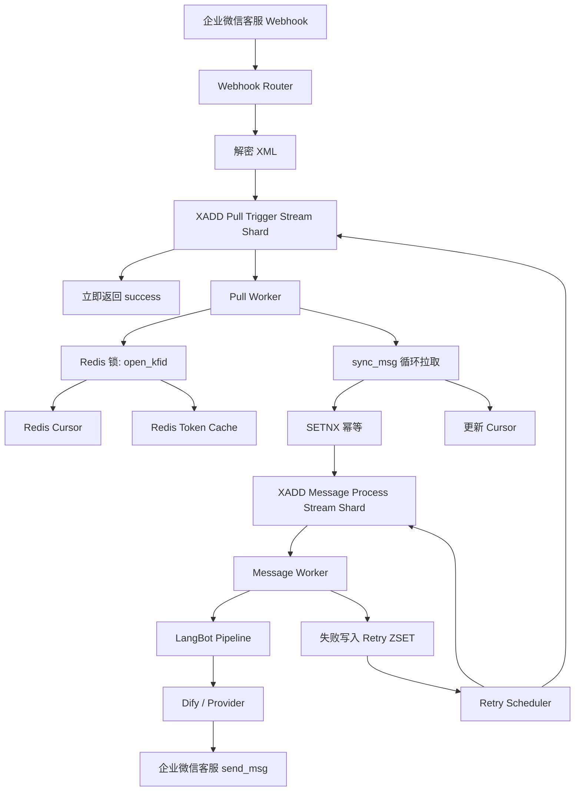

# TDD - 企业微信客服 Redis 两层 Streams 可靠消息架构

| 字段 | 值 |
| --- | --- |
| Tech Lead | TBD |
| Product Manager | TBD |
| Team | 平台后端 / 企业微信适配维护者 |
| Epic/Ticket | TBD |
| Figma/Design | N/A |
| Status | Draft |
| Created | 2026-03-25 |
| Last Updated | 2026-03-25 |

## 背景与前提说明

本文档基于当前 LangBot 主线现状与历史分支 `feature/wecom-message-scheduler` 的经验整理。当前主线已具备企业微信客服 webhook 立即返回 `success` 的基础能力，但还缺少完整的 Redis 基础设施、持久化 token 缓存、两层异步调度、重试编排与可观测性闭环。

当前文档中的人员信息与工单信息暂以 `TBD` 标注，不影响技术设计评审；在进入实现阶段前应补齐负责人、Epic 和发布窗口信息。

## Context

LangBot 当前的企业微信客服链路已经支持统一 webhook 路由与基础消息处理，但其核心路径仍然偏向“请求驱动型”的串行处理：回调到达后，需要完成解密、拉取 `sync_msg`、事件转换、进入 pipeline、调用 Dify、再发送回复。这种模式在功能上可用，但在生产环境下对消息可靠性和系统弹性存在明显限制。

历史分支 `feature/wecom-message-scheduler` 曾尝试使用 Kafka + MySQL 构建一套企业微信客服消息调度器，其目标是解决 1 秒内多条消息丢失、cursor 管理不完整、缺少幂等与重试的问题。该分支提供了正确的问题建模方向，但引入 Kafka 与专用 MySQL 数据源的接入成本较高，与当前 LangBot 主线“尽量轻量化、易部署、低侵入”的演进方向不完全一致。

本次设计希望在不引入 Kafka 的前提下，复用 Docker 环境更容易补入的 Redis，构建一套“两层 Streams + 锁 + ZSET + KV”的企业微信客服消息可靠处理架构。该方案既要满足消息可靠性目标，也要降低部署和维护复杂度，并为未来横向扩展留下清晰的演进路径。

## Problem Statement & Motivation

### 我们要解决的问题

- **问题 1：access_token 缓存不完整**
  - 当前仅具备进程内缓存与失效码触发刷新，没有基于 `expires_in` 的跨进程共享缓存。
  - 影响：多实例或重启场景下容易重复调用 `gettoken`，增加被频率限制的风险。

- **问题 2：消息拉取与业务处理耦合过深**
  - webhook 虽已能快速返回，但后续消息拉取、业务处理、回复发送仍缺少统一的异步调度基础设施。
  - 影响：重试、排队、积压、可观测性与恢复能力不足。

- **问题 3：同一 `open_kfid` 的 cursor 语义要求串行，但系统缺少显式调度模型**
  - 企业微信客服的 `sync_msg` 是按 `open_kfid + cursor` 增量拉取，不能安全地按用户并行推进 cursor。
  - 影响：若未来直接堆并发，容易出现 cursor 竞争、重复拉取、消息跳过。

- **问题 4：缺少分层并发模型**
  - 当前链路没有明确区分“拉取阶段的串行一致性”和“业务处理阶段的可并行性”。
  - 影响：系统不是吞吐不足，就是一致性不足，难以同时满足可靠性和性能。

- **问题 5：缺少统一重试与观测能力**
  - 目前没有基于消息状态的延迟重试、积压监控、失败统计与 pending 恢复机制。
  - 影响：遇到 Dify 超时、企业微信接口短暂抖动、Redis 消费者异常退出时，恢复依赖人工排查。

### Why Now

- 企业微信客服已经是实际使用链路，消息可靠性问题会直接影响 Dify 调用成功率和用户回复体验。
- 当前项目仍未引入 Redis，正适合在企业微信客服场景下先补一套最小可用的缓存与异步调度基础设施。
- 历史 Kafka 方案已经验证了问题模型，但没有合入主线；现在可以基于 Redis 以更低复杂度把关键收益先落地。

### 不解决的影响

- **业务影响**：企业微信客服回复可能继续出现延迟、不回、重试不稳定等现象。
- **技术影响**：后续越往系统里加并发，越容易破坏 cursor 一致性，形成隐性技术债。
- **运维影响**：生产问题难定位，无法快速判断是 webhook 抖动、拉取失败、Dify 超时还是发送失败。

## Scope

### ✅ In Scope

- 为 LangBot Docker Compose 增加 Redis 服务，并为应用补充 Redis 连接配置。
- 在 LangBot 内新增 Redis 基础设施封装，用于 KV、Streams、锁、ZSET 操作。
- 将企业微信客服 `access_token` 缓存迁移到 Redis KV，并基于 `expires_in` 管理 TTL。
- 引入两层 Redis Streams：
  - 第一层：`pull-trigger`，负责 webhook 后的消息拉取调度。
  - 第二层：`message-process`，负责拉取后的业务处理与回复。
- 为两层 stream 均引入“固定分片数 `% n`”策略，且 `n` 必须可配置。
- 为第一层引入 `open_kfid` 级别分布式锁，确保同一客服账号的 cursor 串行推进。
- 为第二层引入基于会话键的分片策略，实现可控并发处理。
- 引入基于 Redis ZSET 的延迟重试机制，至少覆盖拉取任务与消息处理任务。
- 增加观测指标、日志结构与基础告警建议。
- 增加针对 token 缓存、分片路由、锁互斥、重试流程的单元/集成测试。

### ❌ Out of Scope

- 引入 Kafka、RabbitMQ 或其他外部 MQ。
- 为每个 `open_kfid` 动态创建独立 stream。
- 在第一阶段做全平台通用消息调度中间件。
- 实现“严格意义上的端到端 exactly-once”。
- 在本期支持多 region / 多机房一致性调度。
- 改造所有现有平台适配器统一切换到 Redis Streams。

### 🔮 Future Considerations

- 将 Redis 调度基础设施抽象成跨平台通用组件，供其他 webhook 型适配器复用。
- 增加后台管理接口，查看企业微信客服消息积压、失败与重试状态。
- 如果未来吞吐显著提升，再评估是否迁移到 Kafka。

## Technical Solution

### 设计原则

- **拉取阶段串行**：同一 `open_kfid` 的 `sync_msg` 与 cursor 推进必须串行。
- **处理阶段并行**：拉取后的消息可以按会话维度分片并行处理。
- **固定分片数量**：不为每个 `open_kfid` 动态建 stream，统一采用固定 `N` 个分片 stream。
- **配置化并发**：第一层与第二层的 shard 数分别独立配置。
- **Redis 优先**：KV 负责 token/cursor/state，Streams 负责队列，ZSET 负责延迟重试，锁负责互斥。
- **最小侵入主线**：尽量围绕当前 `WecomCSClient` 与 `WecomCSAdapter` 增量改造。

### 核心组件

- **RedisManager**：应用级 Redis 连接与基础操作封装。
- **WecomCSTokenCache**：企业微信客服 token 的读取、刷新、TTL 管理。
- **WecomCSPullTriggerPublisher**：webhook 解密后将拉取任务写入第一层 Streams。
- **WecomCSPullWorker**：消费第一层 Streams，按 `open_kfid` 串行拉取 `sync_msg`。
- **WecomCSMessagePublisher**：将已拉取、已去重的单条消息发布到第二层 Streams。
- **WecomCSMessageWorker**：消费第二层 Streams，进入 LangBot 现有 pipeline / Dify / 回复链路。
- **WecomCSRetryScheduler**：负责 ZSET 延迟重试的投递与恢复。
- **WecomCSStateStore**：Redis 中的 cursor、幂等键、运行状态与 pending 管理。

### 配置模型

建议在实例配置中新增类似配置：

```yaml
wecomcs_scheduler:
  enabled: true
  redis_url: redis://redis:6379/0
  token_refresh_skew_seconds: 300
  pull_stream_shard_count: 8
  process_stream_shard_count: 16
  pull_consumer_group: wecomcs-pull-group
  process_consumer_group: wecomcs-process-group
  retry_poll_interval_seconds: 3
  retry_max_attempts: 3
  retry_backoff_seconds: [15, 30, 45]
  dedupe_ttl_seconds: 604800
  lock_ttl_seconds: 60
```

### 分片策略

#### 第一层：Pull Trigger Streams

固定创建以下 stream：

- `stream:wecomcs:pull-trigger:0`
- `stream:wecomcs:pull-trigger:1`
- ...
- `stream:wecomcs:pull-trigger:{N1-1}`

其中：
- `N1 = pull_stream_shard_count`
- 路由规则：`shard = hash(bot_uuid + ':' + open_kfid) % N1`

**设计原因**：
- 不创建动态 stream，降低运维复杂度。
- 同一个 `open_kfid` 永远进入固定分片。
- 第一层消费者每个分片单线程消费，外加 `open_kfid` 锁，确保 cursor 语义稳定。

#### 第二层：Message Process Streams

固定创建以下 stream：

- `stream:wecomcs:message-process:0`
- `stream:wecomcs:message-process:1`
- ...
- `stream:wecomcs:message-process:{N2-1}`

其中：
- `N2 = process_stream_shard_count`
- 路由键：`session_key = bot_uuid + ':' + open_kfid + ':' + external_userid`
- 路由规则：`shard = hash(session_key) % N2`

**设计原因**：
- 同一用户会落到固定分片，天然获得顺序性。
- 不同用户可以并行进入不同分片，提高 Dify 调用与回复发送并发度。
- 第二层的并发能力由 `N2` 直接控制，运维可按压力调整。

### 为什么不按 `open_kfid` 动态建 stream

- stream 数量会随企业微信客服账号数膨胀，管理成本高。
- 每个 stream 的 consumer group、pending、清理与恢复逻辑都会变复杂。
- 固定分片 stream + 锁已经能满足“串行一致性 + 可配置并发”的核心需求。

### 为什么不在第一层按 user_id 再分片

- `sync_msg` 的增量边界是 `open_kfid + cursor`，不是 `external_userid`。
- 若按 user_id 分片拉取，会出现多个工作单元竞争同一个 cursor 的问题。
- 因此，第一层必须围绕 `open_kfid` 串行；只有第二层业务处理才适合按用户并行。

### 锁模型

#### 第一层锁

- 锁键：`lock:wecomcs:pull:{bot_uuid}:{open_kfid}`
- 使用 Redis `SET key value NX EX` 获取锁。
- 持锁范围：
  - 读取 cursor
  - 调用 `sync_msg`
  - 处理 `has_more / next_cursor`
  - 将单条消息写入第二层 stream
  - 更新 cursor

**要求**：锁释放必须在 finally 中完成；若 worker 崩溃，依赖 TTL 自动回收。

#### 第二层是否需要锁

V1 默认不增加额外会话锁，采用“每个分片单 worker”保证分片内顺序。如果未来需要在单分片内增加 worker 并发，再引入：

- `lock:wecomcs:process:{bot_uuid}:{open_kfid}:{external_userid}`

### 状态与 key 设计

#### Token 缓存

- Key：`langbot:wecomcs:access_token:{corpid}`
- Value：

```json
{
  "access_token": "...",
  "expires_at": 1774370000
}
```

- TTL：`expires_in - token_refresh_skew_seconds`
- 兜底：若接口返回 `40014` 或 `42001`，立即删除 key 并强制刷新。

#### Cursor

- Key：`langbot:wecomcs:cursor:{bot_uuid}:{open_kfid}`
- Value：`next_cursor`
- 无固定 TTL，持久保存。

#### 幂等

- Key：`langbot:wecomcs:dedupe:{bot_uuid}:{msgid}`
- Value：`1`
- 写入方式：`SETNX`
- TTL：`dedupe_ttl_seconds`，建议 7 天。

#### Retry ZSET

- Key：`zset:wecomcs:retry`
- Score：下次重试时间戳
- Value：JSON 或引用 ID，需包含 `job_type`、`payload`、`retry_count`

### 处理流程

#### 流程 A：Webhook → 第一层 Pull Trigger

1. 统一 webhook 收到企业微信客服 POST。
2. 解密 XML，得到 `token` 和 `open_kfid`。
3. 将 `pull-trigger` 任务写入对应分片 stream。
4. 立即返回 `success`。

#### 流程 B：第一层 Pull Worker

1. 消费分片 stream 中的 trigger 任务。
2. 获取 `open_kfid` 锁。
3. 读取 Redis cursor。
4. 通过 `WecomCSTokenCache` 获取可用 access token。
5. 调用 `kf/sync_msg`，按 `has_more / next_cursor` 循环拉取。
6. 对每条消息执行幂等校验：`SETNX dedupe key`。
7. 新消息写入第二层 `message-process` stream。
8. 全部成功后更新 cursor。
9. ACK 第一层 stream 消息并释放锁。

#### 流程 C：第二层 Message Worker

1. 消费 `message-process` 分片 stream。
2. 将 Redis 中的消息 payload 转为 `WecomCSEvent`。
3. 进入当前 LangBot 既有 pipeline。
4. 调用 Dify 或其他 provider 生成回复。
5. 通过企业微信客服接口回复消息。
6. 成功后 ACK 第二层 stream 消息。
7. 失败则写入重试 ZSET。

#### 流程 D：Retry Scheduler

1. 周期性扫描 `zset:wecomcs:retry` 中 `score <= now` 的任务。
2. 根据 `job_type` 决定重新投递到第一层或第二层 stream。
3. 若重试次数超过阈值，记录最终失败日志与统计指标。

### 架构图



### API / 结构契约

#### Pull Trigger 消息结构

```json
{
  "job_type": "pull_trigger",
  "bot_uuid": "c23ad8f0-53bc-43f5-a59a-b4e8004fc0a7",
  "open_kfid": "wk4DEcYgAACRz0Ycgnkp4afFSpLjKzJw",
  "callback_token": "ENC...",
  "callback_id": "uuid",
  "created_at": 1774370000
}
```

#### Message Process 消息结构

```json
{
  "job_type": "message_process",
  "bot_uuid": "c23ad8f0-53bc-43f5-a59a-b4e8004fc0a7",
  "open_kfid": "wk4DEcYgAACRz0Ycgnkp4afFSpLjKzJw",
  "external_userid": "woAJ2GCAAAXtWyujaWJHDD...",
  "msgid": "msg-123",
  "msgtype": "text",
  "send_time": 1774370000,
  "payload": {
    "msgtype": "text",
    "text": {
      "content": "你好"
    }
  }
}
```

## Risks

| 风险 | 影响 | 概率 | 缓解方案 |
| --- | --- | --- | --- |
| Redis 故障导致调度不可用 | 高 | 中 | Redis 挂卷持久化；关键路径日志告警；保留 webhook 快速失败可观测性 |
| 第一层锁实现不严谨导致 cursor 竞争 | 高 | 中 | 统一封装锁；增加互斥测试；锁 TTL + finally 释放 |
| 第二层分片数配置过小导致积压 | 中 | 中 | 将 `process_stream_shard_count` 配置化；通过 backlog 指标动态调参 |
| 幂等 TTL 过短导致重复消息重新处理 | 中 | 低 | 默认 7 天 TTL；提供配置项；记录重复消息计数 |
| 重试策略不合理导致风暴重试 | 高 | 中 | 限制最大重试次数；指数或固定退避；重试与死信指标报警 |
| Redis Streams pending 长时间堆积 | 中 | 中 | 增加 pending 巡检与 claim 逻辑；监控每层 stream backlog |
| Dify 响应慢拖慢第二层吞吐 | 中 | 高 | 第二层独立分片；适当增加 N2；增加 provider 超时与限流 |

## Security Considerations

- Redis 仅在内网容器网络中暴露，不对公网开放。
- Redis 连接信息应通过配置或环境变量注入，禁止写死在代码中。
- `access_token` 不记录完整值到日志中，只允许打码输出。
- 重试 payload 中若包含用户消息内容，应避免记录敏感全文到 error 日志。
- 锁与 stream key 命名需包含业务命名空间，避免与未来其他平台冲突。
- 如后续将 Redis 暴露到共享基础设施，应开启密码认证和 ACL。

## Testing Strategy

### 单元测试

- `WecomCSTokenCache`：
  - 命中缓存直接返回
  - 基于 `expires_in` 设置 TTL
  - `40014 / 42001` 时强制刷新
- 分片路由器：
  - 第一层同一 `open_kfid` 总是命中同一 shard
  - 第二层同一 `external_userid` 总是命中同一 shard
  - `N` 配置变化后分片范围合法
- Redis 锁：
  - 同一 `open_kfid` 并发只允许一个 worker 进入拉取逻辑
- Retry 调度器：
  - 15/30/45 秒重试正确入队
  - 超过最大次数后停止重试

### 集成测试

- webhook → 第一层 stream → 第二层 stream → pipeline 的最小闭环
- 第一层 worker 拉取多页 `sync_msg` 并正确更新 cursor
- 第二层 worker 调用模拟 provider 失败后进入 ZSET 重试，再次处理成功
- Redis 重启恢复后，cursor 与 token 缓存行为符合预期

### 回归测试

- 当前企业微信客服文本消息正常进入 LangBot pipeline
- 当前图片消息在两层架构下仍能正确转换与处理
- 当前 `send_text_msg` token 刷新逻辑不回退

## Monitoring & Observability

### 核心指标

| 指标 | 类型 | 建议告警阈值 |
| --- | --- | --- |
| `wecomcs.pull_trigger_backlog` | Gauge | > 100 持续 5 分钟 |
| `wecomcs.message_process_backlog` | Gauge | > 500 持续 5 分钟 |
| `wecomcs.pull_job_latency_ms` | Histogram | p95 > 3000ms |
| `wecomcs.message_job_latency_ms` | Histogram | p95 > 15000ms |
| `wecomcs.retry_queue_size` | Gauge | > 100 持续 10 分钟 |
| `wecomcs.token_refresh_total` | Counter | 异常突增时观察 |
| `wecomcs.token_refresh_error_total` | Counter | > 5 / 5min |
| `wecomcs.sync_msg_error_total` | Counter | > 5 / 5min |
| `wecomcs.reply_error_total` | Counter | > 5 / 5min |

### 结构化日志字段

```json
{
  "module": "wecomcs-scheduler",
  "layer": "pull|process|retry",
  "bot_uuid": "...",
  "open_kfid": "...",
  "external_userid": "...",
  "msgid": "...",
  "stream": "...",
  "shard": 3,
  "action": "pull|publish|process|retry|ack",
  "duration_ms": 120,
  "result": "success|error"
}
```

## Rollback Plan

### 回滚触发条件

- 接入 Redis Streams 后企业微信客服回复成功率明显下降。
- 第二层积压持续增长且 15 分钟内无法恢复。
- 第一层锁或 cursor 逻辑异常导致消息重复或跳过。
- Redis 服务异常导致 webhook 后处理链路不可用。

### 回滚步骤

1. 关闭 `wecomcs_scheduler.enabled` feature switch。
2. 让企业微信客服回退到当前主线的后台任务处理模式。
3. 暂停 Streams worker 与 Retry Scheduler。
4. 保留 Redis 中已有状态用于事后排查，不立即清理 key。
5. 观察 webhook 基础链路是否恢复稳定。

### 数据回滚说明

- Redis 中的 token、cursor、retry key 都属于运行时状态，无需数据库 down migration。
- 若回滚后重新启用新方案，应先确认 cursor 是否需要沿用或重建。

## Dependencies

- Docker Compose 中新增 Redis 容器与持久化卷。
- Python 依赖新增 `redis` 异步客户端。
- LangBot 应用启动阶段增加 RedisManager 初始化。
- 企业微信客服适配器链路增加调度组件注入。

## Open Questions

- 是否需要在 V1 中把 cursor 从 Redis 再同步落库，用于极端场景审计？
- 第二层是否在 V1 就支持 pending claim 恢复，还是先依赖单 worker + ZSET 重试？
- 是否需要为不同 bot 维度暴露独立监控面板？

## Roadmap / Timeline

| 阶段 | 交付物 | 预计时长 |
| --- | --- | --- |
| Phase 1 | Redis 基础设施 + token 缓存 | 2-3 天 |
| Phase 2 | 第一层 pull-trigger stream + `open_kfid` 锁 + cursor | 3-4 天 |
| Phase 3 | 第二层 message-process stream + pipeline 对接 | 3-4 天 |
| Phase 4 | Retry ZSET + 观测 + 回归测试 | 2-3 天 |
| Phase 5 | 灰度验证与回滚预案演练 | 1-2 天 |

## Approval & Sign-off

| 角色 | 姓名 | 状态 | 日期 | 备注 |
| --- | --- | --- | --- | --- |
| Tech Lead | TBD | 待评审 | - | - |
| 平台维护者 | TBD | 待评审 | - | - |
| 产品/项目负责人 | TBD | 待评审 | - | - |

